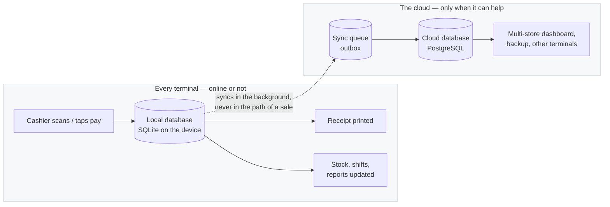
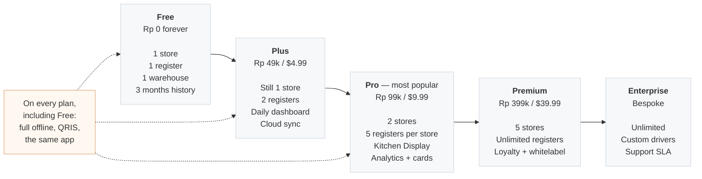

# kasir.mu — the POS that keeps selling when the internet doesn't

> **Point-of-sale software that runs on the hardware you already own and needs no connection
> to take money. Free forever for one store. Paid plans start at $4.99/month — one flat price,
> never a cut of your sales.**

---

## The problem, in one sentence

Every cloud POS works beautifully — until the internet goes down, and then the counter stops.

For a warung, a café, a restaurant, or a chain of shops, that is not an inconvenience. It is
revenue walking out of the door while customers wait. Indonesian merchants already know this:
connection drops are routine, and *"the internet is down"* is a reason a sale gets lost, not a
technical footnote.

Most POS vendors sell you around the problem: a proprietary tablet, a bundled data plan, a
higher tier for the feature you actually needed, a commission on every digital payment. The
bill grows every time you grow.

kasir.mu takes the opposite position. **The terminal is the system.** The cloud is a
convenience layered on top — never a dependency in the path of a sale.

---

## What makes kasir.mu different

### 1. Offline-first is the architecture, not a fallback mode

Sales, checkout, refunds, inventory, shifts, discounts, and receipts run against a local
database on the device. There is no "offline mode" to enable and no degraded feature list —
the same application, the same speed, network or not.

The dotted line is the only thing the network touches. A lost connection delays synchronisation
— it never delays a customer. Competitors describe offline capability; we built the product
around it.

### 2. Your payments, your money — no app commission

kasir.mu does not sit between you and your acquirer. QRIS is supported on **every plan,
including Free** — both dynamic per-transaction QR codes and your own store's static QR
sticker. Card payments via Stripe.

You pay your acquirer's published rate directly, exactly as you would without us. What you
never pay is a **kasir.mu commission on top** — no percentage of turnover, no per-transaction
platform fee.

That distinction matters more than it sounds. A percentage of turnover is a cost that grows
every time you succeed, and stacking a platform cut on top of the acquirer's rate is the most
common way consumer POS pricing is disguised.

### 3. It runs on the hardware you already have

This is a consequence of how it is built, and it shows up as money you do not spend.

| | kasir.mu | Conventional cloud POS |
|---|---|---|
| **Runtime** | Native Rust + the OS's own webview (Tauri v2) | Electron/Java-style bundled runtime |
| **Memory** | Lean — designed for budget terminals | Often 500 MB–1 GB |
| **Installer** | Under 15 MB | Often 150–300 MB |
| **Works on** | Windows 10/11, Android 8+, Linux | Typically modern mid-range or better |
| **Hardware you must buy** | None — use what is on the counter | Frequently bundled or "recommended" |

Merchants keep their existing Windows registers and budget Android tablets. There is no
forced hardware refresh, and no proprietary terminal to rent.

### 4. The features competitors reserve for Enterprise are on regular plans

Every product limits something by price — anyone claiming otherwise is selling you something.
The honest question is *what* gets limited.

kasir.mu limits **capacity**: stores, registers, staff, product count, years of history. What it
does not do is hold the operational essentials hostage. **Multi-store, multi-terminal,
warehouses, and the Kitchen Display System are part of regular plans, not Enterprise-only
add-ons** — which is where conventional POS pricing usually puts them.

| Plan | Monthly | Yearly (2 months free) | For |
|---|---:|---:|---|
| **Free** | Rp 0 / $0 | — | One store, one register, one warehouse. Forever. |
| **Plus** | Rp 49k / $4.99 | Rp 500k / $49.99 | Single-location shops ready to grow. Daily sales dashboard, QRIS, cloud sync. |
| **Pro** ⭐ | Rp 99k / $9.99 | Rp 1.000k / $99.99 | Multi-terminal, Kitchen Display, reports & analytics, card payments. |
| **Premium** | Rp 399k / $39.99 | Rp 3.999k / $399.99 | Multi-location chains, loyalty, whitelabel, scripting. |
| **Enterprise** | Bespoke | Bespoke | Unlimited scale, custom hardware drivers, SLA. |

**Going up a plan buys capacity, not permission.** Every plan signs up the same way, sells the
same way, and works offline the same way — QRIS included. A merchant who outgrows Free never
has to relearn the product.

No credit card to start. No trial that quietly converts.

### 5. The free plan is a real plan — one account, and it never expires

Free is the whole product for one store, at Rp 0, permanently: one register, one warehouse
workspace, three months of sales history, QRIS, and full offline operation. Not a 14-day
window, and not a feature-locked teaser.

It takes an account — and that is deliberate. Setup asks for one first, and **Google or an
email address** takes about a minute:

- **Continue with Google**, or verify your email with a 6-digit code. No credit card, ever.
- The account is what makes the rest work: your plan is attached to it, so a replaced
  register, a reinstall, or a second device reconnects to the same store instead of starting
  from nothing.
- It is also how you get help — licensing, recovery, and support all key off the account
  rather than a serial number somebody has to find on a receipt.
- **No connection during setup?** There is an offline path that provisions the terminal
  without an account. We would rather you could sell today and attach the account tomorrow
  than be blocked at the first screen.

The short version: an account is what lets us recover your store instead of losing it with a
dead laptop. That is worth one verified email.

### 6. Built to be extended, not to trap you

- **Hardware abstraction layer** — printers, scanners, cash drawers, customer displays,
  scales, and EDC terminals behind vendor-independent drivers. USB, Bluetooth, serial, TCP.
  Change the printer without changing the software.
- **Embedded scripting (Premium)** — discount rules, tiered pricing, happy-hour promotions,
  and local tax logic configured at runtime, without waiting for a vendor release.
- **Whitelabel** — app name, icons, colours, receipt logo, and invoice watermark per tenant,
  from a single manifest.
- **No lock-in by design** — the data lives on your device. Export it whenever you want.

### 7. Fast on the hardware that made other POS slow

The POS is written in Rust with an embedded local database. Scans and checkout respond
immediately — not after a round trip to a server. On the budget terminals merchants actually
own, this is the difference between a cashier waiting on a spinner and a queue that moves.

---

## At a glance

| | |
|---|---|
| **What it is** | Offline-first point-of-sale for retail, cafés, restaurants, and multi-location chains |
| **Free plan** | Rp 0 / $0 forever — one store, one register, one warehouse, 3 months of history |
| **Paid from** | Rp 49k / $4.99 per month; yearly = 2 months free |
| **Commission on sales** | 0% — we never take a cut of a transaction |
| **Payments** | QRIS (static + dynamic) on every plan; Stripe cards on Pro and above |
| **Offline** | Every plan, including Free. No feature is online-only |
| **Platforms** | Windows 10/11, Android 8.0+ tablets, Linux |
| **Runtime** | Native Rust core, Tauri v2 shell, SQLite on-device |
| **Data** | Lives on your device; cloud sync is optional (Plus and above) |
| **Languages** | English and Bahasa Indonesia |
| **Won't do** | Charge a percentage of sales. Require a proprietary terminal. Charge extra for multi-store or the Kitchen Display. |

---

## The market

Indonesia alone has **more than 64 million MSMEs**, contributing over 61% of national GDP.
Most of them run on hardware that heavy cloud POS software cannot serve well, on connections
that drop, and on margins that cannot absorb per-transaction commissions or per-feature
upsells.

kasir.mu is built for exactly that segment — and the same architecture is what makes it
attractive further up: multi-location chains get the offline resilience *and* the
multi-store controls, without migrating to a different product. A merchant who outgrows the
free plan does not outgrow the software.

---

## What is real today

The platform is at **v0.0.39**. All six roadmap phases — foundation, hardening, transactions
and staff, scaling (multi-store, cloud sync, card and QRIS payments, Android), intelligence
(reporting and analytics), and ecosystem (loyalty, promotions, KDS, kiosk, table management,
theming) — are delivered, with follow-through gaps recorded openly below.

- **Working:** sales, checkout, refunds, holds, splits, inventory and stock movements, CRM,
  staff and shift management with role-based access, tax and discount rules, daily and period
  reporting, KDS, table management, multi-store topology, cloud sync, QRIS and card payments,
  whitelabel branding, and full English and Indonesian localisation.
- **Not built yet, listed rather than buried:** a chart of accounts, journal and expense
  tracking — there is no accounting module; the purchase-order *history* is real, but four
  feature areas are still scaffolding without domain logic (purchasing, promotions, gift
  cards, kitchen, where the KDS screen is frontend-only); a custom report builder and
  cloud-warehouse export; and voice checkout, which is deferred.

We would rather show you the gaps than have you find them yourself.

---

## Getting started

1. **Download and run.** Windows installer, Android tablet build, or Linux package.
2. **Create your account.** Sign up with Google or your email address — no credit card. The
   setup screen offers your account as the default path; if you have no connection at all,
   you can provision the terminal offline and attach an account later.
3. **Start selling.** Set your business name and currency, and open the register.
4. **Grow when it pays for itself.** Add registers, locations, warehouses, or KDS when the
   business needs them, without reinstalling or migrating data.

---

## For investors and partners

- **Why now:** connectivity is still the weakest link in merchant software, and hardware cost
  is the largest barrier to digital adoption for small merchants. One architectural decision
  addresses both.
- **Why it holds:** the moat is not a feature list, which a competitor can copy in a quarter.
  It is a native Rust core, a hardware abstraction layer, an offline-first data model, and a
  distribution model that asks the merchant to buy no new hardware.
- **Why it converts:** a genuinely usable free tier removes the trial decision — there is
  nothing to evaluate, only a decision to upgrade when capacity runs out.
- **Why the unit economics work:** the terminal does its own reads and writes, so the cloud
  bills for synchronisation rather than for every scan and query. That is what makes a
  free-forever plan and a $4.99 entry tier fundable instead of a loss leader.

Prices, quotas and feature gating in this document follow
[`docs/guides/user/subscription-tiers.md`](./docs/guides/user/subscription-tiers.md), which is the
authoritative tier matrix. For the technical and commercial detail, see
[`docs/guides/product/WHITEPAPER.md`](./docs/guides/product/WHITEPAPER.md) and
[`docs/guides/product/BUSINESS_PLAN.md`](./docs/guides/product/BUSINESS_PLAN.md).

---

## Contact

- Website: **https://kasir.mu**
- Support: **support@kasir.mu**
- Commercial licensing & partnerships: **adikarawiatmaja@gmail.com**

kasir.mu is proprietary software. See [LICENSE](./LICENSE) for terms.
