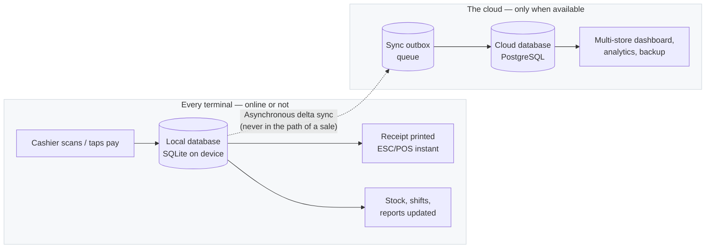
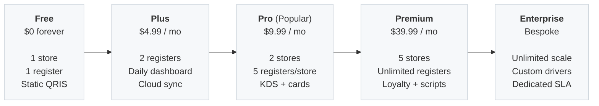

# kasir.mu — the POS that keeps selling when the internet doesn't

[](./stats.json)
[](./scripts/coverage-floors.json)
[](./README-3.md)
[](./README.md#3-engineering-scale--the-ai-native-development-model)

> **Point-of-sale software that runs on the hardware you already own and needs no connection
> to take money. Free forever for one store. Paid plans start at $4.99/month — one flat price,
> never a cut of your sales.**
>
> **How to read this page.** This is the product and technical overview: what kasir.mu does for a merchant,
> how the architecture and economics work, and what is deliberately not built yet. The engineering README is
> [`README-3.md`](./README-3.md) — architecture, commands, and verified figures. Pricing and quotas
> below are quoted exactly as [`docs/guides/user/subscription-tiers.md`](./docs/guides/user/subscription-tiers.md)
> writes them, and that file is the authority when the two ever disagree.

---

## At a glance

### Product & commercial overview

| Dimension | Specification |
|---|---|
| **What it is** | Offline-first point-of-sale for retail, cafés, restaurants, and multi-location chains |
| **Monetization model** | Flat-rate SaaS (Free forever, $4.99 Plus, $9.99 Pro, $39.99 Premium); capacity-gated, zero feature hostage-taking |
| **Sales commission** | **0%** — we never charge a transaction fee or a cut of merchant turnover |
| **Payment integrations** | Static QRIS on every plan (including Free); dynamic QRIS from Plus; Stripe cards from Pro |
| **Network requirement** | **100% offline-capable.** Every transaction, inventory movement, shift, and receipt runs locally |
| **Supported platforms** | Windows 10/11, Android 8.0+ tablets, Linux |
| **Core target market** | 64M+ MSMEs across Indonesia and Southeast Asia facing unreliable network infrastructure |

### Engineering & operational overview

| Dimension | Specification | Reference |
|---|---|---|
| **Codebase size** | **1,334,821 lines of code** across **5,954 files** | [`stats.json`](./stats.json) |
| **Core technology stack** | Native Rust backend + Tauri v2 native shell + React 18 / TypeScript frontend | [`README-3.md`](./README-3.md) |
| **Local database** | SQLite (rusqlite WAL mode) on each terminal; zero server round-trips during checkout | [`docs/architecture/`](./docs/architecture/) |
| **Cloud database** | PostgreSQL sync receiver with asynchronous outbox delta replication | [`crates/kasirmu-core/`](./crates/kasirmu-core/) |
| **Test coverage** | **73.9% measured Rust workspace line coverage** (99.4% in `foundation`, 83.8% in `kasirmu-core`) | [`scripts/coverage-floors.json`](./scripts/coverage-floors.json) |
| **Automated test suite** | **9,026 Rust `#[test]` functions** and **623 frontend test files** | [`README-3.md`](./README-3.md) |
| **Test code volume** | **>508,000 lines of test code** (>50% of the entire codebase is automated verification) | [`stats.json`](./stats.json) |
| **Development model** | **Solo developer — 95% of code authored and verified with AI** | [Section 3 below](#3-engineering-scale--the-ai-native-development-model) |
| **Current release** | **v0.0.40** (all 6 roadmap phases delivered) | [Status below](#5-what-is-real-today--honest-roadmap) |

---

## 1. The problem & the macro opportunity

### The problem: when the internet drops, the counter stops

Every modern cloud POS looks sleek in a product demo — until the store's broadband or cellular connection drops. When that happens:
- The cashier cannot complete sales, look up inventory, or issue receipts.
- Queues back up, customer frustration spikes, and real revenue walks out the door.
- For a high-turnover café, busy restaurant, or neighbourhood store, network instability is not an inconvenience; it is an immediate revenue loss.

To solve this, legacy cloud POS vendors force merchants into predatory lock-in:
1. **Proprietary hardware rentals:** Forcing stores to buy or rent expensive, closed-ecosystem terminals.
2. **Bundled data dependencies:** Selling ongoing cellular SIM plans that still drop in basements and dense areas.
3. **Turnover rent-seeking:** Imposing a 1% to 3% platform commission on top of standard bank acquiring fees.
4. **Paywalled operational essentials:** Locking multi-terminal setups, Kitchen Displays, and inventory sync behind exorbitant "Enterprise" tiers.

### The macro market: 64 million underserved merchants

In Indonesia alone:
- **More than 64 million MSMEs** contribute **over 61% of national GDP** and employ 97% of the domestic workforce.
- The vast majority operate on tight profit margins and cannot absorb per-transaction SaaS commissions.
- They run on commodity, budget hardware (existing Windows counter laptops, budget Android tablets) and experience daily connection dips.
- The entire Southeast Asian region (over 70 million MSMEs) faces the same structural reality.

kasir.mu addresses this structural gap by inverting the typical SaaS architecture: **the terminal is the system**. The cloud is an optional convenience layered on top, never an active gatekeeper in the path of a sale.

---

## 2. The architectural moat: offline-first & edge-native

### 1. Offline-first is the foundation, not a degraded mode

Unlike cloud systems that treat offline as an emergency fallback with disabled features, kasir.mu is built from day one as an **edge-native system**:
- Every scan, price calculation, discount rule, tax computation, stock decrement, and receipt print executes against a **local SQLite database** residing on the merchant's physical device.
- Speed is instant: sub-millisecond local queries replace 300–800ms HTTP round-trips.
- When an internet connection is present, transactions sync silently in the background through a transactional outbox queue. If the connection fails for an hour, a day, or a week, the cash register continues selling at full speed.



### 2. High performance on budget hardware (Tauri v2 + Rust)

Legacy desktop POS applications bundle Chromium and Node.js runtimes (Electron), consuming 500 MB–1 GB of RAM and requiring multi-hundred-megabyte installers.

kasir.mu pairs a compiled **native Rust core** with the operating system's native webview via **Tauri v2**:

| Attribute | kasir.mu | Conventional cloud POS |
|---|---|---|
| **Underlying runtime** | Native compiled Rust + OS Webview (Tauri v2) | Bundled Electron / Java runtime |
| **Installer package size** | **< 15 MB** | 150 MB – 300 MB+ |
| **Active memory footprint** | **30 MB – 50 MB** | 500 MB – 1.2 GB |
| **Supported hardware** | Windows 10/11, Android 8.0+ tablets, Linux | Modern high-spec terminals |
| **Hardware requirements** | **None** — runs on existing counter devices | Proprietary hardware required or urged |

### 3. Hardware Abstraction Layer (HAL)

kasir.mu provides vendor-agnostic driver abstractions (`kasirmu-hal`) across:
- **Receipt printers:** ESC/POS over USB, TCP/Ethernet, Bluetooth, and Serial.
- **Barcode scanners:** Keyboard wedge and raw HID input.
- **Cash drawers:** Pulse triggers via printer RJ11 or dedicated controller.
- **Customer displays:** 2-line VFD / LCD serial displays.
- **Weight scales:** Continuous weight streaming and tare protocols.
- **Payment terminals:** EDC integration with fallback to QRIS stickers.

Every driver includes a comprehensive mock implementation (`crates/kasirmu-hal/src/drivers/mock.rs`), allowing 100% automated test coverage of hardware interactions without physical peripherals.

### 4. Zero transaction tax

kasir.mu connects directly to payment acquirers and merchant accounts:
- **Static QRIS** is included on **every plan, including Free Forever**.
- **Dynamic per-transaction QRIS** unlocks at Plus ($4.99/mo).
- **Credit / Debit cards** via Stripe from Pro ($9.99/mo).
- **0% platform fee:** kasir.mu never takes a cut of sales volume. Merchants keep 100% of their revenue and pay only their acquirer's standard interchange rate.

---

## 3. Engineering scale & the AI-native development model

kasir.mu represents an industry benchmark in **agentic software engineering and capital efficiency**:
The entire platform was architected, engineered, and maintained by a **solo developer, with 95% of code authored and verified by AI**.

```
   ┌────────────────────────────────────────────────────────┐
   │             Human Systems Architect                    │
   │  • Architecture design & module boundaries             │
   │  • Financial & transactional correctness invariants    │
   │  • Rigorous CI gates & test coverage floors            │
   └───────────────────────────┬────────────────────────────┘
                               │ Orchestrates & verifies
                               ▼
   ┌────────────────────────────────────────────────────────┐
   │         Autonomous AI Engineering Agents               │
   │  • 1.33M+ lines of verified code                       │
   │  • 9,000+ automated Rust tests                         │
   │  • Cross-platform desktop (Windows/Linux) & tablet     │
   │  • 14 modular business domains & HAL hardware drivers  │
   └────────────────────────────────────────────────────────┘
```

### Solving the AI code quality challenge

The primary failure mode of AI-generated code is accumulating untested technical debt. kasir.mu solved this by using AI primarily for **exhaustive verification and rigorous test generation**:
- Over **508,000 lines of code** in the repository consist of test suites, mock drivers, and verification suites (>50% of the entire codebase).
- **Invariants enforced at the type system and database layer:**
  - `Money` is strictly modeled as an `i64` minor unit integer (zero floating-point currency representation).
  - All database writes are wrapped in explicit `rusqlite` transactions.
  - Seven automated pre-commit gates enforce line endings, schema drift guards, migration typing, and translation parity.

### Codebase metrics breakdown ([`stats.json`](./stats.json))

The repository encompasses **1,334,821 lines of code** across **5,954 source files**:

| Language / Domain | Files | Lines | Primary Scope |
|---|---:|---:|---|
| **Rust** | 1,389 | 510,786 | Domain logic, SQLite engine, HAL device drivers, security, cryptography, sync outbox |
| **TypeScript / TSX** | 1,514 | 387,698 | React POS UI, state machines, Kitchen Display (KDS), tablet layouts, API clients |
| **Markdown** | 420 | 132,955 | Comprehensive system architecture, ADRs, test strategies, user guides |
| **HTML** | 1,208 | 102,514 | Prototypes, KDS layouts, web views, documentation templates |
| **CSS** | 150 | 62,045 | Design system, tokenized responsive styling, print receipt layouts |
| **Go** | 106 | 44,882 | Standalone licensing server (`apps/license-server`) |
| **Python** | 80 | 40,590 | Verification gates, migration generators, drift checkers, E2E orchestration |
| **JavaScript / MJS** | 834 | 16,241 | Tooling scripts, build pipelines, prototype engines |
| **Fluent (`.ftl`)** | 54 | 12,619 | 10,000+ bilingual localization entries (English and Bahasa Indonesia) |
| **SQL** | 72 | 8,666 | 70 migration schemas (SQLite primary + generated PostgreSQL replica) |
| **Shell & PowerShell** | 76 | 12,829 | CI/CD automation, build scripts, Windows setup tooling |
| **Astro** | 51 | 2,996 | Marketing website & documentation portal |
| **Total** | **5,954** | **1,334,821** | Complete repository footprint |

### Automated test coverage & reliability standards

- **73.9% measured workspace line coverage** in Rust across all crates (ratified via `cargo llvm-cov` in [`scripts/coverage-floors.json`](./scripts/coverage-floors.json)).
- **Core module reliability floors:**
  - `foundation`: **99.4%** coverage
  - `kasirmu-core`: **83.8%** coverage
  - `modules-inventory`: **78.4%** coverage
- **9,026 Rust tests** (`#[test]`) executing on every change.
- **623 frontend test suites** in Vitest covering React UI, accessibility, and offline caching.

---

## 4. Business model & unit economics

### The edge-compute cost advantage

In conventional cloud POS architectures, every barcode scan, cart update, price lookup, and shift summary makes an API call to cloud servers. As a result, the POS vendor incurs escalating server bills:
- Millions of database queries per day per merchant.
- Heavy AWS/GCP infrastructure costs, forcing high monthly subscription fees ($50–$150/mo) or percentage-of-sales fees to remain solvent.

**kasir.mu flips the unit economics entirely:**
- **Zero server costs for transactions:** The merchant's device performs 100% of compute, caching, indexing, and storage.
- **Cloud bills only for delta sync:** The cloud server only processes compressed background sync packets when transactions are uploaded.
- **90%+ reduction in server overhead:** This allows kasir.mu to offer a **perpetual Free plan** and a **$4.99/month entry plan** that are genuinely profitable and scalable, rather than money-losing venture subsidies.

### Transparent subscription tiers

Going up a plan buys **capacity**, never basic operational survival. We never hold core business features hostage.

| Plan | IDR / Month | USD / Month | Yearly (2 mo free) | What it includes |
|---|---:|---:|---:|---|
| **Free** | Rp 0 | $0 | — | 1 store, 1 register, 1 warehouse, 3 months history. Static QRIS. Full offline. Forever. |
| **Plus** | Rp 49.000 | $4.99 | $49.99 | 1 store, 2 registers, cloud sync, daily sales dashboard, dynamic QRIS. |
| **Pro** ⭐ | Rp 99.000 | $9.99 | $99.99 | 2 stores, 5 registers/store, Kitchen Display System (KDS), analytics, card payments. |
| **Premium** | Rp 399.000 | $39.99 | $399.99 | 5 stores, unlimited registers, customer loyalty, custom Lua scripting, whitelabeling. |
| **Enterprise** | Bespoke | Bespoke | Custom | Unlimited scale, custom hardware drivers, dedicated SLA, on-premise cloud deployments. |



---

## 5. What is real today & honest roadmap

The platform is at **v0.0.40**. All six roadmap phases are delivered:

- **Phase 1 (Foundation & MVP):** Barcode scan $\to$ cart $\to$ pay $\to$ receipt, setup wizard, feature flags, Money/CRUD core.
- **Phase 2 (Hardening):** Cryptographic security (`Argon2id` + `AES-256-GCM` backup snapshots), hourly rolling file logging with 30-day retention, multi-platform packaging.
- **Phase 3 (Transactions & Staff):** Void, refund, hold, split tenders, PIN authentication, RBAC, shift management & End-of-Day cash reconciliation, tax engine, Lua discount runtime.
- **Phase 4 (Scaling):** Asynchronous cloud sync (outbox to PostgreSQL), multi-store & multi-terminal topologies, Stripe card & QRIS processing, Android tablet support.
- **Phase 5 (Intelligence):** Daily/weekly/monthly EOD sales reporting, COGS & gross profit tracking, executive dashboards, English & Indonesian localization.
- **Phase 6 (Ecosystem):** Loyalty points, promotions, Kitchen Display System (KDS), table management, whitelabel multi-tenant theming.

### Transparent gap disclosure

We believe in radical transparency:
- **No full accounting ledger yet:** The system provides revenue, COGS, gross-profit, shift cash tracking, and purchase order history. A full general ledger (chart of accounts, journal entries) is not yet built.
- **Scaffolded vertical stubs:** Purchasing history is live, but four domain modules (`purchasing`, `promotions`, `giftcards`, `kitchen`) are currently structured as frontend or core-delegated modules rather than standalone domain services.
- **Deferred features:** Custom cloud report builder and voice checkout remain intentionally deferred.

---

## 6. Quick start for developers

### Prerequisites
- [Rust](https://rustup.rs/) (1.80+ recommended)
- [Node.js](https://nodejs.org/) (20+ LTS)
- OS: Windows 10/11, macOS, or Linux (with WebKit2GTK)

### 4-step setup

```bash
# 1. Clone the repository
git clone https://github.com/kardelitaitu/kasirmu.git
cd kasirmu

# 2. Build the workspace crates
cargo build --workspace

# 3. Install frontend dependencies
cd ui && npm ci --no-audit --no-fund && cd ..

# 4. Launch the desktop application in development mode
cd apps/desktop-tauri && cargo tauri dev
```

For full architecture deep-dives, verified commands, and CI gate reproduction, see [`README-3.md`](./README-3.md) and [`docs/guides/developer/QUICKSTART.md`](./docs/guides/developer/QUICKSTART.md).

---

## 7. For investors & commercial partners

- **The Distribution Thesis:** Emerging market merchants don't resist digitization; they resist overhead. By running on existing hardware with zero platform GMV take-rate and an unexpiring Free tier, kasir.mu drives viral bottom-up merchant acquisition.
- **The Defensibility Moat:** A native Rust engine, unified hardware abstraction layer, offline-first data synchronization, and enterprise-grade test verification cannot be replicated by wrapper apps or quick cloud clones.
- **Unprecedented Capital Efficiency:** Built by a solo developer leveraging 95% AI execution, delivering a 1.33M+ LOC enterprise product at a tiny fraction of typical venture capital burn.

---

## 8. License & contact

**Proprietary and Confidential — Copyright (c) 2024–2026 kasir.mu Contributors / All Rights Reserved.**

This software is **proprietary commercial software**. No part of this codebase, associated binaries, or documentation may be copied, modified, distributed, sublicensed, hosted, or deployed in commercial production settings without an executed Commercial License Agreement.

- **Website:** [https://kasir.mu](https://kasir.mu)
- **General & Support:** support@kasir.mu
- **Commercial Licensing & Partnerships:** **adikaradwiatmaja@gmail.com**

See [LICENSE](./LICENSE) for formal terms and conditions.
