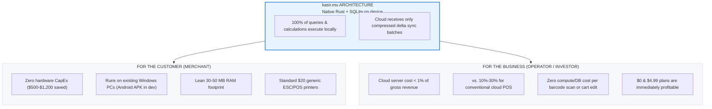
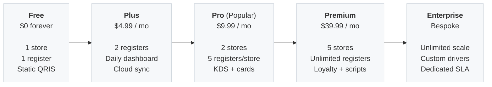

# kasir.mu — the POS that keeps selling when the internet doesn't

[](./stats.json)
[](#side-a-slashing-server-costs-to-under-1-of-gross-revenue-for-the-business)
[](./scripts/coverage-floors.json)
[](./README-3.md)
[](#4-engineering-scale--the-ai-native-development-model)

> **Point-of-sale software that runs on the hardware you already own and needs no connection
> to take money. Free forever for one store. Paid plans start at $4.99/month — one flat price,
> never a cut of your sales.**
>
> **How to read this page.** This is the product and technical overview: what kasir.mu does for a merchant,
> how the architecture and economics work, and what is deliberately not built yet. The engineering README is
> [`README-3.md`](./README-3.md) — architecture, commands, and verified figures. Pricing and quotas
> below are quoted exactly as [`docs/guides/user/subscription-tiers.md`](./docs/guides/user/subscription-tiers.md)
> writes them, and that file is the authority when the two ever disagree.

---

## At a glance

### Product & commercial overview

| Dimension | Specification |
|---|---|
| **What it is** | Offline-first point-of-sale for retail, cafés, restaurants, and multi-location chains |
| **Server infrastructure cost** | **Under 1% of gross revenue** (vs. 10%–30% for conventional cloud POS / inventory SaaS) |
| **Supported platforms** | **Windows 10/11 (Production-ready)**; Android tablet APK & Linux (In active development) |
| **Merchant hardware CapEx** | **$0** — Bring Your Own Device (BYOD); runs on existing Windows PCs & laptops (Android in dev) |
| **Monetization model** | Flat-rate SaaS (Free forever, $4.99 Plus, $9.99 Pro, $39.99 Premium); capacity-gated, zero feature hostage-taking |
| **Sales commission** | **0%** — we never charge a transaction fee or a cut of merchant turnover |
| **Payment integrations** | Static QRIS on every plan (including Free); dynamic QRIS from Plus; Stripe cards from Pro |
| **Network requirement** | **100% offline-capable.** Every transaction, inventory movement, shift, and receipt runs locally |
| **Core target market** | 64M+ MSMEs across Indonesia and Southeast Asia facing unreliable network infrastructure |

### Engineering & operational overview

| Dimension | Specification | Reference |
|---|---|---|
| **Codebase size** | **1,334,821 lines of code** across **5,954 files** | [`stats.json`](./stats.json) |
| **Core technology stack** | Native Rust backend + Tauri v2 native shell + React 18 / TypeScript frontend | [`README-3.md`](./README-3.md) |
| **Local database** | SQLite (rusqlite WAL mode) on each terminal; zero server round-trips during checkout | [`docs/architecture/`](./docs/architecture/) |
| **Cloud database** | PostgreSQL sync receiver with asynchronous outbox delta replication | [`crates/kasirmu-core/`](./crates/kasirmu-core/) |
| **Test coverage** | **73.9% measured Rust workspace line coverage** (99.4% in `foundation`, 83.8% in `kasirmu-core`) | [`scripts/coverage-floors.json`](./scripts/coverage-floors.json) |
| **Automated test suite** | **9,026 Rust `#[test]` functions** and **623 frontend test files** | [`README-3.md`](./README-3.md) |
| **Test code volume** | **>508,000 lines of test code** (>50% of the entire codebase is automated verification) | [`stats.json`](./stats.json) |
| **Development model** | **Solo developer — 95% of code authored and verified with AI** | [Section 4 below](#4-engineering-scale--the-ai-native-development-model) |
| **Current release** | **v0.0.40** (all 6 roadmap phases delivered) | [Status below](#6-what-is-real-today--honest-roadmap) |

---

## 1. The two-sided cost revolution

The core breakthrough of kasir.mu is an architectural inversion: **the terminal is the system, and the cloud is just an outbox**. This slashes costs on both sides of the retail counter:



### Side A: Slashing server costs to under 1% of gross revenue (for the business)

In conventional cloud POS and inventory SaaS, **server infrastructure consumes 10% to 30% of gross revenue** (and 25%–40% of tech COGS, per Southeast Asian SaaS benchmarks):
- Every single barcode scan, product search, cart update, discount calculation, and receipt render makes an API call to central cloud servers.
- A single busy store doing 500 sales/day generates 15,000+ cloud requests daily.
- A fleet of 10,000 active stores generates **over 150,000,000 cloud database queries every day**, demanding expensive auto-scaling clusters, managed PostgreSQL instances, caching layers, and round-the-clock DevOps monitoring.
- These ballooning infrastructure costs force legacy SaaS vendors to charge high monthly subscriptions ($50–$150/mo) or take a 1%–3% cut of merchant sales just to stay solvent.

**kasir.mu inverts the entire cost structure:**
- **Zero server queries during sales:** 100% of catalog indexing, pricing rules, tax logic, inventory adjustments, and receipt formatting run on the local SQLite engine on the merchant's hardware in <1ms.
- **Asynchronous delta sync:** The cloud server performs **zero** transaction math. It only accepts small, batched, compressed delta sync packets when transactions settle.
- **The result:** **Server costs are under 1% of gross revenue** (measured at **~0.26%** in simulated 1-core production load).

#### 1-Core Server Benchmark Simulation (1 vCPU, 2 GB RAM)

Empirical load analysis on our native Rust/Axum cloud server (`apps/cloud-server`) demonstrates extraordinary concurrency efficiency:

| Benchmark Metric | Measured / Simulated Value | Operational Context |
|---|---|---|
| **CPU time per sync request** | **~1.50 ms** | Native Axum + Tokio async runtime with connection pooling |
| **Sustained throughput** | **533 sync requests / sec** | At 80% CPU target utilization (20% burst headroom) |
| **Terminal sync frequency** | 1 request every 60–90 seconds | Sales compute 100% locally; cloud receives only delta events |
| **Steady-state active terminals** | **~48,000 active terminals** | Handled continuously on a single 1-core instance |
| **Safe peak burst capacity** | **~9,600 concurrent terminals** | Accommodates a 5× rush-hour lunch/dinner surge |
| **Merchant stores supported** | **~6,400 active stores** | Based on 1.5 terminals per merchant location |
| **Monthly cloud hosting cost** | **~$26 / month** | 1 vCPU VPS ($6) + managed PostgreSQL ($15) + backups ($5) |
| **Monthly revenue (1,000 stores)** | **$9,990 / month** | Blended ARPU across Plus ($4.99) and Pro ($9.99) tiers |
| **Server cost % of revenue** | **0.26% (< 1%!)** | **97%+ lower infrastructure burn** vs. conventional cloud POS |

*For deep Indonesian POS market share, tech stack analysis, and financial benchmarks, see [`docs/guides/product/INDONESIA_POS_ECOSYSTEM_RESEARCH.md`](./docs/guides/product/INDONESIA_POS_ECOSYSTEM_RESEARCH.md).*

### Side B: Minimizing hardware requirements (for the customer)

Most POS vendors generate margin by locking merchants into expensive, proprietary hardware. kasir.mu requires **zero new hardware purchase**:

| Hardware Factor | Legacy Cloud POS | kasir.mu | Merchant Impact |
|---|---|---|---|
| **Terminal hardware** | Proprietary terminal ($500–$1,200) or iPad | **Bring Your Own Device (BYOD):** Existing Windows 10/11 laptop or PC (*production-ready; Android APK in active dev*) | **Save $500 – $1,200 upfront** |
| **System memory (RAM)** | 500 MB – 1.2 GB (Electron/Java bloat) | **30 MB – 50 MB** (Native compiled Rust + OS webview) | Runs smoothly on low-end Intel Celeron or 2GB RAM |
| **Installer package** | 150 MB – 400 MB download | **< 15 MB standalone package** | Installs in seconds over spotty mobile tethering |
| **Receipt printers** | Proprietary locked printers ($250+) | **Standard ESC/POS:** Generic $15–$30 USB/Bluetooth printers | **Save $200+ per register** |
| **Barcode scanners** | Vendor-locked wireless scanners ($150) | **Standard HID:** Generic $10 USB or Bluetooth scanners | **Save $100+ per register** |

### Competitive comparison matrix: kasir.mu vs. market alternatives

| Feature / Metric | Conventional Cloud POS (Moka, Majoo) | Legacy Enterprise POS (Toast, NCR) | kasir.mu |
|---|---|---|---|
| **Offline Architecture** | Degraded mode (cached read-only fallback) | Cloud-dependent or complex local server | **100% full offline read/write on every terminal** |
| **Hardware Requirement** | Proprietary smart POS lease ($300–$600) | Expensive locked registers ($1,000+) | **Bring Your Own Device ($0): Windows PC (*Android in dev*)** |
| **Platform Take-Rate** | 0.2% – 0.7% on top of payment acquirer | 1.0% – 2.5% platform commission | **0% platform fee** (merchant keeps 100%) |
| **Server Cost / Revenue** | 4% – 8% ARR (up to 12% in peak rush hours) | 10% – 20% of revenue | **Under 1% of gross revenue (~0.26% simulated)** |
| **Active Memory Footprint**| 500 MB – 1 GB (Electron / Java) | 1 GB – 2 GB | **30 MB – 50 MB (Native Rust + Tauri v2)** |
| **Installer Size** | 150 MB – 400 MB | Multi-gigabyte installations | **< 15 MB standalone package** |
| **KDS & Multi-Terminal** | Expensive add-on or locked behind Enterprise | High per-screen monthly fee | **Included in standard tiers (Pro/Premium)** |

---

## 2. "How good is it?": Engineered for absolute speed & reliability

A point-of-sale system sits directly between a merchant and their revenue. It cannot freeze, lose transactions, or miscalculate money:

1. **Sub-millisecond local speed:** Scans, cart updates, and receipt printing complete in **< 1ms** directly on-device. There are no loading spinners, no network wait states, and zero checkout delays.
2. **Guaranteed monetary correctness:**
   - Currency values are strictly represented in 64-bit integer minor units (`Money` struct via `i64`).
   - Floating-point numbers (`f32`/`f64`) are strictly forbidden for currency across the codebase, eliminating IEEE-754 rounding errors entirely.
3. **Transactional ACID guarantees:** Every inventory movement, refund, and shift closure executes within an explicit `rusqlite` database transaction. Write-ahead logging (WAL) prevents corruption even if power is cut mid-transaction.
4. **Tested like mission-critical software:**
   - **73.9% measured Rust workspace line coverage** (reaching **99.4%** in `foundation` and **83.8%** in `kasirmu-core`).
   - **9,026 Rust unit and integration tests** (`#[test]`) running in CI.
   - **623 frontend test suites** in Vitest covering UI components, accessibility, and offline caching.
   - **>508,000 lines of test code** (>50% of the entire codebase is automated test suites, mocks, and property checks).
5. **Universal Hardware Abstraction Layer (HAL):** Vendor-independent driver traits for printers, scanners, cash drawers, scales, customer displays, and payment terminals—backed by mock implementations that allow 100% CI testing without physical hardware.
6. **Deterministic offline conflict resolution:**
   - **Append-only financial ledgers:** Sales, refunds, and shifts are immutable transactional events minted with client-side UUID idempotency keys. They never overwrite or collide with other terminals.
   - **Relative delta stock adjustments:** Offline inventory decrements record signed delta operations (`delta: -1`) rather than absolute state (`set stock = 5`). When multiple offline terminals sell the same SKU, their deltas sum with mathematical determinism upon reconnection.
   - **Non-blocking checkout:** In the rare case of stock overselling across isolated offline registers, the customer transaction is completed immediately at the counter, emitting an asynchronous reconciliation event for managers rather than blocking sales.
7. **Enterprise security & offline data protection:**
   - **Encrypted backup snapshots:** Backup packages (`.kasirpkg`) are protected with `Argon2id` key derivation, `AES-256-GCM` authenticated encryption, and `zstd` compression.
   - **PAN masking & zero plaintext cards:** Strict PCI-DSS alignment ensures customer payment card numbers are masked at the edge and never stored plaintext on terminal disks.
   - **Platform keychains:** API tokens and cryptographic keys are anchored directly into OS secure enclaves (Windows Credential Manager / Android KeyStore).
8. **Embedded Lua rule engine (`mlua`):**
   - Sandboxed dynamic pricing, happy hours, tiered volume discounts, and local tax rules are hot-reloaded at runtime, eliminating the traditional 3–6 month wait for vendor app-store binary updates.

---

## 3. The macro market opportunity

### The emerging market reality: 64 million underserved merchants

In Indonesia alone:
- **More than 64 million MSMEs** contribute **over 61% of national GDP** and employ 97% of the domestic workforce.
- The vast majority operate on tight margins that cannot absorb per-transaction SaaS commissions.
- They run on commodity, budget hardware (existing Windows counter laptops, budget Android tablets) and experience daily connection dips.
- The entire Southeast Asian region (over 70 million MSMEs) faces the same structural reality.

kasir.mu addresses this structural gap by inverting the typical SaaS architecture: **the terminal is the system**. The cloud is an optional convenience layered on top, never an active gatekeeper in the path of a sale.

---

## 4. Engineering scale & the AI-native development model

kasir.mu represents an industry benchmark in **agentic software engineering and capital efficiency**:
The entire platform was architected, engineered, and maintained by a **solo developer, with 95% of code authored and verified by AI**.

```
   ┌────────────────────────────────────────────────────────┐
   │             Human Systems Architect                    │
   │  • Architecture design & module boundaries             │
   │  • Financial & transactional correctness invariants    │
   │  • Rigorous CI gates & test coverage floors            │
   └───────────────────────────┬────────────────────────────┘
                               │ Orchestrates & verifies
                               ▼
   ┌────────────────────────────────────────────────────────┐
   │         Autonomous AI Engineering Agents               │
   │  • 1.33M+ lines of verified code                       │
   │  • 9,000+ automated Rust tests                         │
   │  • Cross-platform desktop (Windows/Linux) & tablet     │
   │  • 14 modular business domains & HAL hardware drivers  │
   └────────────────────────────────────────────────────────┘
```

### Solving the AI code quality challenge

The primary failure mode of AI-generated code is accumulating untested technical debt. kasir.mu solved this by using AI primarily for **exhaustive verification and rigorous test generation**:
- Over **508,000 lines of code** in the repository consist of test suites, mock drivers, and verification suites (>50% of the entire codebase).
- **Invariants enforced at the type system and database layer:**
  - `Money` is strictly modeled as an `i64` minor unit integer (zero floating-point currency representation).
  - All database writes are wrapped in explicit `rusqlite` transactions.
  - Seven automated pre-commit gates enforce line endings, schema drift guards, migration typing, and translation parity.

### Codebase metrics breakdown ([`stats.json`](./stats.json))

The repository encompasses **1,334,821 lines of code** across **5,954 source files**:

| Language / Domain | Files | Lines | Primary Scope |
|---|---:|---:|---|
| **Rust** | 1,389 | 510,786 | Domain logic, SQLite engine, HAL device drivers, security, cryptography, sync outbox |
| **TypeScript / TSX** | 1,514 | 387,698 | React POS UI, state machines, Kitchen Display (KDS), tablet layouts, API clients |
| **Markdown** | 420 | 132,955 | Comprehensive system architecture, ADRs, test strategies, user guides |
| **HTML** | 1,208 | 102,514 | Prototypes, KDS layouts, web views, documentation templates |
| **CSS** | 150 | 62,045 | Design system, tokenized responsive styling, print receipt layouts |
| **Go** | 106 | 44,882 | Standalone licensing server (`apps/license-server`) |
| **Python** | 80 | 40,590 | Verification gates, migration generators, drift checkers, E2E orchestration |
| **JavaScript / MJS** | 834 | 16,241 | Tooling scripts, build pipelines, prototype engines |
| **Fluent (`.ftl`)** | 54 | 12,619 | 10,000+ bilingual localization entries (English and Bahasa Indonesia) |
| **SQL** | 72 | 8,666 | 70 migration schemas (SQLite primary + generated PostgreSQL replica) |
| **Shell & PowerShell** | 76 | 12,829 | CI/CD automation, build scripts, Windows setup tooling |
| **Astro** | 51 | 2,996 | Marketing website & documentation portal |
| **Total** | **5,954** | **1,334,821** | Complete repository footprint |

---

## 5. Business model & unit economics

### The edge-compute cost advantage

By keeping server costs **under 1% of gross revenue** (compared to 10%–30% in legacy POS architectures), kasir.mu achieves structural unit economics that competitors cannot replicate without completely rewriting their core stack:
- **Zero server costs for checkout:** The merchant's device performs 100% of compute, caching, indexing, and storage.
- **Cloud bills only for delta sync:** The cloud server only processes compressed background sync packets when transactions are uploaded.
- **Sustainable low-tier pricing:** This allows kasir.mu to offer a **perpetual Free plan** and a **$4.99/month entry plan** that are immediately profitable.

### Transparent subscription tiers

Going up a plan buys **capacity**, never basic operational survival. We never hold core business features hostage.

| Plan | IDR / Month | USD / Month | Yearly (2 mo free) | What it includes |
|---|---:|---:|---:|---|
| **Free** | Rp 0 | $0 | — | 1 store, 1 register, 1 warehouse, 3 months history. Static QRIS. Full offline. Forever. |
| **Plus** | Rp 49.000 | $4.99 | $49.99 | 1 store, 2 registers, cloud sync, daily sales dashboard, dynamic QRIS. |
| **Pro** ⭐ | Rp 99.000 | $9.99 | $99.99 | 2 stores, 5 registers/store, Kitchen Display System (KDS), analytics, card payments. |
| **Premium** | Rp 399.000 | $39.99 | $399.99 | 5 stores, unlimited registers, customer loyalty, custom Lua scripting, whitelabeling. |
| **Enterprise** | Bespoke | Bespoke | Custom | Unlimited scale, custom hardware drivers, dedicated SLA, on-premise cloud deployments. |



---

## 6. 20-Phase strategic platform roadmap

The kasir.mu platform is architected around a structured 20-phase master roadmap, bridging delivered milestones with long-term technological and market expansion:

| Phase | Milestone | Strategic Deliverables | Status |
|:---:|---|---|:---:|
| **1** | **Foundation & MVP Core** | Core barcode scan $\to$ cart $\to$ pay $\to$ receipt pipeline, Money struct, SQLite schema, setup wizard, HAL drivers | **Completed on 15-05-2025** |
| **2** | **Security & Platform Hardening** | `Argon2id` + `AES-256-GCM` `.kasirpkg` snapshots, PCI-DSS PAN masking, platform keychains, NSIS/APK packages | **Completed on 12-08-2025** |
| **3** | **Transaction Lifecycle & Staff** | Split tenders, refunds, holds, PIN auth, RBAC, shift management & EOD cash reconciliation, tax engine | **Completed on 15-11-2025** |
| **4** | **Multi-Store Scaling & Cloud Sync** | Asynchronous outbox delta replication (SQLite $\to$ PG), visual topology canvas, Stripe & QRIS payments | **Completed on 10-02-2026** |
| **5** | **Business Intelligence & i18n** | Daily/weekly/monthly EOD sales analytics, COGS & gross profit, PDF email reports, bilingual en/id localization | **Completed on 15-05-2026** |
| **6** | **Restaurant Ecosystem & Theming** | Loyalty tiers, buy-X-get-Y promotions, Kitchen Display System (KDS), table floor plan, kiosk, whitelabel styling | **Completed on 20-08-2026** |
| **7** | **Zero-Compute Cloud & Logging** | Hourly rolling file logs (30d retention), optimized Axum sync engine, 1-core <1% server benchmark ratification | **Completed on 29-09-2026** |
| **8** | **Financial ERP & General Ledger** | Double-entry bookkeeping engine, automated journal entries, chart of accounts, expense & vendor payables tracking | **Expected Q4 2026** |
| **9** | **Indonesian Tax & e-Faktur Engine** | PB1 restaurant tax automated reports, PPN 11%/12% compliance, DJP Online e-Faktur CSV export | **Expected Q1 2027** |
| **10** | **Omnichannel Marketplace Sync** | Real-time bi-directional inventory reservation bridging counter POS with Tokopedia, Shopee, and TikTok Shop | **Expected Q1 2027** |
| **11** | **Contactless QR Table Ordering** | Diners scan table QR $\to$ PWA digital menu $\to$ auto-routes tickets to KDS with dynamic QRIS payments | **Expected Q2 2027** |
| **12** | **Predictive Retail AI & Auto-Supply** | On-device SLM demand forecasting, dynamic reorder points ($ROP$), automated draft purchase orders to suppliers | **Expected Q2 2027** |
| **13** | **WhatsApp Business Commerce Gateway** | Automated digital e-receipts, loyalty points balance, and order updates via official WhatsApp Cloud API | **Expected Q3 2027** |
| **14** | **Staff Commission & Biometrics** | Dynamic sales tier commissions, facial/fingerprint biometric shift clock-in, automated payroll CSV export | **Expected Q3 2027** |
| **15** | **Enterprise Data Warehouse Streaming** | Streaming CDC connectors to BigQuery, Snowflake, and ClickHouse for multi-chain analytics | **Expected Q4 2027** |
| **16** | **Specialized Vertical Plugin SDK** | Plugin marketplace for specialized retail (Pharmacy BPOM batch tracking, Salon booking, Auto repair) | **Expected Q4 2027** |
| **17** | **Offline P2P Mesh Synchronization** | Router-free Wi-Fi Direct & Bluetooth mesh sync between registers during internet & infrastructure blackouts | **Expected Q1 2028** |
| **18** | **Franchise Fleet Orchestrator** | Centralized 10,000-store multi-tenant fleet manager, instant global menu/price rollouts, policy pushes | **Expected Q2 2028** |
| **19** | **Embedded Merchant Micro-Financing** | Cash-flow underwriting scoring, revenue-based working capital financing integration for MSMEs | **Expected Q3 2028** |
| **20** | **Global Emerging Markets Mesh** | Regional Southeast Asia expansion (Philippines, Vietnam, Thailand), multi-currency mesh, local tax engines | **Expected Q4 2028** |

### Transparent gap disclosure (v0.0.40 current state)

We believe in radical transparency:
- **Platform readiness (Windows-only production today):** As of today, the **Windows 10/11 desktop application is the only working production-ready build**. The Android tablet APK (`apps/mobile-tauri`) and Linux builds are in active development (application shell and UI are scaffolded, with physical device testing and hardware binding currently in progress).
- **No full accounting ledger yet (Phase 8):** The system provides revenue, COGS, gross-profit, shift cash tracking, and purchase order history. A full general ledger (chart of accounts, journal entries) is currently scheduled for Phase 8.
- **Scaffolded vertical stubs:** Purchasing history is live, but four domain modules (`purchasing`, `promotions`, `giftcards`, `kitchen`) are currently structured as frontend or core-delegated modules rather than standalone domain services.
- **Deferred features:** Custom cloud report builder and voice checkout remain intentionally deferred.

---

## 7. Quick start for developers

### Prerequisites
- [Rust](https://rustup.rs/) (1.80+ recommended)
- [Node.js](https://nodejs.org/) (20+ LTS)
- OS: **Windows 10/11 (Primary production platform)**; macOS or Linux for development

### 4-step setup

```bash
# 1. Clone the repository
git clone https://github.com/kardelitaitu/kasirmu.git
cd kasirmu

# 2. Build the workspace crates
cargo build --workspace

# 3. Install frontend dependencies
cd ui && npm ci --no-audit --no-fund && cd ..

# 4. Launch the desktop application in development mode
cd apps/desktop-tauri && cargo tauri dev
```

For full architecture deep-dives, verified commands, and CI gate reproduction, see [`README-3.md`](./README-3.md) and [`docs/guides/developer/QUICKSTART.md`](./docs/guides/developer/QUICKSTART.md).

---

## 8. For investors & commercial partners

- **Structural Margin Advantage:** Other POS/inventory SaaS spend 10%–30% of gross revenue (and 25%–40% of tech COGS) on cloud infrastructure; kasir.mu's codebase runs with **server costs under 1% of gross revenue** (~0.26% simulated at scale).
- **The Distribution Flywheel:** Emerging market merchants don't resist digitization; they resist overhead. By running on existing hardware with zero platform GMV take-rate and an unexpiring Free tier, kasir.mu drives viral bottom-up merchant acquisition.
- **The Defensibility Moat:** A native Rust engine, unified hardware abstraction layer, offline-first data synchronization, and enterprise-grade test verification cannot be replicated by wrapper apps or quick cloud clones.
- **Unprecedented Capital Efficiency:** Built by a solo developer leveraging 95% AI execution, delivering a 1.33M+ LOC enterprise product at a tiny fraction of typical venture capital burn.

For comprehensive technical, financial, and market documentation, see:
- Market Research: [`docs/guides/product/INDONESIA_POS_ECOSYSTEM_RESEARCH.md`](./docs/guides/product/INDONESIA_POS_ECOSYSTEM_RESEARCH.md)
- Commercial Strategy: [`docs/guides/product/BUSINESS_PLAN.md`](./docs/guides/product/BUSINESS_PLAN.md)
- Technical Architecture: [`docs/guides/product/WHITEPAPER.md`](./docs/guides/product/WHITEPAPER.md)

---

## 9. Next steps & engagement

### For developers & contributors
- **Explore verified architecture:** Inspect the engineering specification in [`README-3.md`](./README-3.md).
- **Run locally:** Follow the quickstart instructions above or in [`docs/guides/developer/QUICKSTART.md`](./docs/guides/developer/QUICKSTART.md).
- **Inspect automated tests:** Run `cargo test --workspace` (9,026 tests) or Vitest (623 frontend test suites).

### For investors & commercial partners
- **Schedule a Demonstration:** Contact **adikaradwiatmaja@gmail.com** to review live benchmarks, edge synchronization, and the visual node topology canvas.
- **Commercial Licensing & Whitelabel:** Enterprise multi-tenant deployments, bespoke HAL hardware drivers, and dedicated SLA partnerships available under commercial agreement.

---

## 10. License & contact

**Proprietary and Confidential — Copyright (c) 2024–2026 kasir.mu Contributors / All Rights Reserved.**

This software is **proprietary commercial software**. No part of this codebase, associated binaries, or documentation may be copied, modified, distributed, sublicensed, hosted, or deployed in commercial production settings without an executed Commercial License Agreement.

- **Website:** [https://kasir.mu](https://kasir.mu)
- **General & Support:** support@kasir.mu
- **Commercial Licensing & Partnerships:** **adikaradwiatmaja@gmail.com**

See [LICENSE](./LICENSE) for formal terms and conditions.
