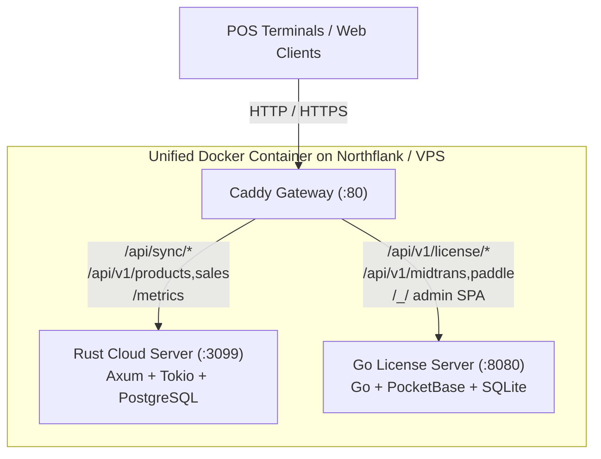
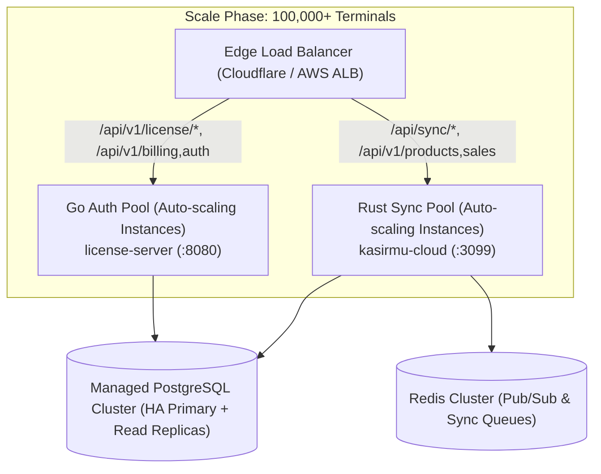

# Architecture Analysis: System Design, Trade-offs & Incumbent Dynamics

<!-- Audit stamp: 2026-10-02 · Product & Systems Architecture Review -->

## 1. Executive Summary & Architectural Thesis

`kasir.mu` employs a **Lean Systems Architecture** combining an offline-first client model with a hybrid **Rust + Go unified backend container**. 

While mainstream cloud POS and ERP SaaS platforms (such as Moka POS, Majoo, Pawoon, Accurate Online, Mekari, and Toast) run multi-tier, cloud-first microservices on Kubernetes, `kasir.mu` deliberately diverges from this industry consensus.

```
Traditional Cloud POS (Incumbents)        kasir.mu Architecture
┌───────────────────────────────┐         ┌───────────────────────────────┐
│ Client Terminal               │         │ Client Terminal               │
│ (Thin Web / React Native)     │         │ (Tauri + Local SQLite ACID)   │
└──────────────┬────────────────┘         └──────────────┬────────────────┘
               │ HTTP REST (Every action)                │ Delta Sync (Async batches)
               ▼                                         ▼
┌───────────────────────────────┐         ┌───────────────────────────────┐
│ 20+ Microservices on K8s      │         │ Unified Container (Caddy)     │
│ (Java / Node.js / Spring)     │         │ ├── Rust Core Engine (:3099)  │
│ Cloud Cost: 10%–30% of ARR    │         │ └── Go Auth / Billing (:8080) │
│ Outages: Halts in-store sales │         │ Cloud Cost: < 1% of ARR       │
└───────────────────────────────┘         └───────────────────────────────┘
```

This document details:
1. **The Core Server Architecture:** Why Rust, Go, and Caddy were chosen for their respective roles.
2. **The Trade-off Matrix:** The objective engineering advantages (pros) versus the hidden operational and technical costs (cons).
3. **The Incumbent Dilemma:** Why well-funded incumbents with tens of millions of dollars in capital cannot or will not migrate to this model.
4. **The Greenfield AI Asymmetry:** How AI-driven systems engineering enabled a solo developer to build a 1.33M+ LOC platform that previously required a 25-person systems team.

---

## 2. Server Architecture: Pragmatic Polyglot

Rather than forcing a single language across the entire backend, `kasir.mu` separates the **hot transactional data path** from the **control and billing plane**.



### A. The Core Transaction & Sync Engine: Pure Rust (`apps/cloud-server`)
* **Stack:** Rust, Axum, Tokio async runtime, Tower HTTP, deadpool-postgres / tokio-postgres, rusqlite, Redis.
* **Responsibilities:**
  * High-frequency offline-first delta synchronization (`/api/sync/*`).
  * Deterministic vector-clock and monotonic sequence conflict resolution.
  * Multi-tenant inventory, sales transactions, and ledger mutations (`/api/v1/*`).
  * High-resolution Prometheus telemetry and health monitoring (`/metrics`, `/api/health`).
* **Design Rationale:** Zero-allocation streams, deterministic memory footprint (30–50 MB under heavy load), and absolute absence of Garbage Collection (GC) pauses during lunch/dinner transaction spikes.

### B. The Licensing, Auth & Billing Plane: Go (`apps/license-server`)
* **Stack:** Go (Golang) on top of PocketBase.
* **Responsibilities:**
  * RSA-4096 offline cryptographic license signing and device anti-tamper attestations (`/api/v1/license/*`).
  * Terminal pairing, Web OTP, and Google OAuth flows (`/api/v1/desktop/*`, `/api/v1/pairing/*`).
  * Payment gateway webhook ingest and subscription reconciliation (Midtrans QRIS and Paddle).
  * Out-of-the-box superuser administration UI (`/_/*`).
* **Design Rationale:** Writing authentication glue, session management, and third-party webhook handlers in Rust is development-intensive. Go delivers rapid iteration, standard library networking excellence, and native PocketBase integration without the memory overhead of Node.js or Java.

### C. The Deployment Model: Single Unified Container (`apps/unified`)
* **Stack:** Caddy reverse proxy + `supervisord` + Rust binary + Go binary.
* **Responsibilities:**
  * Single public ingress on port `:80` (or edge TLS).
  * In-memory / localhost loopback proxying between Caddy and internal runtimes (zero cross-service network serialization latency).
  * Deployable as a single portable OCI image to Northflank, AWS ECS, GCP Cloud Run, or bare-metal Linux VPS.

---

## 3. The Objective Trade-off Matrix (Pros vs. Cons)

No architecture is without compromise. The table below outlines the tangible benefits and hidden costs of this design:

| Feature / Pattern | Architectural Advantage (Pro) | Hidden Cost & Liability (Con) |
| :--- | :--- | :--- |
| **Rust Sync Engine (`apps/cloud-server`)** | Sub-millisecond latency (`~1.5ms`); tiny memory footprint (30–50MB); zero GC latency spikes; slashes server costs to **<1% of ARR**. | **High Talent Barrier:** Rust engineers are rare and expensive. Steep learning curve for async lifetimes, Send/Sync bounds, and unsafe boundaries. |
| **Local-First Architecture (Client SQLite)** | Zero UI latency (<2ms writes); immune to internet drops; 100% operational uptime for stores during ISP/cloud outages. | **Distributed State Complexity:** Requires solving split-brain states, vector clocks, and concurrent inventory depletion edge cases without central row locks. |
| **Go Auth & Billing (`apps/license-server`)** | Turnkey auth, fast webhook prototyping, built-in admin dashboard, independent security surface. | **Polyglot Overhead:** Context switching across Rust, Go, TypeScript/React, SQL, and Fluent i18n adds cognitive drag to full-stack engineering. |
| **Unified Single Container (`apps/unified`)** | Extreme operational simplicity ($26/mo VPS); no Kubernetes cluster needed; zero internal network hops. | **Coupled Deployments:** Updating a webhook in Go requires cycling the container, briefly affecting the Rust sync server. Shared CPU/memory noisy-neighbor risk. |
| **Dual-Database Layer (SQLite Edge $\leftrightarrow$ Postgres Cloud)** | Tailored database engines: SQLite optimized for embedded single-user speed; Postgres optimized for analytical multi-tenant cloud storage. | **Dual-Dialect Friction:** Maintaining schema parity across SQLite and Postgres requires automated transpilation (`generate-pg-migration.py`) and strict drift gates. |
| **Client Edge Storage** | Zero network bandwidth for local queries; complete local privacy and ownership. | **Hardware Disk Vulnerability:** Budget POS terminals (cheap mini-PCs, Android boxes) face sudden power cuts. Requires robust SQLite WAL journaling and disk vacuum maintenance. |

---

## 4. The Million-Dollar Question: Why Incumbents Do Not Adopt This Architecture

Industry observers often ask: *If this architecture yields <1% server costs, instant local checkouts, and complete immunity to internet outages, why haven't incumbents like Moka POS, Majoo, Pawoon, Accurate, or Toast adopted it?*

The answer lies in five structural business, organizational, and technical barriers:

### 1. The "Second-System Curse" & Sunk Cost Fallacy
* **Decades of Entrenched Code:** Incumbents possess 5–15 years of legacy codebases written in Java/Spring, PHP/Laravel, Python/Django, or Node.js. These codebases embed thousands of undocumented business rules, tax calculations (PPN/PPh), edge-case discount matrices, and hardware workarounds.
* **Rewrites are Commercial Suicide:** As documented in software engineering history (e.g., Netscape's infamous rewrite), halting product feature development for 2–3 years to rewrite an existing revenue-generating system in Rust is an unacceptable existential risk.
* **The Boardroom Reality:** A CTO cannot justify a 2-year, $5M rewrite to a Board of Directors when the end result—from the merchant's perspective—is simply *"the same POS, but our AWS bill is lower."*

### 2. Conway's Law & Organizational Headcount Bloat
* **"Organizations design systems that mirror their communication structures."**
* A venture-funded POS company with $20M–$50M in funding typically employs **100 to 250 engineers**.
* **Microservices exist to manage people, not code:** To prevent 150 engineers from stepping on each other, leadership divides them into siloed squads (Menu Squad, Payment Squad, Table Management Squad, Promo Squad, Analytics Squad). Each squad runs its own microservice on Kubernetes.
* **The Lean Systems Contradiction:** A unified, hyper-dense systems architecture (Rust + Go modular container) is designed for **1 to 5 high-leverage engineers**. You cannot assign 150 developers to a compact modular monolith without creating total organizational gridlock.

### 3. The VC Cloud Subsidy & Payment Take-Rate Trap
* **Free Cloud Credits Hide Waste:** Early-to-growth stage startups in Southeast Asia receive $100k–$350k in promotional cloud credits from AWS, Google Cloud, and Alibaba Cloud. By the time the credits expire, their infrastructure is deeply coupled to managed cloud primitives (RDS, DynamoDB, SQS, ElastiCache).
* **The Real Business Model is Payments, Not Software:**
  * Indonesian POS software subscriptions are cheap (IDR 150,000–300,000/month).
  * Incumbents generate **60%–75% of their net revenue from payment processing fees** (0.2%–0.7% MDR on QRIS and cards), hardware financing, and working capital loans.
  * When a platform processes IDR 1 Trillion in monthly transaction volume, spending $30,000/month on AWS is viewed as an acceptable operating cost rather than an architectural emergency.

### 4. The Fear of Distributed State & Regulatory Audit Risk
* **Cloud-First is Easy:** In a cloud-first system, concurrency is simple: the terminal sends an HTTP request, the central database executes an ACID transaction with pessimistic locks, and returns success.
* **Offline-First is Distributed Systems at the Edge:** 
  * Implementing local-first SQLite delta synchronization means managing thousands of asynchronous, intermittently connected database nodes.
  * For enterprise accounting systems like **Accurate Online** or **Mekari Jurnal**, data correctness is legally mandated by Indonesian tax authorities (Ditjen Pajak) and statutory accounting standards (PSAK).
  * An inventory desync or reconciliation bug caused by an offline split-brain condition creates legal and financial exposure. Most corporate enterprise architects consider local-first synchronization "too dangerous" for accounting ledgers.

### 5. The "Greenfield AI" Paradigm Shift
* **Historical Cost of Systems Programming:** Prior to 2024, building a 1.33M+ line multi-platform codebase in Rust, TypeScript, Go, and C with comprehensive test suites (9,000+ tests, 73.9% line coverage) required an engineering budget of **$3M–$5M annually** and 20+ specialized systems developers.
* **The AI Execution Advantage:** `kasir.mu` was developed greenfield in 2024–2026, leveraging autonomous AI agents for 95% of code generation, formal test writing, and refactoring. A solo developer achieved the output of an enterprise engineering department without accumulating organizational debt or legacy baggage.
* Incumbents are culturally and technically constrained by the paradigms, frameworks, and team sizes of the 2012–2020 era.

---

## 5. Architectural Scaling Roadmap

While the current unified container easily handles vertical scaling up to tens of thousands of active merchant outlets on affordable VPS hardware, the architecture supports clean horizontal decoupling as the platform scales toward 100,000+ concurrent endpoints:



1. **Path-Based Decoupling:** Because the Caddy reverse proxy already isolates routes cleanly (`/api/sync/*` and `/api/v1/*` to Rust; `/api/v1/license/*` and `/api/v1/web/*` to Go), migrating to separate auto-scaling clusters requires **zero application code changes**—only an ingress route configuration update.
2. **Database Read Replicas:** Read-heavy analytics and dashboard queries can be offloaded to PostgreSQL streaming replicas, reserving the primary cluster for monotonic delta-sync write streams.

---

## 6. Conclusion

The `kasir.mu` server design is not an accidental microservice-versus-monolith debate; it is an **intentional strategic moat**:
* It trades away junior-developer familiarity and rapid throwaway prototyping.
* In exchange, it achieves **unrivaled operational margins (<1% cloud cost)**, **zero-downtime offline reliability for store owners**, and **massive capital efficiency** that legacy competitors cannot match without destroying their own legacy businesses.
