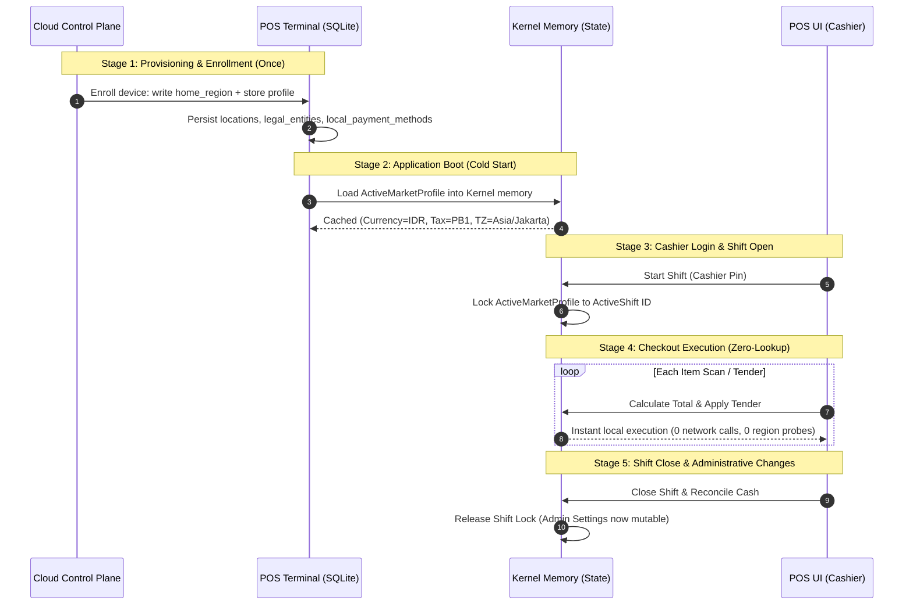

<!-- Spec: Account-Locked Data Residency & Store-Locked Market Profile · 2026-10-02 · status: IMPLEMENTED · owner: Architecture / Core -->

# Account-Locked Data Residency & Store-Locked Market Profile

> **Status: ACCEPTED & TESTED.**  
> **Date:** 2026-10-02 · Recorded against branch `0.0.41`  
> **Governing ADRs:** [ADR-59 (Regional Topology & Modular Delivery)](../../decisions/2026-09-21-adr59-regional-topology-and-modular-delivery.md), [ADR-56 (First-Run Provisioning)](../../decisions/2026-09-21-adr56-first-run-provisioning.md), [ADR-48 (Timezone Representation)](../../decisions/2026-09-09-adr48-timezone-representation.md), [ADR-64 (Tender Vocabulary & Offline State)](../../decisions/2026-10-02-adr64-tender-vocabulary-and-offline-tender-state.md).  
> **Implementation Target:** `crates/kasirmu-core/src/regional.rs`, `platform/kernel/`, `apps/desktop-tauri/src/commands/`, `ui/src/contexts/WorkspaceContext.tsx`.

---

## 1. Problem Statement & Motivation

In global retail POS deployments, determining a terminal's country, tax engine, currency, or data sovereignty dynamically during checkout creates two catastrophic failure modes:

1. **Offline Fragility:** If a register must query an external registry or API to evaluate its region, checkout halts whenever the internet connection drops or fluctuates.
2. **Checkout Latency & Non-Determinism:** Dynamic rule lookups (`if country == "ID" ...`) across micro-actions (scanning barcodes, applying line discounts, computing taxes) add CPU and memory overhead, violating the sub-100ms item scan requirement.
3. **Mid-Shift Configuration Drift:** Allowing live modification of currency or tax regimes while cash drawers and shift ledgers are open corrupts financial reconciliation and inventory valuation.

---

## 2. Core Invariant: The Dual-Axis Lock

The architecture splits regional responsibility into two independent, locked axes (ADR-59 §2.2):

| Axis | System Parameter | Storage Location | Mutability | Deciding Authority |
|---|---|---|---|---|
| **Data Residency** | Physical cloud cluster (`ap-southeast-1`, `eu-central-1`) | `tenants.region` (Postgres) & `provisioning.home_region` (SQLite) | **Account-Locked** (Set at signup; immutable without cross-region migration) | Cloud Control Plane |
| **Market Profile** | Currency, tax regime, locale, timezones, allowed rails | `legal_entities.country_code` & `locations.*` (SQLite) | **Store-Locked** (Resolved at boot; immutable while shift is open) | Store / Legal Entity |

---

## 3. End-to-End Lifecycle



---

## 4. Technical Data Contract

### 4.1 In-Memory Snapshot (`ActiveMarketProfile`)

Stored in the Tauri/Kernel application state upon cold boot and store activation:

```rust
/// The compiled, locked market profile governing local checkout.
/// Initialized once from SQLite on startup; zero runtime database reads during sales.
#[derive(Debug, Clone, PartialEq, Eq, Serialize, Deserialize)]
pub struct ActiveMarketProfile {
    /// Active location identifier
    pub location_id: String,
    /// Owning legal entity identifier
    pub legal_entity_id: String,
    /// ISO-3166 alpha-2 country code (e.g. "ID", "SG")
    pub country_code: String,
    /// ISO-4217 currency code (e.g. "IDR", "SGD")
    pub currency: String,
    /// Primary BCP-47 locale tag (e.g. "id-ID")
    pub default_locale: String,
    /// Authoritative IANA timezone (e.g. "Asia/Jakarta")
    pub timezone: String,
    /// Pre-resolved tax regime descriptor
    pub tax_regime: String,
    /// Pre-compiled statutory rounding mode
    pub statutory_rounding: RoundingMode,
    /// Whitelist of active local tender codes (e.g. ["cash", "qris_static", "qris", "card"])
    pub enabled_payment_rails: Vec<String>,
}
```

### 4.2 Shift Immunity Lock

To prevent financial corruption, mutating any regional or market axis while a shift is open is strictly blocked at the command layer:

```rust
pub fn verify_regional_mutation_allowed(
    tx: &rusqlite::Transaction,
    location_id: &str,
) -> Result<(), CoreError> {
    // `shifts` has no `location_id` column — join through `terminals`.
    // `terminals.bound_location_id` (renamed from `bound_store_id` in
    // migration 20260906_rename_store_to_location.sql) is the FK to
    // `inventory_locations.id`. If a future migration adds `location_id`
    // directly to `shifts`, this query can be simplified to a single-table
    // predicate.
    let mut stmt = tx.prepare_cached(
        "SELECT s.id FROM shifts s
         JOIN terminals t ON t.id = s.terminal_id
         WHERE t.bound_location_id = ?1
           AND s.closed_at IS NULL
         LIMIT 1"
    )?;
    
    if stmt.exists([location_id])? {
        return Err(CoreError::Validation {
            field: "regional_settings",
            message: "Cannot modify currency, country, or tax regime while a cashier shift is active. Close all open shifts first.".into(),
        });
    }
    
    Ok(())
}
```

---

## 5. Sale Execution Guarantees (Zero-Lookup Path)

During a sale lifecycle:

1. **Price & Currency Calculation:**
   - Amount values are handled strictly in `Money(i64)` minor units.
   - Currency formatting uses the compiled `ActiveMarketProfile.currency` from memory. No database queries.
2. **Tax Engine Calculation:**
   - Tax rates are resolved using `TaxRateScope::Location` or `TaxRateScope::LegalEntity` matching `ActiveMarketProfile.legal_entity_id`.
   - Tax rounding strictly applies `ActiveMarketProfile.statutory_rounding`.
3. **Receipt Formatting:**
   - Receipt header/footer, legal tax registration numbers (e.g. NPWP, GSTIN), and date/time formatting use `ActiveMarketProfile.timezone` and `ActiveMarketProfile.default_locale`.
   - Zero calls to remote endpoints; zero parsing of device operating system locale.
4. **Offline Electronic Tender Selection:**
   - Only payment rails present in `ActiveMarketProfile.enabled_payment_rails` are displayed in `PaymentModal.tsx`.
   - Cash and static offline QR tenders complete without gateway validation rows (ADR-64 §2 D6).

---

## 6. Verification & Test Suite

The implementation must pass three automated test cases:

1. **Test Zero-Lookup Invariant (`test_sale_execution_zero_lookups`):**
   - Mock all network connections to disconnect (`assert_offline`).
   - Run a 100-item checkout cycle with PB1 tax calculation and receipt rendering.
   - Assert zero network requests and sub-10ms total execution time.
    - Runner: `cargo test -p kasirmu-core --test integration offline::test_sale_execution_zero_lookups`
2. **Test Shift-Immunity Lock (`test_shift_locks_regional_settings`):**
   - Open a shift for Location `loc-1`.
   - Attempt to call `update_regional_settings` to change currency from `IDR` to `USD`.
   - Assert `CoreError::Validation { field: "regional_settings", .. }` is returned (there is no `code` field on this variant; discriminate by `field` name).
   - Close the shift.
   - Re-attempt `update_regional_settings`; assert successful mutation and audit event emission.
   - Runner: `cargo test -p kasirmu-core --test integration shift::test_shift_locks_regional_settings`
3. **Test Scope-Chain Fallback (`test_regional_scope_chain_resolution`):**
   - Verify that an unset location correctly inherits currency and country from its parent `LegalEntity` without requiring manual duplication.
   - Runner: `cargo test -p kasirmu-core --test integration settings::test_regional_scope_chain_resolution`

