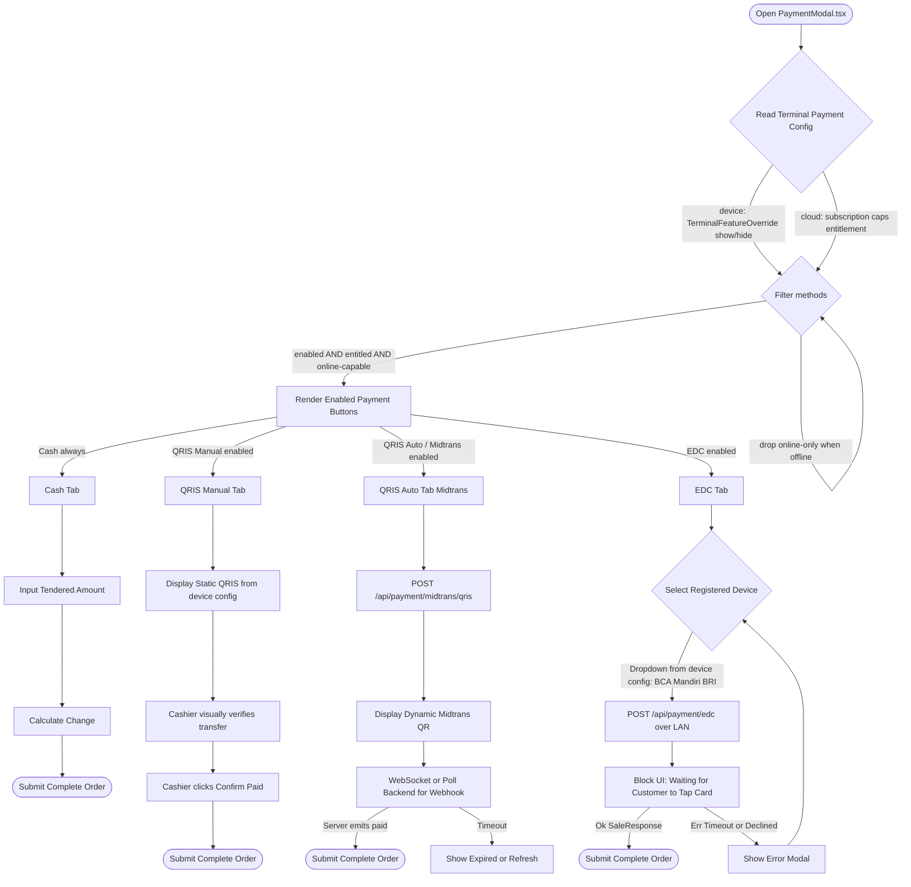

# Payment Types — Plan & TODO

> Working plan for how payment types/methods are modeled, configured, and
> rendered in the POS. The modal lives at `ui/src/features/sales/PaymentModal.tsx`.
> This doc captures the architecture decision and a phased backlog. Add detail
> as design progresses.

> **Status (2026-09-13):** the QRIS Auto / Midtrans **server path landed** via
> `todo-payment-agents-1.md`: `POST /api/payment/midtrans/qris` (issue) and
> `POST /api/webhooks/midtrans` (SHA512-verified settlement) over the existing
> `crates/oz-payment` driver, with a cloud-side `midtrans_transactions` ledger
> driving `finalize_sale` — commits `08adf9fe8d` (driver `qr_string` alias fix),
> `9e143fc5ca` (endpoint + webhook + ledger). The :34 rule holds as designed:
> the secret is a cloud-only platform `MIDTRANS_SERVER_KEY`, the device never
> sees it. The **UI half stays open** in `todo-payment-agents-3.md` (QR render,
> expiry countdown, status polling, EDC checkout flow). Row 4's HAL note is
> also stale: the EDC protocol stack shipped in
> `crates/oz-hal/src/drivers/edc/` (agents-2 stamped absorbed 08:38 today).

## Goal

Model the supported payment types as **config-driven, terminal-scoped** methods
instead of hardcoded UI, and define where each piece of configuration lives so
the POS stays **offline-first** and **hardware-bound** ("saved to hardware, not
user") while entitlements remain cloud-driven.

## Payment types

| # | Type | Availability | Config location | Online/Offline | Notes |
|---|------|--------------|-----------------|----------------|-------|
| 1 | **cash** | Always on | (none) | Offline | Constant; no flag needed. |
| 2 | **qris_manual** | Show/hide per terminal | Device (hardware config + flag) | Offline-capable (print QR) | Customer scans a *printed* QR; cashier waits for bank SMS/email/notification or manually checks the mobile bank app, then confirms in POS. No live callback. |
| 3 | **midtrans** | Show/hide per terminal | Device flag + cloud secrets | **Online only** | Multiple endpoints — research later. Sensitive API keys must stay server-side. |
| 4 | **edc** (credit/debit card) | Show/hide per terminal | Device (HAL `HardwareConfig`) | LAN (local network) | One or more LAN EDC terminals configured from terminal settings. HAL drivers currently stubs (reconciled design in Phase 4 — EDC). |

## Architecture decision — where config lives

**Reframe:** "Rust or Tauri?" — in this repo Tauri *is* Rust (`apps/desktop-client`
is the Tauri v2 Rust side). The real axis is **device-local vs cloud**.

**Rule (driven by offline-first + "saved to hardware, not user"):**
- Show/hide flags + hardware-bound config → **on-device** (desktop-client +
  `oz-hal` + local SQLite). Works offline, terminal-scoped, operator-set.
- Entitlements (is a method *allowed* on this plan?) → **cloud** subscription
  `caps`.
- Gateway secrets (Midtrans keys, etc.) → **cloud-server**, never plaintext on
  device.

**Existing mechanisms this builds on (already in repo):**
- `TerminalFeatureOverride` — `crates/oz-core/src/terminal_override.rs`,
  table `terminal_feature_overrides` (on-device SQLite), keyed by
  `terminal_id` + `feature` (kebab) + `enabled`. Doc comment literally says
  "a kiosk terminal that should not accept card payments." → the show/hide
  switch.
- `crates/oz-hal` `HardwareConfig` + `apply_config()` via
  `platform_startup::hardware` — operator-saved hardware config applied at
  startup ("apps map their `TerminalProfile` → `HardwareConfig`"). → home for
  EDC device list + merchant QRIS string.
- `crates/oz-hal` `EdcTerminal` trait (`traits/edc.rs`) with
  `WiredEdcTerminal` / `WirelessEdcTerminal` — **currently stubs**
  (`HalError::Unsupported`); protocol codecs (Ingenico/PAX/Verifone) also stubs.
- `TerminalProfile` — `crates/oz-core/src/terminal_profile.rs` (UI lockdown
  per terminal; candidate extension point but `TerminalFeatureOverride` is the
  cleaner fit for enable/disable flags).
- Subscription `caps` — `ui/src/contexts/SubscriptionContext.tsx` (cloud).
  Today gates QRIS as Plus+ via `caps.supportsQris`.
- `apps/desktop-client/src/commands/terminals.rs` already exposes
  `set_terminal_override_scoped` / `list_terminal_overrides_scoped` /
  `get_terminal_scoped` for the IPC side.

### Responsibility split

| Concern | Lives in | Notes |
|---|---|---|
| Which methods visible on THIS terminal (show/hide) | `TerminalFeatureOverride` (device SQLite) | keys `payment:qris-manual`, `payment:midtrans`, `payment:edc` |
| Hardware-bound config (EDC LAN list, merchant QRIS string, Midtrans endpoint choice) | `HardwareConfig` / `apply_config` (HAL) | applied at startup; offline-capable |
| Entitlements (method allowed on plan?) | cloud subscription `caps` | existing QRIS Plus+ gate stays |
| Gateway secrets (Midtrans keys) | cloud-server | device holds only enable flag + endpoint ref |

**Visibility formula:**
```
visibleMethods = ALL_METHODS
  .filter(m => terminalEnabled(m))      // TerminalFeatureOverride
  .filter(m => planEntitled(m))         // subscription caps
  .filter(m => offlineOk(m) || online)  // midtrans dropped when offline
```
Today `PaymentModal` hardcodes `['cash','card','qris','credit']` and gates QRIS
via `caps.supportsQris` — that list must become this derived set.

## Payment flow (per-method)

High-level method-selection + completion flow. Tabs are config-driven; every
tab ends in `completeSaleScoped` with the right payment method / gateway ref.



### Flow clarifications (vs a naive single-filter version)
- **Config source = two inputs, not generic "POS settings".** Tabs render from
  `terminalEnabled(m)` (device `TerminalFeatureOverride`, "saved to hardware,
  not user") **and** `planEntitled(m)` (cloud subscription `caps`). The filter is
  three-way: `enabled AND entitled AND online-capable` - online-only methods
  (QRIS Auto / Midtrans) are hidden when offline.
- **QRIS Manual** = static merchant QR from device hardware config; cashier
  confirms visually (no live callback).
- **QRIS Auto = Midtrans** (online only; secrets stay cloud-side; UI polls a
  WebSocket/webhook for the `paid` event). Midtrans may later gain more
  surfaces (VA, card) - this tab is the QRIS endpoint of several.
- **EDC** device list comes from HAL `HardwareConfig` (applied at startup via
  `apply_config`); drivers are currently **stubs** (`HalError::Unsupported`). Reconciled design in **Phase 4 — EDC**.

### open_bill / credit reconciliation
- **open_bill** is an *order-lifecycle* action (park / hold the cart), **not a
  tender**. It is closed later using the same normal payment methods
  (cash / qris_manual / qris_auto / edc) as any sale - so it does **not** appear
  as a payment tab.
- **credit** (sell on customer credit / AR) - still TBD; likely also orthogonal
  to tender selection. See Open questions.

## Phased TODO

### Phase 0 — Data model & config schema
- [ ] Define payment-method feature keys in `crate::feature_key` namespace
      (`payment:qris-manual`, `payment:midtrans`, `payment:edc`); verify against
      existing `feature_key` style for consistency.
- [ ] Use `TerminalFeatureOverride` for per-terminal show/hide (no new table
      needed; reuse `set_terminal_override_scoped` / `list_terminal_overrides_scoped`).
- [ ] Define `HardwareConfig` additions: EDC device list, QRIS merchant string,
      Midtrans endpoint id/selection.
- [ ] Define cloud-side entitlement mapping (which `caps` gate each method; today
      only QRIS/Plus+ exists).
- [ ] Define UI derivation: `visibleMethods = enabled ∩ entitled ∩ online-capable`.

### Phase 1 — Cash (always available)
- [ ] Confirm cash is a constant with no config/flag. (Likely no code change.)

### Phase 2 — QRIS manual
- [ ] `payment:qris-manual` show/hide flag (TerminalFeatureOverride).
- [ ] Store merchant QRIS string in hardware config (needed offline at print).
- [ ] Print static QR encoding merchant string + amount (offline).
- [ ] Manual "payment received" confirmation path in `PaymentModal`
      (no live bank callback; cashier confirms).
- [ ] Keep existing Plus+ entitlement gate on top of terminal flag.

### Phase 3 — Midtrans
- [ ] Research Midtrans endpoints / multiple endpoint profiles.
- [ ] `payment:midtrans` show/hide flag (TerminalFeatureOverride).
- [ ] Endpoint selection in hardware/operator config.
- [ ] Keep API keys/secrets **cloud-side**; device holds only enable flag +
      endpoint reference. Online-only (hide when offline).
- [ ] Define secure call path (cloud makes the actual gateway call).

- [ ] **Integration library:** Midtrans publishes an official Node.js client
      (https://github.com/Midtrans/midtrans-nodejs-client). Our backends are Rust
      (cloud-server axum, desktop-client Tauri) and the UI is browser/React, so the
      Node client cannot run client-side (would expose secrets). Decide: call
      Midtrans REST directly from Rust (recommended - keeps secrets server-side, no
      new runtime) vs add a Node BFF. Use the client as a reference for the Core
      API / Snap / QRIS request+response shapes (charge, status, notification).

- [ ] **Reference copies (research only):** both shallow-cloned + gitignored (NOT
      build dependencies):
      - `references/midtrans-nodejs-client/` - official Node.js client
        (`github.com/Midtrans/midtrans-nodejs-client`); study `lib/`
        (CoreApi / Snap / Transaction / httpClient) + `examples/`.
      - `references/midtrans-php/` - official PHP client
        (`github.com/Midtrans/midtrans-php`); study `Midtrans/ApiRequestor.php`
        (auth), `Midtrans/Config.php` (base URLs), `Midtrans/CoreApi.php`
        (charge), `Midtrans/Transaction.php` (status), `Midtrans/Notification.php`
        (webhook).
      - **Cross-verified against both clients:** auth = HTTP Basic
        `Authorization: Basic base64(serverKey + ":")`; base URL
        `api.midtrans.com` (prod) / `api.sandbox.midtrans.com` (sandbox); Core
        API path `/v2/...`. Our `crates/oz-payment/src/drivers/qris.rs` already
        matches this exactly (same Basic-auth header, `/v2` base, `payment_type:
        "qris"` charge, `/{id}/status` poll, refund/cancel paths).
      - **QRIS caveat:** neither vendored client ships a *classic Core-API*
        QRIS sample - both expose QRIS only via the newer **SnapBi** API
        (asymmetric clientId/clientSecret/private-key + OAuth token). Our Rust
        driver uses the classic `POST /charge {payment_type:"qris"}`, which is
        still supported and simpler. The QR response field is `qr_string` (the
        raw QRIS string to render into a QR image), NOT `qr_code_url` - the
        driver's current field name still needs a sandbox confirmation.
      - **Webhook caveat:** the official PHP `Notification` class does NOT verify
        a signature - it re-fetches `Transaction::status(transaction_id)` and
        trusts that (the Node `transaction.notification()` does the same). That
        re-fetch pattern is the vendor-recommended webhook handling; our
        `crates/oz-payment/src/webhook.rs` stub should follow it (or verify
        `signature_key` = SHA512(order_id + status_code + gross_amount +
        serverKey)). The route home is `apps/cloud-server/src/webhooks.rs`
        (`/api/webhooks/{gateway}` + HMAC verifiers + `processed_webhooks`
        idempotency), which already handles Stripe/Square.


#### Targeted QRIS / `acquirer` (study)

Midtrans can lock a QRIS charge to a specific e-wallet via the `acquirer`
parameter, so the POS can show a co-branded QR for GoPay / ShopeePay / DANA /
LinkAja instead of a generic QRIS code.

- **Where the param lives:**
  - Classic Core API (what `crates/oz-payment/src/drivers/qris.rs` uses):
    `qris.acquirer` in the `POST /charge` body.
  - SnapBi API (the only style the vendored examples show): `additionalInfo.acquirer`.
    The proven value in both vendored clients is `"gopay"`
    (`references/midtrans-nodejs-client/examples/SnapBi/SnapBiQrisPayment.js:46`,
    `references/midtrans-php/examples/snap-bi/snap-bi-qris-payment.php:45`).
- **Valid `acquirer` values** (per Midtrans docs; `gopay` is the only one
  confirmed by the vendored code - confirm the rest in a sandbox):
  `gopay`, `shopeepay`, `dana`, `linkaja`. **Omit the field for a generic QRIS
  code** (scannable by any QRIS-compliant app).
  - [ ] **Fix:** the driver hardcodes `"airpay shopee"`, the *legacy alias* for
        ShopeePay. Change to `"shopeepay"` (or make it configurable) in
        `charge_qris()` (`crates/oz-payment/src/drivers/qris.rs`).
- **Generic vs targeted trade-off:**
  - *Targeted* (`acquirer: "gopay"`) - co-branded QR that **only that wallet can
    scan**. Use to push a specific app (promo / branding / merchant deal).
  - *Generic* (field omitted) - standard QRIS code any QRIS app can scan (GoPay,
    OVO, DANA, LinkAja, ShopeePay, bank apps). Maximum interoperability -
    usually the better default for a general POS.
- **Merchant-activation caveat:** a merchant must be **activated for each
  acquirer** in the Midtrans dashboard; you cannot freely pick `dana` at runtime
  unless that merchant's account is onboarded for DANA. The available acquirer
  set is a per-merchant config, not a free runtime choice.
- **UI / flow impact:** the response shape is **unchanged** - Midtrans returns
  the same `qr_string` (still needs sandbox confirmation vs the driver's current
  `qr_code_url`), just co-branded. The UI render path and the `GET /{id}/status`
  poll loop are identical; only the QR *content* and the wallet label differ.
  Capture `acquirer` + `qr_string` in the response struct so the modal can label
  "Pay with GoPay".
- **Proposed Rust change:** add `enum QrisAcquirer { Generic, Gopay, Shopeepay,
  Dana, Linkaja }`; thread it through `charge_qris` (and `authorize`/`sale`),
  defaulting to `Generic`; source the choice from terminal/hardware config with
  an optional cashier override in `PaymentModal`. No change to the
  webhook/status path.


#### Phase 3 implementation plan (recommended)

Ordered backlog that turns the study into shippable work. Each step is
independent except where noted; the sandbox probe (step 1) unblocks the driver
fixes (steps 2-3).

1. **Sandbox probe (unblocks everything).** Hit `POST /charge` with
   `payment_type: "qris"`, once with no `qris.acquirer` (generic) and once with
   `qris.acquirer: "gopay"` / `"shopeepay"`. Capture the real response and
   confirm:
   - the QR field is `qr_string` (raw QRIS string), not `qr_code_url`;
   - a generic QR is scannable by multiple wallets while a targeted one is not;
   - valid `acquirer` values and the `airpay shopee` -> `shopeepay` alias.
   Record results back into this doc (resolves two Open questions).
2. **Driver contract fix (`crates/oz-payment/src/drivers/qris.rs`).**
   - Read `qr_string` (and echo `acquirer`) into the charge-response struct;
     drop `qr_code_url`.
   - Add `enum QrisAcquirer { Generic, Gopay, Shopeepay, Dana, Linkaja }`;
     thread it through `charge_qris` / `authorize` / `sale`, defaulting to
     `Generic` (field omitted). Replace the hardcoded `"airpay shopee"` literal
     with the `Shopeepay` variant.
   - Keep the existing idempotency (`order_id_for` reuses `idempotency_key`) and
     the bounded HTTP client (COR-31).
3. **Webhook (`apps/cloud-server/src/webhooks.rs`).** Add
   `POST /api/webhooks/midtrans` mirroring the Stripe/Square handlers:
   - verify by re-fetching `Transaction::status(transaction_id)` (vendor pattern;
     signature check optional later),
   - idempotency via `processed_webhooks`,
   - on `settlement`/`capture` -> `enqueue_finalize_sale` like the Square
     handler; on `expire`/`cancel` -> mark the sale failed.
   - register the URL in the Midtrans dashboard (append, not override, so other
     integrations keep working).
4. **Multi-tenant key + acquirer scoping (`cloud-server`).** Resolve the server
   key and per-merchant acquirer set from the sale's `tenant_id` (not a single
   global env var). Consider sourcing the key from `oz-security` Keyring / a
   per-tenant secret store rather than `MIDTRANS_SERVER_KEY` env. Construct the
   `QrisPaymentProcessor` per request with the tenant's key + default acquirer.
5. **Config surface (`oz-core` / `oz-hal`).** Keep `payment:midtrans` show/hide
   in `TerminalFeatureOverride`; add a terminal/hardware config field for the
   default `QrisAcquirer` (Generic unless the merchant wants a specific wallet),
   with an optional cashier override in `PaymentModal`.
6. **UI (`PaymentModal.tsx`).** Render the returned `qr_string` to a QR image
   (any QR lib); label it "Pay with {wallet}" using the echoed `acquirer`; show a
   spinner that resolves on webhook `settlement` (or poll fallback). Keep
   Midtrans hidden whenever offline.

7. **Async settlement refactor (kills the PAY-6 sync trap).** Split `authorize`
   (returns `AUTHORIZED` + `transaction_id` + `qr_string` **immediately**, as
   struct fields) from settlement, which is driven out-of-band by the webhook +
   reconciliation job (steps 3/11), not a blocking `sale()` poll. `sale()` for
   QRIS must NOT block on the 60s poll. (Resilience A.)
8. **Fallback chain in the registry.** A payment *method* resolves to an ordered
   processor list `[midtrans_qris, qris_manual]`; on `Transient`/`Terminal`
   primary failure the caller falls back to the next. `qris_manual` is
   device-local (no secrets) so it works even when Midtrans is unreachable.
   (Resilience B.)
9. **Typed error classification.** Add `PaymentError::classify() ->
   ErrorClass { Transient, Terminal, Deferred }` and delete the UI's
   string-matching `classifyError`, using this instead. (Resilience C.)
10. **`ResilientProcessor` decorator** (new `crates/oz-payment/src/resilience.rs`):
    bounded timeout (COR-31 already) + full-jitter retry on `Transient` (reuse the
    oz-core `image_refs` backoff helper) + a circuit breaker (open after N
    consecutive `Transient` failures => fail-fast so the fallback chain triggers
    instead of hanging). Uniform across Stripe/Square/Midtrans. (Resilience D.)
11. **Reconciliation job.** Background task that polls unsettled QRIS sales and
    marks those still `pending` past `QR_VALIDITY (300s) + slack` as
    `expired`/`voided`; converges with the webhook on `enqueue_finalize_sale` and
    is deduped via `processed_webhooks`. (Resilience E, settlement half.)
12. **UI fallback UX + basket preservation.** On `Transient`/`Terminal` Midtrans
    failure, keep the basket and offer retry (backoff) / fall back to
    `qris_manual` (print static QR) / switch to cash - without losing the cart.
    Midtrans stays hidden when offline. (Resilience F.)

**Sale flow (Midtrans QRIS), end to end:**
```
cashier selects Midtrans + (optional wallet)
  -> cloud-server authorize(): POST /charge {payment_type:"qris", qris.acquirer?}
  <- 201 { qr_string, transaction_id, order_id }
  -> UI renders qr_string -> QR image
  -> customer scans + pays in their wallet
  -> Midtrans POST /api/webhooks/midtrans
       -> re-fetch /status (settlement)
       -> enqueue_finalize_sale(tenant_id, sale_id)   (or poll fallback)
  -> receipt printed; on expire/cancel -> sale marked failed, operator re-enters
refund: POST /{transaction_id}/refund (full = amount:null, partial = minor units)
```

### Phase 4 — EDC (credit/debit card, LAN card-present)
> Reconciled design: reuse the existing HAL `DriverRegistry`; do NOT add a new
> `TerminalManager`. See `crates/oz-hal/src/registry.rs` and `traits/edc.rs`.

- [ ] **Reuse `DriverRegistry.terminals`.** It already holds
      `RwLock<HashMap<String, Arc<dyn EdcTerminal>>>` with
      `register_terminal` / `register_wired_terminal` / `register_wireless_terminal`,
      `terminal(id)`, and `terminal_ids()`. Card terminals are deliberately absent
      from `discover()` (never auto-bind a money device).
- [ ] **Key by terminal id, not `method_id`.** Registry key = the `edc_terminals`
      config-row id (user-defined string). The UI dropdown (BCA / Mandiri / BRI)
      selects a *terminal id*; the driver knows its bank/protocol. Wire the existing
      `DEFAULT_TERMINAL_ID` and add the documented `terminal_id` argument follow-up
      (`apps/desktop-client/src/commands/edc.rs` already notes it).
- [ ] **Ownership & concurrency.** Store `Arc<dyn EdcTerminal>`; the lookup returns
      a cloned `Arc` so the long (multi-second) sale runs without holding the registry
      lock. `edc_sale` must be `&self` (interior mutability via `RwLock`), never
      `&mut self` (that would serialize all terminals and block other callers).
- [ ] **Use the real trait shapes** (`crates/oz-hal/src/traits/edc.rs`):
  - `sale(&self, amount: Money) -> Result<EdcPaymentResult, HalError>` — NOT
    `process_sale(amount: u64) -> Result<SaleResponse, String>`.
  - `amount` is `Money { minor_units, currency }` (minor units!) — never a bare
    `u64`; map from the UI total/tendered minor.
  - Errors are `HalError` (structured) so the UI can classify retryable
    (offline/network) vs terminal (declined) — same job as `classifyError`.
  - Result is `EdcPaymentResult { success, transaction_id, auth_code, card_scheme,
    card_last4, message }`; `edc.rs` already has `EdcResultDto: From<EdcPaymentResult>`.
    `auth_code` becomes the `gatewayReference`.
  - Also implement `status`, `authorize`, `capture`, `refund`, `void`,
    `print_receipt`, `device_info`.
- [ ] **Connection lifecycle.** The *driver* owns its target and manages the socket;
      do NOT pre-open/store a raw `TcpStream` at boot. Use async
      `tokio::net::TcpStream` (not blocking `std::net::TcpStream`), with (re)connect
      per call / health check. LAN EDC -> `register_wireless_terminal(target, info)`
      (target = IP:port); wired serial/USB -> `register_wired_terminal(port, baud, info)`.
- [ ] **Protocol codecs** (`IndonesianEcr`, `MandiriEcr`, ...) live under
      `crates/oz-hal/src/drivers/edc/` next to the stubbed
      `protocol/{ingenico,pax,verifone}.rs`. LRC framing / payload build / parse
      belong in the codec; the registry only routes by id. Bank-specific structs
      implement the single `EdcTerminal` trait.
- [ ] **Bootstrap from `HardwareConfig`.** Implement
      `platform_startup::hardware::register_card_terminals` to read the `edc_terminals`
      config table and register each row via the registry, picking the concrete
      driver by a `protocol` field (factory). Surface boot failures via the HAL
      `BootstrapReport` / logging instead of silently skipping — a misconfigured
      terminal then fails closed at sale with `HalErrorKind::NotFound`.
- [ ] **Reconcile with the `payment:edc` flag.** The `TerminalFeatureOverride` flag
      = "EDC tab visible on this POS terminal"; the `edc_terminals` config = "which
      bank devices exist". Both device-local. The flag gates the tab; the config
      supplies the device list.
- [ ] **Capture for later void/refund.** Store `terminal_id` + `auth_code` on the
      sale so void/refund (and the terminal's own `print_receipt`) route back to the
      same device/batch.
- [ ] **Map to checkout.** Feed `completeSaleScoped` a `paymentSplit` with
      `method: "EDC"` (or per-bank), `amountMinor`, and
      `gatewayReference: auth_code` (+ terminal id). See Phase 5 UI wiring.

```rust
// apps/desktop-client/src/commands/edc.rs (reconciled; driver currently stubbed)
pub async fn edc_sale(
    state: State<AppState>,
    terminal_id: Option<String>,
    amount: Money,
) -> Result<EdcResultDto, AppError> {
    let id = terminal_id.unwrap_or_else(|| DEFAULT_TERMINAL_ID.into());
    let term = state.registry.terminal(&id).await
        .ok_or_else(|| AppError::not_found("no edc terminal configured"))?;
    let res = term.sale(amount).await?; // EdcPaymentResult
    Ok(res.into())                      // EdcResultDto: From<EdcPaymentResult>
}

// crates/oz-hal/src/drivers/edc/indonesian_ecr.rs
pub struct IndonesianEcr { target: SocketAddr, conn: RwLock<Option<TcpStream>>, info: DeviceInfo }
#[async_trait]
impl EdcTerminal for IndonesianEcr {
    async fn sale(&self, amount: Money) -> Result<EdcPaymentResult, HalError> {
        let mut s = self.connect().await?;                   // tokio, (re)connect
        s.write_all(&self.build(amount.minor_units)).await?; // LRC framing
        // read ACK, wait for approval, parse -> EdcPaymentResult
    }
}
```
### Phase 5 — UI / PaymentModal
- [ ] Replace hardcoded `['cash','card','qris','credit']` with derived
      `visibleMethods`.
- [ ] Drive QRIS upgrade/entitlement gate from `caps` + terminal flag.
- [ ] Per-type flow sections (cash tender, QRIS manual confirm, Midtrans online,
      EDC terminal interaction).
- [ ] Update/extend tests: `ui/src/__tests__/PaymentModal*.test.tsx`.


## Resilience & failure isolation (research)

Goal: a failing or slow Midtrans (or any gateway) must **degrade gracefully** -
never crash the sale, never lose the basket, never block the cashier. The
abstraction should contain the failure and offer a fallback path.

### What already exists
- `PaymentProcessor` trait (`crates/oz-payment/src/processor.rs`):
  `authorize / capture / sale / refund / void / receipt / device_info`; default
  `sale()` = authorize -> capture.
- Typed `PaymentError` (`error.rs`): 7 variants, `#[non_exhaustive]`
  (`Declined, Timeout, Network, InvalidResponse, InvalidCard, Expired,
  Duplicate, Unsupported`).
- `PaymentProcessorRegistry` (`registry.rs`): a name -> processor map, but
  `build_from_config` is a stub (returns `Unsupported`); **no fallback chain,
  no retry, no circuit breaker.**
- `WebhookVerifier` trait (`webhook.rs`) with an `UnverifiedWebhookGuard` that
  fails closed; **no Midtrans verifier yet.**
- `cloud-server/src/webhooks.rs` already shows the target pattern for
  `finalize_sale` + `processed_webhooks` idempotency (Stripe/Square).
- `oz-core/src/db/image_refs.rs` already has an AWS full-jitter backoff helper
  (`mark_push_attempt`) we can reuse for retry/backoff.

### Where it can break today (failure modes)
| Failure | Current behaviour | Why it breaks the POS |
|---|---|---|
| Midtrans down at QR issue | `sale()` returns `Network`/`Timeout` | no fallback; basket stuck on error screen |
| `sale()` synchronous poll | QRIS `sale()` (`qris.rs:561`) returns `SCAN_QR|...` and `capture()` polls ~60s while the QR is valid 300s (PAY-6) | blocks the server request up to 60s; a customer who pays at 90s never settles in-call |
| Webhook lost / late pay | nothing reconciles `pending` sales | sale stuck `pending` forever |
| Midtrans slow (not down) | every call waits up to COR-31 30s | no circuit breaker => cashier waits on every sale |
| UI error handling | `PaymentModal.classifyError` string-matches English messages for retryable vs terminal | brittle; backend typed-error intent is discarded |

### Recommended resilient abstraction
- **A. Async settlement (kill the sync trap).** `authorize()` for QRIS returns
  `AUTHORIZED` + `transaction_id` + `qr_string` **immediately**; settlement
  arrives out-of-band (webhook + background poll) and converges on
  `finalize_sale`. `sale()` must NOT block on a 60s poll. Carries
  `qr_string`/`transaction_id` as **struct fields**, not a `SCAN_QR|` message
  string (so a format change cannot break the UI). (Plug-in: `processor.rs`
  payment-kind + `qris.rs` `sale()` rewrite.)
- **B. Fallback chain in the registry.** A payment *method* ("qris") maps to an
  **ordered** processor list `[midtrans_qris, qris_manual]`. On a transient or
  terminal primary failure, the caller falls back to the next. `qris_manual`
  is device-local (merchant's static QR, no secrets) so it works even when
  Midtrans is unreachable. This is the concrete "should not break" guarantee.
  (Plug-in: `registry.rs` `method -> Vec<processor>` + real `build_from_config`.)
- **C. Classified errors, single source of truth.** Add
  `PaymentError::classify() -> ErrorClass { Transient, Terminal, Deferred }`
  (`Transient` = Network/Timeout; `Terminal` = the rest; `Deferred` = QR
  issued, awaiting settlement). Delete the UI's string-match `classifyError`
  and use this. (Plug-in: `error.rs`, `PaymentModal.tsx`.)
- **D. Resilience decorator.** A `ResilientProcessor` wrapping
  `Arc<dyn PaymentProcessor>` adds: bounded timeout (COR-31 already),
  **retry-with-full-jitter-backoff on `Transient`** (reuse oz-core helper), and
  a **circuit breaker** (open after N consecutive `Transient` failures =>
  fail-fast so the fallback chain triggers instead of hanging). Uniform across
  Stripe/Square/Midtrans. (Plug-in: new `crates/oz-payment/src/resilience.rs`.)
- **E. Webhook + reconciliation, idempotent.** Add `POST /api/webhooks/midtrans`
  (re-fetch pattern) and a background job that polls unsettled QRIS sales; both
  call `enqueue_finalize_sale`, both deduped via `processed_webhooks`. A
  **reconciliation/timeout job** marks QRIS sales still `pending` after
  `QR_VALIDITY (300s) + slack` as `expired`/`voided` so they never stick.
  (Plug-in: `cloud-server/src/webhooks.rs` + new job; pattern already present.)
- **F. Basket preservation + UI fallback UX.** On `Transient`/`Terminal`
  Midtrans failure, keep the basket and offer: retry (backoff), fall back to
  `qris_manual` (print static QR), or switch to cash - without losing the cart.
  Midtrans stays hidden when offline.

### Still undecided -> resolved (see `## Decisions (resolved)`)
- Automatic vs explicit fallback: **automatic try-next on `Transient` (cap N
  attempts), then explicit UI choice** for terminal / last-resort. (Decided.)
- Circuit-breaker scope in multi-tenant `cloud-server`: **per `(tenant_id,
  gateway)`** keyed state. (Decided.)

## Decisions (resolved)

Calls made during the study. Items still needing a confirmation (mostly sandbox
checks) remain in `## Open questions`.
- **Fallback is automatic-then-explicit.** On a `Transient` error the registry
  tries the next processor in the method's ordered list (capped at N attempts);
  if all fail or the error is `Terminal`/stuck-`Deferred`, the UI presents an
  explicit choice (retry / `qris_manual` / cash). (Resolves a Resilience
  "Still undecided".)
- **Circuit-breaker state is per `(tenant_id, gateway)`.** In multi-tenant
  `cloud-server` the breaker/failure counter is keyed by `(tenant_id, gateway)`
  so one merchant's Midtrans outage does not trip the breaker for others.
  (Resolves a Resilience "Still undecided".)

- **No Node BFF.** The Midtrans integration is Rust, server-side, in
  `crates/oz-payment/src/drivers/qris.rs`. The official Node/PHP clients are
  research references only (gitignored), not dependencies.
- **Classic Core API, not SnapBi.** Use `POST /v2/charge` with
  `payment_type: "qris"`. SnapBi (asymmetric clientId/secret/private-key + OAuth)
  is heavier and unnecessary for POS QRIS; both vendored clients expose QRIS only
  via SnapBi, but the classic endpoint is still supported and simpler.
- **Auth.** HTTP Basic `Authorization: Basic base64(serverKey + ":")`.
  Cross-verified against both official clients (`ApiRequestor.php`,
  `httpClient.js`).
- **Secrets cloud-side.** The device holds only the enable flag + endpoint id;
  the server key never leaves `cloud-server`. Consistent with the
  `TerminalFeatureOverride` (device) vs cloud entitlement split.
- **Webhook = re-fetch.** Follow the vendor pattern: on notification, re-query
  `GET /{id}/status` and trust that (do not trust the body alone). Build
  `POST /api/webhooks/midtrans` in `cloud-server` mirroring the Stripe/Square
  handlers; keep the driver's status poll as a fallback. Signature verification
  (`SHA512(order_id + status_code + gross_amount + serverKey)`) is optional
  defense-in-depth.
- **Default acquirer = generic.** Omit `qris.acquirer` so any QRIS wallet can
  scan; allow a per-terminal default + optional cashier override. The current
  hardcoded `"airpay shopee"` is a legacy alias and will be replaced by a
  `QrisAcquirer::Shopeepay` variant (tracked in the Phase 3 plan + Open
  questions).
- **QR field = `qr_string`.** Plan to render the raw `qr_string` returned by the
  charge; the driver's current `qr_code_url` is wrong (pending sandbox
  confirmation, step 1 of the plan).
- **Settlement finalize via webhook**, like Square, so a closed/firewalled
  session still finalizes.

## Open questions
- [ ] Confirm show/hide flags live in `TerminalFeatureOverride` (device), not
      cloud user/tenant settings? (Recommended: yes.)
- [ ] Midtrans: device holds only enable flag + endpoint id, cloud makes the
      secure call? (Recommended: yes, to avoid leaking secrets.)
- [ ] Merchant QRIS string: operator-entered on terminal (device-local) or
      seeded from cloud business settings? (Manual mode needs it offline →
      device-local simplest.)
- [ ] Should `payment:*` keys be added to `crate::feature_key` (feature-flag
      style) or a separate payment-method config table?

- [ ] **credit** (sell on customer credit / AR): confirm it is orthogonal to
      tender selection like open_bill, and where its enable/config lives.
      (open_bill resolved above: it is a park action, closed later with the
      normal tenders - not a payment tab.)


### Midtrans / QRIS open questions (from study)

> **Ruled 2026-09-07 (sole maintainer, blessed as recommended)** — the four
> either/or questions below carry the ruling inline; the remaining items are
> **evidence-blocked, not decision-blocked**: they resolve by Midtrans sandbox
> verification, not by choice (qr_string vs qr_code_url, acquirer
> interoperability, refund behavior, per-merchant acquirer activation).

- [ ] **QR response field (`qr_string` vs `qr_code_url`):** the driver currently
      reads `qr_code_url`, but Midtrans QRIS charge returns `qr_string` (the raw
      QRIS string to render into a QR image). Neither vendored client ships a
      classic Core-API QRIS sample to confirm. **Blocking item for actually
      displaying a scannable QR.** (Recommended: switch to `qr_string`; verify
      against the sandbox.)
- [x] **Webhook verification strategy — RULED 2026-09-07: (a) re-fetch, (b)
      later.** Follow the vendor pattern and re-fetch `Transaction::status`
      on every webhook now; add `signature_key = SHA512(order_id + status_code +
      gross_amount + serverKey)` verification later as defense-in-depth.
      Notification URL registration in the Midtrans dashboard: use the
      dashboard's own setting; the re-fetch makes the delivery channel
      untrusted by construction.
- [ ] **Acquirer availability / merchant activation:** a merchant must be
      activated per-acquirer in the Midtrans dashboard, so `dana`/`linkaja`/etc.
      are not freely choosable. How do we model the per-merchant *available*
      acquirer set, and what happens at the register if the selected/terminal
      default acquirer is not activated (fallback to generic? hard error?)?
- [x] **Default acquirer — RULED 2026-09-07: generic.** Omit the acquirer
      field by default (any QRIS app scans — maximum interoperability);
      per-terminal override for merchants with a co-branded activation.
- [x] **Server-key storage / injection — RULED 2026-09-07: env now, per-tenant
      store at the multi-tenant milestone.** `MIDTRANS_SERVER_KEY` stays in env
      for the single-tenant desktop path; move to a per-tenant secret store
      when the cloud-server multi-tenant payment path lands (same milestone
      that introduces per-tenant scoping below).
- [ ] **Multi-tenant key + acquirer scoping:** `cloud-server` serves many tenants;
      how is the correct server key + acquirer set selected per request (by
      `tenant_id` derived from the sale/order)? Needed before the secure call
      path (Phase 3) is production-shaped.
- [x] **Settlement finalize: poll vs webhook — RULED 2026-09-07: webhook +
      poll fallback.** Build the `/api/webhooks/midtrans` route driving
      `finalize_sale` (like Square), so a closed/firewalled session still
      finalizes; keep the existing `GET /{id}/status` poll as fallback.
- [ ] **Generic QRIS interoperability:** confirm a no-acquirer QRIS code is
      scannable by all major wallets (GoPay/OVO/DANA/LinkAja/ShopeePay) and that a
      targeted acquirer truly restricts to that wallet (co-branded). Sandbox check
      that informs the default-acquirer decision above.
- [ ] **QRIS refund support:** confirm Midtrans supports refund on QRIS
      transactions and that partial refunds behave as the driver assumes
      (`amount: null` = full, minor units = partial).

## References
- `ui/src/features/sales/PaymentModal.tsx` (modal; ~2030 lines)
- `ui/src/features/sales/PaymentModal.css`
- `ui/src/__tests__/PaymentModal.test.tsx`, `PaymentModalEdgeCases.test.tsx`,
  `PaymentModalSaleFlow.test.tsx`
- `crates/oz-core/src/terminal_override.rs` + `.../db/terminal_overrides.rs`
- `crates/oz-core/src/terminal_profile.rs`
- `crates/oz-hal/README.md` (EdcTerminal, HardwareConfig, apply_config)
- `crates/oz-hal/src/traits/edc.rs`, `drivers/edc/wired.rs`, `drivers/edc/wireless.rs`
- `apps/desktop-client/src/commands/terminals.rs` (override IPC)
- `ui/src/contexts/SubscriptionContext.tsx` (entitlement caps)
- Architecture: offline-first, SQLite authoritative; cloud optional.

- Midtrans official Node.js client: https://github.com/Midtrans/midtrans-nodejs-client
- Midtrans Node.js client - local vendored copy: `references/midtrans-nodejs-client/` (gitignored research reference; not a dependency).
- Midtrans official PHP client: https://github.com/Midtrans/midtrans-php
- Midtrans PHP client - local vendored copy: `references/midtrans-php/` (gitignored research reference; not a dependency). Cross-verified the auth (HTTP Basic `base64(serverKey + ":")`) and base URLs against this client - see Phase 3 reference-copy bullet.
