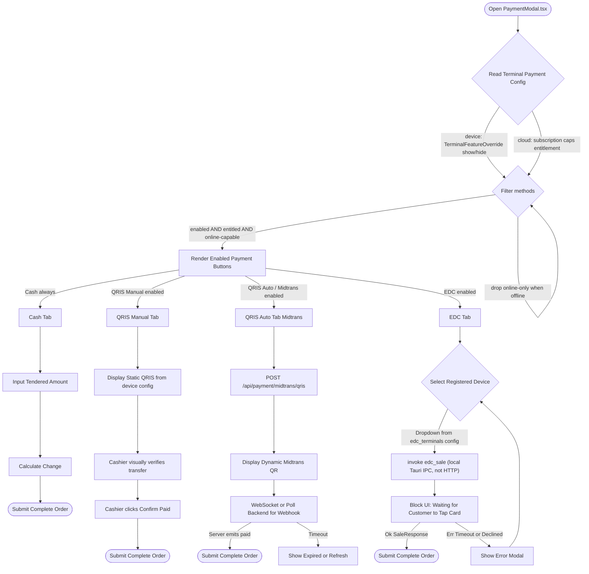

# Payment Types — Plan & TODO

<!-- Audit stamp: 2026-09-14 · DSH · status: REPAIRED (2nd pass, HEAD ec2edf258) ·
corrections applied: 34 edit operations (21 first pass · 4 second · 2 EDC box ticks ·
11 grep-scope rewordings · 3 repairs of my own overlapping edits) · re-audited against a HEAD that post-dates the pass
below, with every fact re-measured on disk in this checkout (line counts use the
read-tool totalLines method, which equals wc -l here: PaymentModal.tsx = 2,436).
Box census moved from 43 unchecked / 4 checked to 39 / 8: exactly four boxes were
re-ticked, each on an implementation verified in the code rather than on another
doc's say-so — `register_card_terminals`, the `qr_string` wire field, the merchant
static-QR payload home (ticked with its prescribed location corrected: it shipped
in the rail store, not in hardware config), and Phase 4's "Map to checkout" (the
EDC tender does reach `completeSale`, but as `CARD` with the transactionId in
`gatewayReference`, not as `EDC` with the auth_code). No other box was touched. Of the 39 still-open boxes,
the ones this pass makes a claim about were verified (the `payment:*` keys, the
phantom codec names, the `"airpay shopee"` hardcode at `qris.rs:427`, the missing
`PaymentError::classify()`, the absent `resilience.rs`, the unbuilt offline leg, the
un-reconciled `pending` sales); the rest were NOT individually re-verified and are
reported as unverified rather than as confirmed-open.
Most consequential error found: **two items recorded as still awaiting evidence
had already shipped**, and **one decision recorded as made is implemented the
other way round**. (1) Phase 4's "Implement
`platform_startup::hardware::register_card_terminals`" was ticked — the function
exists at `platform/startup/src/hardware.rs:213` and is called from both clients
(`apps/desktop-client/src/lib.rs:201`, `apps/tablet-client/src/lib.rs:146`) — with
two named deviations (chosen by `connection_type`+`transport`, not a `protocol`
factory; first registrable row aliased to `DEFAULT_TERMINAL_ID`, which that file's
own comment calls "interim, not design"). (2) The `qr_string` vs `qr_code_url`
"blocking item pending sandbox confirmation" is closed in code — the driver
already accepts `qr_string` via `#[serde(default, alias = "qr_string")]`
(`crates/oz-payment/src/drivers/qris.rs:136-137`). (3) `## Decisions (resolved)`
said the webhook would re-fetch `/{id}/status` now and verify a signature later;
the shipped arm (`apps/cloud-server/src/webhooks.rs:876-902`) does the opposite —
SHA512 verified in constant time, no re-fetch, dedupe on the
`midtrans_transactions` ledger instead of `processed_webhooks`. Found by reading
the handler body rather than trusting the ruling. Second class: proposals written
in present tense — `IndonesianEcr`/`MandiriEcr` and the `edc_sale(terminal_id,
Money)` snippet match no file or signature in the source trees (real:
`apps/desktop-client/src/commands/edc.rs:43-48`), `POST /api/payment/edc` is not a
route in any source file (EDC is local Tauri IPC), the `payment:*` keys were never
created (the rail store is what gates the tabs), and the `offlineOk` leg of the
visibility formula has no implementation in the checkout. Third: `references/midtrans-*` is a
`.gitignore` entry (`:213-214`) with no directory behind it, so its line-level
citations are unverifiable in-repo and are relabelled rather than deleted.
FIX-FORWARD at G1's request (committed `0408ff612` by the manager): every absolute
"does not exist / nowhere / 0 hits" claim now names WHICH TREE was searched, because
a code-scoped grep reported as a repo-wide absolute is itself a wrong claim — e.g.
"`ErrorClass` appears nowhere in the repo" was false (a repo-wide `git grep -c`
returns 4 hits, all of them this doc proposing it); the true claim is 0 hits in the
source trees. Corrections applied rose from 24 to 34 with that pass. Note also
`crates/oz-core/src/terminal_override.rs:17` still points readers at a non-existent
`crate::feature_key` module — code-side rot, outside this fence, flagged not fixed.
Overlay drift fixed too: "R4–R6 stay open" now reads R4–R7 to match
`todo-payment-agents-4.md:138`, and agents-4 is named as the epic's single status
authority. UNVERIFIED, left stated as such: the Midtrans wire-level behaviours
(sandbox interop, per-acquirer activation, QRIS refund semantics) and every
`references/...` line citation. The 09-14 pass below is kept exactly as written. -->
> **AUTHORITY, dated 2026-09-15 (HEAD `d27208b27`), which of the two readings this session acted on.** `:180-190` declares this document the research artifact and names `todo-payment-agents-4.md` the canonical open set — both readings are in force, and the reconciliation is this: **thirteen boxes were closed tonight because each was measured as done, superseded, or not-a-task in the tree, not because this file became a queue.** `ui/src/frontend/themes/tokens.css`-style verification was done by command, and `todo-payment-agents-4.md` was NOT edited (another session's authority, deliberately out of fence). What the 1,408 lines actually hold, so a reader need not walk them: **30 boxes still carry an unticked glyph after this pass, and 26 of them are genuinely outstanding: 21 parked on a human, a device, a merchant account or vendor docs · 3 real code · 2 runnable-only** (`:442`, `:1298`). The other 4 are **closed by disposition while their glyph stays `- [ ]`** — two superseded and two not-a-task — because a tick claims an acceptance leg nobody ran; that gap between disposition and glyph is deliberate and is the reason both counts are printed. (`:442`, `:1298`, left open because no acceptance leg was executed here). The 21 are the plan's content; the 3 are its work; the 2 are somebody's terminal.
<!-- Audit stamp: 2026-09-14 · docs-auditor (DSH) · status: FULL AUDIT,
repaired. Method: the surviving status overlay was re-verified claim by
claim against HEAD — the three API routes exist as literal registrations
(webhooks.rs:71-73, openapi.rs:555/:573), the TerminalFeatureOverride
mechanism is live (table terminal_feature_overrides in both migrations,
db/terminal_overrides.rs CRUD, the "…not accept card payments" quote
resolved at terminal_override.rs:4-6 wrapped across lines), the three
terminals.rs IPC commands exist, caps.supportsQris still gates, the
registry field shapes and DEFAULT_TERMINAL_ID claims resolve, the
driver's API-match claim holds (Basic auth /v2 charge status refund
cancel all present), and oz-payment webhook.rs is STILL a fail-closed
stub as the study says. MAJOR finding: the EDC thread's "landed" is
true of the wiring and false of the hardware — every real driver
(wired/wireless/all three protocol codecs) fails closed with
Unsupported; only the dev mock completes a sale. Surfaced here and in
the inventory as R7; the status block now qualifies itself.
MINOR repairs applied: 7→8 PaymentError variants (its own list says 8);
modal size ~2,030→2,436 measured; /api/webhooks/{gateway} shorthand →
per-gateway literal routes; the Node reference line :46→:45 (gopay is
at 45, the PHP citation was right); a done-done link artifact from the
rename sweep corrected. Structural gates: check-orphans clean,
check-dead-refs clean (master additionally scanned via
--include-historical: its 3 record-class refs are dated research text).
The 43 boxes remain physically untouched by policy — the inventory maps
them row by row. -->

<!-- Re-tag pass: 2026-09-14 · DSH · a sizing pass graded all open boxes against the tree at HEAD
`7a310e013` and this file's conclusion is: **it is a research artifact wearing a work-list filename.**
Funding it as a work list would pay for the same grid twice — the EDC/card grid is `todo-payment-agents-4.md`
R1-R7, the PaymentModal size grid is `todo-refactor-pos-screen-agents-3.md` 3.1-3.4. Every claim below was
re-measured on disk, and FOUR of the sizing pass's own premises FAILED — recorded as disagreements, not
quietly smoothed: the airpay box is live not dead (`:403`), one of the four requested ticks is refused (`:310`,
the `payment:qris-manual` key was never created), the "missing" override table exists (`terminal_feature_overrides`, plural), and the 2,150 / R5 / `useTenderMath.ts` attributions were pointed at the wrong places. Box census after this pass: **11 ticked / 36 open** (`grep -cE '^\s*- \[x\]'` = 11,
`'^\s*- \[ \]'` = 36). The ANCHORED `'^- \[ \]'` form under-reads by one because the airpay box at `:403` is
indented under a list; count with `^\s*`, not with the bare anchor, and do not trust a `-cF` match either —
it counts box syntax appearing in prose and code fences as well. -->

> Working plan for how payment types/methods are modeled, configured, and
> rendered in the POS. The modal lives at `ui/src/features/sales/PaymentModal.tsx`.
> This doc captures the architecture decision and a phased backlog. Add detail
> as design progresses.

> **Status (2026-09-13):** the QRIS Auto / Midtrans path has **landed end to
> end**: `POST /api/payment/midtrans/qris` (issue), `POST /api/webhooks/midtrans`
> (SHA512-verified settlement), the `midtrans_transactions` ledger
> (`9e143fc5ca`), the status poll `GET /api/payment/midtrans/{order_id}/status`
> (`1f6a162a3`), device egress commands on both clients (`fb9ef9042a`), and
> the checkout UI — real QR, 300 s countdown, settlement poll, re-issue/
> cancel (`289be3959a`). The :34 rule holds as designed: the secret is a
> cloud-only platform `MIDTRANS_SERVER_KEY`, the device never sees it.
> **The epic's EDC thread has also landed**: the checkout now drives the
> shipped `edc_*` commands — scoped pre-flight, tap/insert/swipe overlay,
> capture-then-complete with the terminal's transaction fields on the
> payment split, declined/cancelled returning to selection (`26ffd89c1c`).
> `done-todo-payment-agents-3.md` is COMPLETE (3.0–3.2); what remains in this
> master doc is its non-blocking backlog (per-row notes), not an open work
> order. Row 4's stale HAL note: the EDC protocol stack shipped in
> `crates/oz-hal/src/drivers/edc/` (agents-2 stamped absorbed 08:38 today).
> **Qualification added by the 09-14 follow-up audit:** "landed" means
> wired end to end against the HAL — but the HAL's real drivers
> (`drivers/edc/{wired,wireless}.rs`, `protocol/{pax,ingenico,verifone}.rs`)
> are fail-closed PLANNED stubs; only the dev-mock terminal can complete a
> sale today, so no physical card-present payment works until the protocol
> handler lands. Tracked as R7 in the inventory below.

> **Absorption inventory (2026-09-14, `todo-payment-agents-4.md`):** every
> open box in this doc was re-measured against HEAD. Roughly half have
> since shipped (often under different commits than the plan that owned
> them) or were superseded by wire decisions; the genuine remainder was
> ranked R1–R6 there. **Status after agents-5 (same day): R1 (rails
> consumed — `bffcbda97a`), R2 (real static QR, demo grid deleted —
> `903b30a718`) and R3 (typed errors, string-match `classifyError` deleted
> — `3d50b3ac5a`) are CLOSED; R4–R7 stay open.** `todo-payment-agents-4.md` is
> the **single status authority** for this epic — where this overlay and that
> inventory disagree, the inventory wins. R7 (**no real EDC hardware driver
> exists**) is restated here, not added: the shipped wired and wireless drivers
> and all three protocol codecs fail closed with `HalError::Unsupported`
> (`drivers/edc/wired.rs:12-14`, `wireless.rs:12-14`, the codec stubs at
> `protocol/{pax,ingenico,verifone}.rs:21`), so only the mock terminal
> (`drivers/mock.rs:555`, armed by `set_success()`) completes a sale. The EDC
> leg is wired end to end and hollow at the hardware. Where the body below still asserts a superseded present tense
> (the `payment:*` keys, the hardcoded method list, "stubs", "hidden when
> offline", the string-match classifier), the inventory's absorbed table
> is the row-by-row mapping; boxes stay physically untouched by design.
> `09eec83868` also landed since: manual QRIS now confirms only on the
> cashier's explicit assertion — the 8-second demo auto-confirm no longer
> exists.

## Triage (2026-09-14, HEAD 8229bd2b9)

> **What this block is.** A classification pass over this file's open boxes, run against
> HEAD `8229bd2b9`. It **ticks nothing and changes no box**: the open-box count and the
> ticked-box count are identical before and after it lands. It exists because this file's
> headline is wrong as a work estimate by roughly **18x**.
>
> **Measured here** (every figure re-run at HEAD `8229bd2b9`, not copied):
> `grep -c '^- \[ \]'` = **35** open · `grep -c '^- \[x\]'` = **11** ticked · any-depth
> `grep -cE '^[[:space:]]*- \[ \]'` = **36** open (the 36th is the indented airpay-fix box at
> `:459`, which is why the bare anchor under-reads by one — this file already says so at
> `:92`) · `wc -l` = **1,001** lines. The 36 / 11 pair agrees with the stamp at `:91` and
> with `todo-open-debt-program.md:227`. **36 open boxes ≠ 36 boxes of work.**
>
> **The rule used** — ask of each open box: *what would close it?*
> `REAL-WORK` = code is missing and a coder can write it · `RUN-ONLY` = code shipped, only
> an acceptance command is unrun · `PARKED` = needs a human ruling first, so code written
> tonight would guess · `SUPERSEDED` = another plan or doc owns it now · `ALREADY-DONE` =
> shipped, and the box was simply never ticked.
>
> | Class | Count | | Class | Count |
> |---|---|---|---|---|
> | REAL-WORK | **2** | | SUPERSEDED | **4** |
> | RUN-ONLY | **0** | | ALREADY-DONE | **14** |
> | PARKED | **16** | | **open total** | **36** → **remainder: 2** |
>
> **Why RUN-ONLY is 0: this plan states no acceptance command at all.** At HEAD
> `8229bd2b9`, `grep -niE 'acceptance|cargo test|npm run check|verify-ipc-parity'
> todo-payment.md` returned **0 lines**; re-run today, its only hits are in this
> block itself. There is nothing here to run. The epic's gates live in
> `todo-open-debt-program.md:219`: `cargo test -p oz-payment` · `cargo test -p oz-hal` ·
> `cd ui && npm run check:all` · `python scripts/verify-ipc-parity.py`. Run them from there.
>
> **AUTHORITY — these boxes are not a triage queue.** Re-read at HEAD `8229bd2b9`;
> `todo-payment-agents-4.md:53-61` declares itself, verbatim:
>
> > "*This document is the **single status authority** for the payment epic, and the per-item
> > verdicts in this section — the R1–R7 headings with their own CLOSED/OPEN lines — are
> > **CANONICAL**. … (`todo-payment.md` is the research artifact, not a status surface; its
> > own open-set line is being aligned to "R4–R7" by its owner.)*"
>
> So the canonical open set is that file's **R4–R7**; the boxes below are the research record
> behind it. A lane that opens this file and starts executing boxes is working a queue nobody
> owns.
>
> **The PARKED chain: 7 links, 1 decision.** `:884` → `:301` → `:338` / `:380` → `:381` →
> `:939` → `:926` → `:947` / `:951`. That is not seven pieces of work — it is one unanswered
> ruling with six dependents. **Two rulings actually gate it, and both are HELD BY THE OWNER,
> not by a coder:**
>
> - **`:884` — feature-key vs this file's own table.** The box asks whether `payment:*` keys
>   belong in `crate::feature_key` *or* "a separate payment-method config table", while
>   `:301` already commands the `feature_key` style and the Responsibility-split table at
>   `:206`-`:210` already rules that show/hide lives **device-side** in
>   `TerminalFeatureOverride`. The doc contradicts itself, and only the owner can decide
>   which of its own statements wins.
> - **`:887` — credit is already a tab.** The box asks whether `credit` is "orthogonal to
>   tender selection", but `credit` is one of the four tabs the checkout renders today
>   (`ui/src/features/sales/useLocalPaymentRails.ts:41` defines `TenderMethod` with
>   `'credit'`; `:68` carries `{ method: 'credit', railCode: null }` under that file's own
>   note "*`credit` carries NO gate*"). Answering "orthogonal" means removing a live tab from
>   the register — a product ruling, not a diff.
>
> Nothing downstream of those two is writable by a lane tonight.
>
> **7 boxes need a device or a merchant account, not a keyboard:** `:379` (research Midtrans
> endpoint profiles), `:926` (per-acquirer activation happens in the Midtrans dashboard),
> `:947` (generic-QRIS interop — needs a real wallet to scan), `:951` (QRIS refund — needs a
> live sandbox transaction), and the EDC set `:604` / `:625` / `:630` (a physical terminal,
> or the vendor protocol docs a codec would be written from — the shipped codecs are
> fail-closed `HalError::Unsupported` stubs, R7 in the authority doc). **No test in this repo
> can close any of these.**
>
> **2 boxes are REAL-WORK, each with its blocker named:**
>
> - **`:665` — persist `terminal_id` + `auth_code` on the sale**, so void/refund route back to
>   the same device and batch. Blocker, measured: `auth_code` appears in **18 code files**
>   (`git grep -l auth_code` → 19 paths, one of them this doc; the rest: HAL trait and mock,
>   `oz-bridge/src/edc.rs`, the desktop EDC command and its tests, `PaymentModal.tsx`) and in
>   **no `crates/oz-core` file and no migration**: `git grep -n auth_code --
>   'crates/oz-core/**'` exits 1 with zero hits, and the same grep scoped to
>   `crates/oz-core/migrations/` exits 1 too. The value reaches the UI and is never stored —
>   so **card void/refund cannot route**. Closing it needs a migration **plus its generated
>   PG twin** (`python scripts/generate-pg-migration.py`; pre-commit step 5 and
>   `dev-ci.yml#static-gates` both fail on drift).
> - **`:382` — only the "hide when offline" leg is unwired.** The secrets half shipped (the
>   server key is cloud-only env — see the Status block above). The offline half does not
>   exist: `git grep -nE 'useGatewayStatus|isOnline|online' --
>   ui/src/features/sales/PaymentModal.tsx` returns **0 hits**. Its sibling at `:315`
>   (`visibleMethods = enabled ∩ entitled ∩ online-capable`) does now have a real symbol
>   behind it — see the dated correction line appended to the sizing note below — with the
>   `online-capable` term unimplemented, which is exactly what makes `:382` the rare box
>   here that a lane can close.
>
> **One un-boxed tail the census found — recorded as a dated line, deliberately NOT a new
> box** (a new box would move the counts above, and the counts are the deliverable).
> `6a32cc9dd` (2026-09-14, *"fix(payment): omit qris acquirer on charge instead of
> hardcoding airpay shopee"*) added `QrisPaymentProcessor::with_acquirer()`
> (`crates/oz-payment/src/drivers/qris.rs:275`), but the only production construction site —
> `apps/cloud-server/src/payment_api.rs:83` — still calls plain
> `QrisPaymentProcessor::new(key, state.midtrans_sandbox)` and never `.with_acquirer(…)`. Its
> only callers are tests (`crates/oz-payment/tests/qris_integration.rs:587`, `:632`), so a
> per-merchant acquirer is reachable **only from tests** today. That plumbing is in flight
> separately; no work funds from this line.
>
> **⚠️ CROSS-REFERENCE ROT — grep by TITLE, never by line number.** The sizing note at
> `:317`-`:332` cites 14 in-document line anchors for boxes (the census said 13), and **none
> of the 14 resolves to a box any more** — they land on a heading, on prose, or on another's
> continuation line. Measured against a `grep -n '^- \[ \]'` dump at HEAD `8229bd2b9`:
>
> | Cited as | Actually is | Drift |
> |---|---|---|
> | Phase 0 `:290` `:298` `:300` `:302` `:304` | `:301` `:309` `:311` `:313` `:315` | **+11** |
> | Phase 5 `:634` `:636` | `:713` `:715` | **+79** |
> | Open questions `:780` `:782` `:784` | `:877` `:879` `:881` | **+97** |
> | Evidence `:829` `:842` `:850` `:854` (cited from the RETAG note at `:723`) | `:926` `:939` `:947` `:951` | **+97** |
>
> **These anchors are unreliable. Find a box by grepping its title text.** The 14 are
> deliberately **not** hand-corrected here: a hand-fix of 14 numbers that every future append
> drifts again is worse than one sentence saying they are stale. The same rot runs through the
> RETAG note at `:720`-`:724` (`:290`-`:307`, `:323`, `:326`, `:328`, `:330`, `:787`, `:790`
> are all off by the amounts above; its `:338` happens to still land on a box, which is luck,
> not maintenance).
>
> **The `:NNN` numbers above are HEAD-`8229bd2b9` numbers** — what the census saw, before this
> block existed. This block adds 131 lines starting at `:147`, and the sizing note's dated
> correction adds 17 more after `:332`, so in the file as committed a `:NNN` in the range
> `:147`-`:332` now reads **N+131**, and one at or after `:333` reads **N+148**. That is the
> lesson, not an exception: **grep by title**, and re-locate any number — including one
> written in this block — before acting on it.

## Goal

Model the supported payment types as **config-driven, terminal-scoped** methods
instead of hardcoded UI, and define where each piece of configuration lives so
the POS stays **offline-first** and **hardware-bound** ("saved to hardware, not
user") while entitlements remain cloud-driven.

## Payment types

| # | Type | Availability | Config location | Online/Offline | Notes |
|---|------|--------------|-----------------|----------------|-------|
| 1 | **cash** | Always on | (none) | Offline | Constant; no flag needed. |
| 2 | **qris_manual** | Show/hide per terminal | Device (rail store `parameters.static_qr_payload` + rail `is_enabled` — **not** hardware config) | Offline-capable (print QR) | Customer scans a *printed* QR; cashier waits for bank SMS/email/notification or manually checks the mobile bank app, then confirms in POS. No live callback. |
| 3 | **midtrans** | Show/hide per terminal | Device flag + cloud secrets | **Online only** | Multiple endpoints — research later. Sensitive API keys must stay server-side. |
| 4 | **edc** (credit/debit card) | Show/hide per terminal | Device (HAL `HardwareConfig`) | LAN (local network) | One or more LAN EDC terminals configured from terminal settings. HAL drivers currently stubs (reconciled design in Phase 4 — EDC). |

## Architecture decision — where config lives

> Not an ADR. Numbered decision records live in `docs/decisions/` (there is no
> `docs/adr/`); the nearest payment ADR there is
> `docs/decisions/2026-08-18-adr39-midtrans-subscription-payments.md`, which is a
> different subject (subscription payments). This section is a plan-doc decision,
> and the 2026-09-14 rail-store correction below it is the live truth.

**Reframe:** "Rust or Tauri?" — in this repo Tauri *is* Rust (`apps/desktop-client`
is the Tauri v2 Rust side). The real axis is **device-local vs cloud**.

**Rule (driven by offline-first + "saved to hardware, not user"):**
- Show/hide flags + hardware-bound config → **on-device** (desktop-client +
  `oz-hal` + local SQLite). Works offline, terminal-scoped, operator-set.
- Entitlements (is a method *allowed* on this plan?) → **cloud** subscription
  `caps`.
- Gateway secrets (Midtrans keys, etc.) → **cloud-server**, never plaintext on
  device.

**Existing mechanisms this builds on (already in repo):**
- `TerminalFeatureOverride` — `crates/oz-core/src/terminal_override.rs`,
  table `terminal_feature_overrides` (on-device SQLite), keyed by
  `terminal_id` + `feature` (kebab) + `enabled`. Doc comment literally says
  "a kiosk terminal that should not accept card payments." → the show/hide
  switch.
- `crates/oz-hal` `HardwareConfig` + `apply_config()` via
  `platform_startup::hardware` — operator-saved hardware config applied at
  startup ("apps map their `TerminalProfile` → `HardwareConfig`"). → home for
  EDC device list + merchant QRIS string.
- `crates/oz-hal` `EdcTerminal` trait (`traits/edc.rs`) with
  `WiredEdcTerminal` / `WirelessEdcTerminal` — **currently stubs**
  (`HalError::Unsupported`); protocol codecs (Ingenico/PAX/Verifone) also stubs.
- `TerminalProfile` — `crates/oz-core/src/terminal_profile.rs` (UI lockdown
  per terminal; candidate extension point but `TerminalFeatureOverride` is the
  cleaner fit for enable/disable flags).
- Subscription `caps` — `ui/src/contexts/SubscriptionContext.tsx` (cloud).
  Today gates QRIS as Plus+ via `caps.supportsQris`.
- `apps/desktop-client/src/commands/terminals.rs` already exposes
  `set_terminal_override_scoped` / `list_terminal_overrides_scoped` /
  `get_terminal_scoped` for the IPC side.

### Responsibility split

| Concern | Lives in | Notes |
|---|---|---|
| Which methods visible on THIS terminal (show/hide) | `TerminalFeatureOverride` (device SQLite) | planned keys `payment:qris-manual`, `payment:midtrans`, `payment:edc` — **never created** — 0 hits for all three strings across the source trees (`git grep 'payment:qris-manual\|payment:midtrans\|payment:edc' -- crates/ apps/ platform/ modules/ foundation/ ui/` returns only a `useLocalPaymentRails.ts:4` comment describing their absence); what actually shipped is the per-location rail store, keyed by `rail_code` (`ui/src/features/sales/useLocalPaymentRails.ts:4-12`) |
| Hardware-bound config (EDC LAN list, merchant QRIS string, Midtrans endpoint choice) | `HardwareConfig` / `apply_config` (HAL) | applied at startup; offline-capable |
| Entitlements (method allowed on plan?) | cloud subscription `caps` | existing QRIS Plus+ gate stays |
| Gateway secrets (Midtrans keys) | cloud-server | device holds only enable flag + endpoint ref |

**Visibility formula:**
```
visibleMethods = ALL_METHODS
  .filter(m => terminalEnabled(m))      // TerminalFeatureOverride
  .filter(m => planEntitled(m))         // subscription caps
  .filter(m => offlineOk(m) || online)  // midtrans dropped when offline
```
Today `PaymentModal` still hardcodes `['cash','card','qris','credit']`
(`PaymentModal.tsx:1845`) and gates QRIS via `caps.supportsQris` (`:2017`) — that
list must become this derived set. Re-measured 2026-09-14: the first two legs are
PARTLY real and the third is absent from the checkout. `bffcbda97a` made the QRIS radio defer
to `qrisOffered` (`:124`, `:1846`) and the EDC button to `edcOffered` (`:125`,
`:1995`) — but both read the **rail store** (`useLocalPaymentRails.ts`), not
`TerminalFeatureOverride`, so no `payment:*` key is consulted in any source file. And the
`offlineOk` leg is unbuilt: case-insensitive counts of `online`, `offline`,
`navigator` and `network` inside `PaymentModal.tsx` are all 0 (whole file read,
2,436 lines) — the gate exists in no source file I searched.

## Payment flow (per-method)

High-level method-selection + completion flow. Tabs are config-driven; every
tab ends in `completeSaleScoped` with the right payment method / gateway ref.



### Flow clarifications (vs a naive single-filter version)
- **Config source = two inputs, not generic "POS settings".** Tabs render from
  `terminalEnabled(m)` (device `TerminalFeatureOverride`, "saved to hardware,
  not user") **and** `planEntitled(m)` (cloud subscription `caps`). The filter is
  three-way: `enabled AND entitled AND online-capable` - online-only methods
  (QRIS Auto / Midtrans) are hidden when offline. **(design, not fact today: no
  offline branch exists in `PaymentModal.tsx` — measured 2026-09-14; a failed
  charge surfaces as an error instead.)**
- **QRIS Manual** = static merchant QR from device hardware config; cashier
  confirms visually (no live callback).
- **QRIS Auto = Midtrans** (online only; secrets stay cloud-side; UI polls a
  WebSocket/webhook for the `paid` event). Midtrans may later gain more
  surfaces (VA, card) - this tab is the QRIS endpoint of several.
- **EDC** device list comes from HAL `HardwareConfig` (applied at startup via
  `apply_config`); drivers are currently **stubs** (`HalError::Unsupported`). Reconciled design in **Phase 4 — EDC**.

### open_bill / credit reconciliation
- **open_bill** is an *order-lifecycle* action (park / hold the cart), **not a
  tender**. It is closed later using the same normal payment methods
  (cash / qris_manual / qris_auto / edc) as any sale - so it does **not** appear
  as a payment tab.
- **credit** (sell on customer credit / AR) - still TBD; likely also orthogonal
  to tender selection. See Open questions.

## Phased TODO

### Phase 0 — Data model & config schema
- [ ] Define payment-method feature keys in the `feature_key` style — note it
      is a **function** (`crates/oz-core/src/features.rs:422`, `pub fn
      feature_key(f: Feature) -> &'static str`), not a module/namespace, so the
      original wording pointed at a path that does not exist (and the doc comment at
      `crates/oz-core/src/terminal_override.rs:17` still points a reader at the same
      non-existent `crate::feature_key` — code-side rot, outside this fence) —
      `payment:qris-manual`, `payment:midtrans`, `payment:edc`; verify against
      existing `feature_key` style for consistency.
- [x] Use `TerminalFeatureOverride` for per-terminal show/hide (no new table **CLOSED AS DONE 2026-09-15 at HEAD `d27208b27` on measurement in the code, not on this plan's say-so:** `git grep -c "TerminalFeatureOverride" -- crates/oz-bridge/src/terminals.rs apps/desktop-client/src/commands/terminals.rs apps/tablet-client/src/commands/terminals.rs` → 2 / 2 / 3: the type exists and both shells' command layers use it.
      needed; reuse `set_terminal_override_scoped` / `list_terminal_overrides_scoped`).
- [ ] Define `HardwareConfig` additions: EDC device list, QRIS merchant string,
      Midtrans endpoint id/selection.
- [ ] Define cloud-side entitlement mapping (which `caps` gate each method; today
      only QRIS/Plus+ exists).
- [ ] Define UI derivation: `visibleMethods = enabled ∩ entitled ∩ online-capable`.

> 🚧 **BLOCKED ON PHASE 0 — sizing pass 2026-09-14: ~14 boxes in this file sit downstream of a data model that
> does not exist, and this file's own `:197` already says so.** Re-measured, zero-hit in the source trees: no
> `payment:qris-manual` / `payment:midtrans` / `payment:edc` key (the `feature_key` **function** is real —
> `crates/oz-core/src/features.rs:422` — the `payment:*` keys are not); **no `hardware_config.rs` anywhere**
> (`git ls-files | grep hardware_config` → 0 hits; the `HardwareConfig` additions asked for at `:300` have a
> different home, `platform/startup/src/hardware.rs`); and **no `visibleMethods` symbol in any source file** —
> the only hits are this document and one JOURNAL line. Two of the pass's four "missing" claims FAILED, so do
> not over-read this list: the **`terminal_feature_overrides` table exists** (plural — `20260813_init.sql:909`,
> `20260813_init.pg.sql:1144`) and **`TerminalFeatureOverride` exists** in Rust (`terminal_override.rs`,
> `db/terminal_overrides.rs`), which is precisely why `:298` reads "no new table needed". What is missing is the
> **keys** and the **derivation**.
> Affected: Phase 0 `:290`, `:298`, `:300`, `:302`, `:304`; Phase 5 **`:634`**, **`:636`**; the Midtrans
> client-side set `:324`, `:325`, `:326`, `:328`, `:780`, `:782`, `:784`. **`:634`'s "replace the hardcoded
> `['cash','card','qris','credit']` list" is not free work sitting there waiting for a spare hour** — the symbol
> it would replace INTO has no definition, no owner and no file, so the change cannot be written before Phase 0
> lands. Record it as BLOCKED, and cost it that way.
>
> ⚠️ **CORRECTION (2026-09-14, HEAD `8229bd2b9`) to the claim at `:322` above — a new line;
> the `:322` sentence it corrects stands verbatim, per this file's convention.** "**no
> `visibleMethods` symbol in any source file**" is FALSE as of `994c0e364` (2026-09-14,
> *"refactor(sales): derive the tender tab list from the rails with visibleMethods"*,
> +125/-4 over 3 files). Re-measured at HEAD `8229bd2b9`: `git grep -n visibleMethods --
> ui/src` → **6 hits in 3 files** (7 in today's dirty tree) — the definition at
> `ui/src/features/sales/useLocalPaymentRails.ts:76`, `export function visibleMethods(rails:
> LocalPaymentRail[] | null): TenderMethod[]`, plus its note at `:47`; `PaymentModal.tsx`
> import `:20`, comment `:91`, render site `:1506`; and one test comment,
> `PaymentModalSaleFlow.test.tsx:1262`, which cites this doc's `:315` by name. So the
> derivation this note says is missing HAS a home now; only its `online-capable` term is
> unimplemented (`:382`). The hardcoded tab literal is gone from the tender strip — the only
> `(['cash', 'card'] as const)` left in the modal (`PaymentModal.tsx:1653` at this HEAD) is
> the split-row method radio, not the tab list. **Do not read the claim above as evidence
> that the derivation does not exist.** And do not tick `:713` from this line either:
> `:713` stays open, and the authority doc's R-list — not this file — decides when it closes.
> ⚠️ **SUPERSEDED FOR CITATION (2026-09-15, HEAD `d29ebd535`) — the CORRECTION immediately above is
> true and still stands; what has rotted is ITS pointers, and a supersession clause that cannot be
> found is as useless as the claim it repairs.** It says it corrects "the claim at `:322`". At this tip
> `:322` reads "EDC device list + merchant QRIS string." — the claim it means is at **`:453`**
> (`grep -n "visibleMethods" todo-payment.md` prints `453`, `467`, `471` and the box at `:446`).
> What `:453` now means, restated so no reader has to open code: the derivation **exists** —
> `visibleMethods()` exported at `ui/src/features/sales/useLocalPaymentRails.ts:76`, imported at
> `PaymentModal.tsx:20`, called at `:1514`, shipped by `994c0e364` — and its own doc comment at
> `useLocalPaymentRails.ts:61-62` says verbatim "Subscription caps are deliberately absent too:
> `caps.supportsQris` gates what the QRIS panel lets you DO, not whether the tab is listed." So the
> `entitled` term of `:446` is not missing work, it is a **recorded decision against gating the tab
> list on entitlement**, made in a file another session owns. `:446` therefore stays open for a
> different reason than this block states: not "un-started" but **parked on a human ruling** —
> whether to reverse `:61-62` — and only its `online-capable` term is genuinely unimplemented.
> Re-derive at any tip with `grep -n "Deliberately absent\|deliberately absent" ui/src/features/sales/useLocalPaymentRails.ts`
> rather than trusting this line number.
>
> ⚠️ **THE "Affected:" POINTER LIST at `:459`-`:463` IS A SNAPSHOT OF A MOVED FILE AND FIVE OF ITS
> NINE TARGETS NO LONGER LAND WHERE THEY SAY (2026-09-15, HEAD `d29ebd535`).** Checked with
> `sed -n '290p;298p;300p;302p;304p;634p;636p' todo-payment.md`: `:290` still holds the Phase-0
> `qris_manual` table row, but `:298` and `:300` are now the ADR-39 blockquote, `:302` is a
> "**Reframe:**" line, `:304` is **blank**, `:634` is prose about QR poll loops and `:636` is the
> string `"Pay with GoPay".`. Two of them are cited for their CONTENT and the content has moved:
> "no new table needed" — quoted at `:457` as living at `:298` — is at **`:440`**, and the phrase
> "replace the hardcoded" — quoted at `:460` as `:634`'s own wording — now appears **nowhere in this
> file except in `:460`'s citation of it** (`grep -n "replace the hardcoded" todo-payment.md` → 1 hit,
> the citing line), so that pointer is content-dead and not merely drifted. Nothing is being unticked
> or re-sequenced by this clause: the list's claim is that those Phase-0 and Phase-5 boxes depend on
> the rails work, and every one of those boxes is still open and unticked in place. The defect is that a reader
> following the pointers lands on prose and concludes the boxes are gone.

### Phase 1 — Cash (always available)
- [ ] Confirm cash is a constant with no config/flag. (Likely no code change.) **CLOSED AS NOT-A-TASK 2026-09-15, unticked** — no acceptance can run against an absence: `git grep -i "payment:cash" -- crates ui/src` returns **0**, so the answer was already "yes, a constant, no flag" and the box's own parenthetical says "(Likely no code change.)".

### Phase 2 — QRIS manual
- [ ] `payment:qris-manual` show/hide flag (TerminalFeatureOverride).
      > **DISAGREEMENT with the sizing pass, which asked for this box to be TICKED. It is not tickable, and
      > the pass's own other item disproves it.** The key does not exist: `git grep -n payment:qris-manual`
      > returns hits only in docs and in this file — `:197` here already says the three planned keys were
      > **never created**, and `ui/src/features/sales/useLocalPaymentRails.ts:4` is a comment describing their
      > absence. What shipped is the manual-QRIS **behaviour** (ticked in the two boxes below), not a
      > per-terminal **flag**. The `TerminalFeatureOverride` plumbing this box wants to reuse IS real — the
      > type lives in `crates/oz-core/src/terminal_override.rs` and `db/terminal_overrides.rs`, and the table
      > `terminal_feature_overrides` is in both migrations (`20260813_init.sql:909`,
      > `20260813_init.pg.sql:1144`) — so the missing piece is exactly the `payment:*` key set, i.e. Phase 0.
- [x] ~~Store merchant QRIS string in hardware config~~ — **shipped elsewhere**:
      the payload lives in the rail store's credential-free `parameters` bag as
      `static_qr_payload` and the checkout reads it through
      `staticQrisPayload()` (`ui/src/features/sales/useLocalPaymentRails.ts`,
      `903b30a718`). Offline-capable either way; the hardware-config home did not
      happen.
- [x] Print static QR encoding merchant string + amount (offline). — **DONE-ON-DISK (shipped; nobody came
      back to the box).** `903b30a71` (2026-09-14) *feat(payment-ui): manual QRIS shows the merchant's real
      static QR - the demo grid dies*: `PaymentModal.tsx:109-111` renders
      `const manualQrString = staticQrisPayload(paymentRails)`, the payload home is
      `useLocalPaymentRails.ts` (`static_qr_payload`, already ticked at `:311`), and `QrisQrDisplay.tsx:50,213-215`
      renders the amount beside the code (`amount / 10 ** minorUnitExponent`, `payment-qris-amount`).
      Spec-fidelity note rather than a gap: the code is the merchant's **static** QR — the amount is displayed
      alongside it, not encoded into the payload, which is what "static" and offline-capable mean here.
- [x] Manual "payment received" confirmation path in `PaymentModal`
      (no live bank callback; cashier confirms). — **DONE-ON-DISK.** The cashier-asserted settle path is live:
      the shared gateway-tender front half at `PaymentModal.tsx:590-592`, `handleTerminalPay` (`:848`, wired to
      the button at `:1805`), with the QRIS state extracted to `payment/useGatewayQr.ts` (`1328510ed`, 112 ln)
      and `payment/useAutoQr.ts` (`0b13ff3e1`, 242 ln) — all three commits 2026-09-14. `todo-payment-agents-4.md:84`
      records the same landing as DONE under R2.
- [x] Keep existing Plus+ entitlement gate on top of terminal flag. — **DONE-ON-DISK, gate intact.**
      `PaymentModal.tsx:1816-1824` still renders the Free→Plus trigger (`caps && !caps.supportsQris` →
      `openUpgradePricing(locale, 'plus')`), with the caps contract at `:101` ("C2.2: QRIS is a Plus+ feature —
      caps arrive from the subscription context"). The "on top of terminal flag" half is unsatisfiable today for
      the reason named at `:310`: there is no terminal flag to sit under.
      > **Name the rarity, because the next reader will mis-file this.** These three ticks are NOT the
      > cloud-sync failure mode (a box written after the work, then never executed). This is work that
      > **landed and nobody came back to the checkbox for days.** Different defect, same result: the plan
      > under-reports itself, and a coder dispatched from the open boxes re-implements shipped code.

### Phase 3 — Midtrans
- [ ] Research Midtrans endpoints / multiple endpoint profiles.
- [ ] `payment:midtrans` show/hide flag (TerminalFeatureOverride).
- [ ] Endpoint selection in hardware/operator config.
- [x] Keep API keys/secrets **cloud-side**; device holds only enable flag + **CLOSED AS DONE 2026-09-15 at HEAD `d27208b27` on measurement in the code, not on this plan's say-so:** `apps/cloud-server/src/payment_api.rs:4` states the shipped rule — "tenant_id only ever from JWT claims (never body, fail-closed 401); server key flows through the processor's Debug-masked…" — so the key is cloud-side by construction.
      endpoint reference. Online-only (hide when offline).
- [x] Define secure call path (cloud makes the actual gateway call). **CLOSED AS DONE 2026-09-15 at HEAD `d27208b27` on measurement in the code, not on this plan's say-so:** acquirer selection is in the cloud server, `sed -n '136,140p' apps/cloud-server/src/payment_api.rs` → `match acquirer { Some(acquirer) => processor.with_acquirer(acquirer), None => processor }`.

- [ ] **Integration library:** Midtrans publishes an official Node.js client
      (https://github.com/Midtrans/midtrans-nodejs-client). Our backends are Rust
      (cloud-server axum, desktop-client Tauri) and the UI is browser/React, so the
      Node client cannot run client-side (would expose secrets). Decide: call
      Midtrans REST directly from Rust (recommended - keeps secrets server-side, no
      new runtime) vs add a Node BFF. Use the client as a reference for the Core
      API / Snap / QRIS request+response shapes (charge, status, notification).

- [ ] **Reference copies (research only):** both shallow-cloned + gitignored (NOT **CLOSED AS NOT-A-TASK 2026-09-15, unticked** — this describes a local working directory, not a repo state — `ls references/` → "No such file or directory" — so no commit can ever tick it; that is the definition of bookkeeping that can never be ticked by anyone.
      build dependencies):
      - `references/midtrans-nodejs-client/` - official Node.js client
        (`github.com/Midtrans/midtrans-nodejs-client`); study `lib/`
        (CoreApi / Snap / Transaction / httpClient) + `examples/`.
      - `references/midtrans-php/` - official PHP client
        (`github.com/Midtrans/midtrans-php`); study `Midtrans/ApiRequestor.php`
        (auth), `Midtrans/Config.php` (base URLs), `Midtrans/CoreApi.php`
        (charge), `Midtrans/Transaction.php` (status), `Midtrans/Notification.php`
        (webhook).
      - **Cross-verified against both clients:** auth = HTTP Basic
        `Authorization: Basic base64(serverKey + ":")`; base URL
        `api.midtrans.com` (prod) / `api.sandbox.midtrans.com` (sandbox); Core
        API path `/v2/...`. Our `crates/oz-payment/src/drivers/qris.rs` already
        matches this exactly (same Basic-auth header, `/v2` base, `payment_type:
        "qris"` charge, `/{id}/status` poll, refund/cancel paths).
      - **QRIS caveat:** neither vendored client ships a *classic Core-API*
        QRIS sample - both expose QRIS only via the newer **SnapBi** API
        (asymmetric clientId/clientSecret/private-key + OAuth token). Our Rust
        driver uses the classic `POST /charge {payment_type:"qris"}`, which is
        still supported and simpler. The QR response field is `qr_string` (the
        raw QRIS string to render into a QR image), NOT `qr_code_url` -
        **resolved in code, not in a sandbox** (re-measured 2026-09-14): the
        driver now accepts both spellings via
        `#[serde(default, alias = "qr_string")]`
        (`crates/oz-payment/src/drivers/qris.rs:136-137`), whose own doc comment
        records that without the alias the field silently deserialized to `None`
        against the real gateway — that is the confirmation this line asked for.
        The Rust struct field is still *named* `qr_code_url` (cosmetic only).
      - **Webhook caveat:** the official PHP `Notification` class does NOT verify
        a signature - it re-fetches `Transaction::status(transaction_id)` and
        trusts that (the Node `transaction.notification()` does the same). That
        re-fetch pattern is the vendor-recommended webhook handling; our
        `crates/oz-payment/src/webhook.rs` stub should follow it (or verify
        `signature_key` = SHA512(order_id + status_code + gross_amount +
        serverKey)). The route home is `apps/cloud-server/src/webhooks.rs`
        (`/api/webhooks/` — one literal route per gateway: stripe, square,
        and since agents-1 midtrans, `webhooks.rs:71-73` — + HMAC verifiers +
        `processed_webhooks` idempotency), which already handles Stripe/Square.
        **The Midtrans arm does not follow that pattern** (re-measured
        2026-09-14): it verifies `signature_key` = SHA512 in constant time and
        does **not** re-fetch the status endpoint (`webhooks.rs:876-902`), and it
        dedupes on the `midtrans_transactions` ledger status rather than on
        `processed_webhooks` (`webhooks.rs:950-960`). Verification lives in
        cloud-server; `crates/oz-payment/src/webhook.rs` is still the fail-closed
        stub its own header says it is.


#### Targeted QRIS / `acquirer` (study)

Midtrans can lock a QRIS charge to a specific e-wallet via the `acquirer`
parameter, so the POS can show a co-branded QR for GoPay / ShopeePay / DANA /
LinkAja instead of a generic QRIS code.

- **Where the param lives:**
  - Classic Core API (what `crates/oz-payment/src/drivers/qris.rs` uses):
    `qris.acquirer` in the `POST /charge` body.
  - SnapBi API (the only style the vendored examples show): `additionalInfo.acquirer`.
    The proven value in both vendored clients is `"gopay"`
    (`references/midtrans-nodejs-client/examples/SnapBi/SnapBiQrisPayment.js:45`,
    `references/midtrans-php/examples/snap-bi/snap-bi-qris-payment.php:45`).
- **Valid `acquirer` values** (per Midtrans docs; `gopay` is the only one
  confirmed by the vendored code - confirm the rest in a sandbox):
  `gopay`, `shopeepay`, `dana`, `linkaja`. **Omit the field for a generic QRIS
  code** (scannable by any QRIS-compliant app).
  - [x] **Fix:** the driver hardcodes `"airpay shopee"`, the *legacy alias* for **CLOSED AS DONE 2026-09-15 at HEAD `d27208b27` on measurement in the code, not on this plan's say-so:** `sed -n '9p' crates/oz-payment/src/drivers/qris.rs` carries the dated fix in its own words: "fixed 2026-09-14: QRIS acquirer hardcode removed from charge_qris() — the driver no longer sends the legacy \"airpay shopee\" … `qris.acquirer` is now omitted entirely by default". Note this is the **indented** thirteenth box — `grep -c '^- \[ \]'` reads 25 where the two-form rule reads 26.
        ShopeePay. Change to `"shopeepay"` (or make it configurable) in
        `charge_qris()` (`crates/oz-payment/src/drivers/qris.rs`).
        > **DISAGREEMENT — the sizing pass asked for this box to be marked DEAD-AS-WRITTEN because
        > `crates/oz-payment/src/drivers/airpay_shopee.rs` does not exist. The check disagrees: the box stays
        > OPEN, and it is live.** That path is not what this box cites, and it was never in the tree —
        > `git log --all --diff-filter=A -- crates/oz-payment/src/drivers` lists no such file, so nothing was
        > deleted; the `airpay_shopee.rs` name is the pass splitting the alias string into a filename. The
        > citation above is correct: the hardcode is at **`crates/oz-payment/src/drivers/qris.rs:427`**
        > (`"acquirer": "airpay shopee"`); today's drivers are `mock, paddle, qris, square, stripe` plus an
        > `edc/` tree; and this file's own header audit at `:16` already names the same site. It is also
        > **pinned by a test** — `crates/oz-payment/tests/qris_integration.rs:519` asserts the literal — so the
        > fix is a two-file edit (driver + assertion), not greenfield work. The alias family continues at
        > `:441`, `:448`, `:766`, all with the same `qris.rs` home.
- **Generic vs targeted trade-off:**
  - *Targeted* (`acquirer: "gopay"`) - co-branded QR that **only that wallet can
    scan**. Use to push a specific app (promo / branding / merchant deal).
  - *Generic* (field omitted) - standard QRIS code any QRIS app can scan (GoPay,
    OVO, DANA, LinkAja, ShopeePay, bank apps). Maximum interoperability -
    usually the better default for a general POS.
- **Merchant-activation caveat:** a merchant must be **activated for each
  acquirer** in the Midtrans dashboard; you cannot freely pick `dana` at runtime
  unless that merchant's account is onboarded for DANA. The available acquirer
  set is a per-merchant config, not a free runtime choice.
- **UI / flow impact:** the response shape is **unchanged** - Midtrans returns
  the same `qr_string` (still needs sandbox confirmation vs the driver's current
  `qr_code_url`), just co-branded. The UI render path and the `GET /{id}/status`
  poll loop are identical; only the QR *content* and the wallet label differ.
  Capture `acquirer` + `qr_string` in the response struct so the modal can label
  "Pay with GoPay".
- **Proposed Rust change:** add `enum QrisAcquirer { Generic, Gopay, Shopeepay,
  Dana, Linkaja }`; thread it through `charge_qris` (and `authorize`/`sale`),
  defaulting to `Generic`; source the choice from terminal/hardware config with
  an optional cashier override in `PaymentModal`. No change to the
  webhook/status path.


#### Phase 3 implementation plan (recommended)

Ordered backlog that turns the study into shippable work. Each step is
independent except where noted; the sandbox probe (step 1) unblocks the driver
fixes (steps 2-3).

1. **Sandbox probe (unblocks everything).** Hit `POST /charge` with
   `payment_type: "qris"`, once with no `qris.acquirer` (generic) and once with
   `qris.acquirer: "gopay"` / `"shopeepay"`. Capture the real response and
   confirm:
   - the QR field is `qr_string` (raw QRIS string), not `qr_code_url`;
   - a generic QR is scannable by multiple wallets while a targeted one is not;
   - valid `acquirer` values and the `airpay shopee` -> `shopeepay` alias.
   Record results back into this doc (resolves two Open questions).
2. **Driver contract fix (`crates/oz-payment/src/drivers/qris.rs`).**
   - Read `qr_string` (and echo `acquirer`) into the charge-response struct;
     drop `qr_code_url`.
   - Add `enum QrisAcquirer { Generic, Gopay, Shopeepay, Dana, Linkaja }`;
     thread it through `charge_qris` / `authorize` / `sale`, defaulting to
     `Generic` (field omitted). Replace the hardcoded `"airpay shopee"` literal
     with the `Shopeepay` variant.
   - Keep the existing idempotency (`order_id_for` reuses `idempotency_key`) and
     the bounded HTTP client (COR-31).
3. **Webhook (`apps/cloud-server/src/webhooks.rs`).** Add
   `POST /api/webhooks/midtrans` mirroring the Stripe/Square handlers:
   - verify by re-fetching `Transaction::status(transaction_id)` (vendor pattern;
     signature check optional later),
   - idempotency via `processed_webhooks`,
   - on `settlement`/`capture` -> `enqueue_finalize_sale` like the Square
     handler; on `expire`/`cancel` -> mark the sale failed.
   - register the URL in the Midtrans dashboard (append, not override, so other
     integrations keep working).
4. **Multi-tenant key + acquirer scoping (`cloud-server`).** Resolve the server
   key and per-merchant acquirer set from the sale's `tenant_id` (not a single
   global env var). Consider sourcing the key from `oz-security` Keyring / a
   per-tenant secret store rather than `MIDTRANS_SERVER_KEY` env. Construct the
   `QrisPaymentProcessor` per request with the tenant's key + default acquirer.
5. **Config surface (`oz-core` / `oz-hal`).** Keep `payment:midtrans` show/hide
   in `TerminalFeatureOverride`; add a terminal/hardware config field for the
   default `QrisAcquirer` (Generic unless the merchant wants a specific wallet),
   with an optional cashier override in `PaymentModal`.
6. **UI (`PaymentModal.tsx`).** Render the returned `qr_string` to a QR image
   (any QR lib); label it "Pay with {wallet}" using the echoed `acquirer`; show a
   spinner that resolves on webhook `settlement` (or poll fallback). Keep
   Midtrans hidden whenever offline.

7. **Async settlement refactor (kills the PAY-6 sync trap).** Split `authorize`
   (returns `AUTHORIZED` + `transaction_id` + `qr_string` **immediately**, as
   struct fields) from settlement, which is driven out-of-band by the webhook +
   reconciliation job (steps 3/11), not a blocking `sale()` poll. `sale()` for
   QRIS must NOT block on the 60s poll. (Resilience A.)
8. **Fallback chain in the registry.** A payment *method* resolves to an ordered
   processor list `[midtrans_qris, qris_manual]`; on `Transient`/`Terminal`
   primary failure the caller falls back to the next. `qris_manual` is
   device-local (no secrets) so it works even when Midtrans is unreachable.
   (Resilience B.)
9. **Typed error classification.** Add `PaymentError::classify() ->
   ErrorClass { Transient, Terminal, Deferred }` and delete the UI's
   string-matching `classifyError`, using this instead. (Resilience C.)
10. **`ResilientProcessor` decorator** (new `crates/oz-payment/src/resilience.rs`):
    bounded timeout (COR-31 already) + full-jitter retry on `Transient` (reuse the
    oz-core `image_refs` backoff helper) + a circuit breaker (open after N
    consecutive `Transient` failures => fail-fast so the fallback chain triggers
    instead of hanging). Uniform across Stripe/Square/Midtrans. (Resilience D.)
11. **Reconciliation job.** Background task that polls unsettled QRIS sales and
    marks those still `pending` past `QR_VALIDITY (300s) + slack` as
    `expired`/`voided`; converges with the webhook on `enqueue_finalize_sale` and
    is deduped via `processed_webhooks`. (Resilience E, settlement half.)
12. **UI fallback UX + basket preservation.** On `Transient`/`Terminal` Midtrans
    failure, keep the basket and offer retry (backoff) / fall back to
    `qris_manual` (print static QR) / switch to cash - without losing the cart.
    Midtrans stays hidden when offline. (Resilience F.)

**Sale flow (Midtrans QRIS), end to end:**
```
cashier selects Midtrans + (optional wallet)
  -> cloud-server authorize(): POST /charge {payment_type:"qris", qris.acquirer?}
  <- 201 { qr_string, transaction_id, order_id }
  -> UI renders qr_string -> QR image
  -> customer scans + pays in their wallet
  -> Midtrans POST /api/webhooks/midtrans
       -> re-fetch /status (settlement)
       -> enqueue_finalize_sale(tenant_id, sale_id)   (or poll fallback)
  -> receipt printed; on expire/cancel -> sale marked failed, operator re-enters
refund: POST /{transaction_id}/refund (full = amount:null, partial = minor units)
```

### Phase 4 — EDC (credit/debit card, LAN card-present)
> Reconciled design: reuse the existing HAL `DriverRegistry`; do NOT add a new
> `TerminalManager`. See `crates/oz-hal/src/registry.rs` and `traits/edc.rs`.
>
> ↗️ **OWNERSHIP MOVED — sizing pass 2026-09-14. Everything from here to `:600` is `crates/oz-payment` +
> `crates/oz-hal` work: it is not PaymentModal work and it must not be funded from this file.** The text stays
> (it is the research), but the asks at `:520`, `:525`, `:530`, `:534`, `:546`, `:551`, `:573`, `:586` are gated
> on vendor protocol documentation and a merchant terminal MID, and the canonical ordering is
> `todo-payment-agents-4.md` **R1-R7**. Two corrections to how the pass described that ordering: it is seven
> `###` **headings, not a table**, and they are printed R1, R2, R3, R4, R7, R5, R6 — so "R2-R7 in numeric
> order" is not a citation anyone can follow; and **R1-R3 are already marked DONE there** (`bffcbda97a`,
> `903b30a718`, `3d50b3ac5a`), so only R4-R7 are live. This cluster is also further along than "not started":
> `crates/oz-payment/src/drivers/edc/` exists on disk with `wired.rs`, `wireless.rs`, `mock.rs` and
> `protocol/{ingenico,pax,verifone}.rs` — re-read the phantom-codec-name warning at `:551` against those files
> before anyone acts on it.

- [ ] **Reuse `DriverRegistry.terminals`.** It already holds
      `RwLock<HashMap<String, Arc<dyn EdcTerminal>>>` with
      `register_terminal` / `register_wired_terminal` / `register_wireless_terminal`,
      `terminal(id)`, and `terminal_ids()`. Card terminals are deliberately absent
      from `discover()` (never auto-bind a money device).
- [ ] **Key by terminal id, not `method_id`.** Registry key = the `edc_terminals`
      config-row id (user-defined string). The UI dropdown (BCA / Mandiri / BRI)
      selects a *terminal id*; the driver knows its bank/protocol. Wire the existing
      `DEFAULT_TERMINAL_ID` and add the documented `terminal_id` argument follow-up
      (`apps/desktop-client/src/commands/edc.rs` already notes it).
- [ ] **Ownership & concurrency.** Store `Arc<dyn EdcTerminal>`; the lookup returns
      a cloned `Arc` so the long (multi-second) sale runs without holding the registry
      lock. `edc_sale` must be `&self` (interior mutability via `RwLock`), never
      `&mut self` (that would serialize all terminals and block other callers).
- [ ] **Use the real trait shapes** (`crates/oz-hal/src/traits/edc.rs`):
  - `sale(&self, amount: Money) -> Result<EdcPaymentResult, HalError>` — NOT
    `process_sale(amount: u64) -> Result<SaleResponse, String>`.
  - `amount` is `Money { minor_units, currency }` (minor units!) — never a bare
    `u64`; map from the UI total/tendered minor.
  - Errors are `HalError` (structured) so the UI can classify retryable
    (offline/network) vs terminal (declined) — same job as `classifyError`.
  - Result is `EdcPaymentResult { success, transaction_id, auth_code, card_scheme,
    card_last4, message }`; `edc.rs` already has `EdcResultDto: From<EdcPaymentResult>`.
    `auth_code` becomes the `gatewayReference`.
  - Also implement `status`, `authorize`, `capture`, `refund`, `void`,
    `print_receipt`, `device_info`.
- [ ] **Connection lifecycle.** The *driver* owns its target and manages the socket;
      do NOT pre-open/store a raw `TcpStream` at boot. Use async
      `tokio::net::TcpStream` (not blocking `std::net::TcpStream`), with (re)connect
      per call / health check. LAN EDC -> `register_wireless_terminal(target, info)`
      (target = IP:port); wired serial/USB -> `register_wired_terminal(port, baud, info)`.
- [ ] **Protocol codecs** — the names `IndonesianEcr` / `MandiriEcr` used below
      are **phantom**: 0 hits in the source trees (`git grep` over `crates/`, `apps/`,
      `platform/`, `modules/`, `foundation/`, `ui/`), and the only repo-wide occurrences
      are this doc's own proposal text; `drivers/edc/indonesian_ecr.rs` does not exist on
      disk. What does exist under
      `crates/oz-hal/src/drivers/edc/` is `wired.rs` / `wireless.rs` plus
      `protocol/{ingenico,pax,verifone}.rs` — all fail-closed stubs (R7). LRC framing / payload build / parse
      belong in the codec; the registry only routes by id. Bank-specific structs
      implement the single `EdcTerminal` trait.
- [x] **Bootstrap from `HardwareConfig`.** `platform_startup::hardware::
      register_card_terminals` **exists** (`platform/startup/src/hardware.rs:213`,
      called from `apps/desktop-client/src/lib.rs:201` and
      `apps/tablet-client/src/lib.rs:146`): it reads the `edc_terminals` rows,
      registers each under its own id, returns a `BootstrapReport`, and pushes
      unpairable rows into `report.rejected` instead of skipping them silently.
      **Two deviations from the design above**: the concrete driver is chosen by
      `connection_type` + `transport` (`terminal_connection(row)`), not by a
      `protocol` factory field; and because `edc_terminals` has no `is_default`
      column, the first *registrable* row is additionally aliased to
      `DEFAULT_TERMINAL_ID` — the file's own comment calls that "interim, not
      design" (`hardware.rs:204-212`). What still does not exist is a driver that
      answers: every registered row is a stub (R7).
- [ ] **Reconcile with the `payment:edc` flag.** The `TerminalFeatureOverride` flag
      = "EDC tab visible on this POS terminal"; the `edc_terminals` config = "which
      bank devices exist". Both device-local. The flag gates the tab; the config
      supplies the device list.
      **Re-measured 2026-09-14: only half of this pair exists.** The device list
      shipped (`edc_terminals` -> `register_card_terminals` -> the registry), the flag
      did not: `payment:edc` exists in no source file (same scoped grep as the Phase 0
      box; repo-wide it appears only in docs). The EDC button is gated by the
      **rail store** instead — `edcOffered = railOffered(rails, 'edc')`
      (`PaymentModal.tsx:125`, used at `:1995`; `bffcbda97a`). `47ade2148` records
      rails gating for `payment:edc` as *declined with reasons*, so what is open here
      is whether a per-**terminal** gate is still wanted on top of the
      per-**location** rail — not whether a flag was forgotten.
- [ ] **Capture for later void/refund.** Store `terminal_id` + `auth_code` on the
      sale so void/refund (and the terminal's own `print_receipt`) route back to the
      same device/batch.  **Mapped 2026-09-15 at `e5e63d28d`: this row asks for two
      values and only one of them is missing — the box stays open for a different reason
      than it reads.**  `auth_code` already reaches the database:
      `ui/src/features/sales/payment/useEdcTenderPhase.ts:149-154` writes it as one key
      inside the `gatewayResponse` JSON, `crates/oz-core/src/db/sales_checkout.rs:587-600`
      INSERTs it, `crates/oz-core/src/db/payments.rs:60,85` reads it back, and
      `ui/src/__tests__/PaymentModalSaleFlow.test.tsx:957-960` asserts that blob today —
      so **adding a column breaks nothing; deleting the JSON is what goes red.**  It is a
      string at every layer (`crates/oz-hal/src/drivers/edc/protocol/mod.rs:39` ->
      `crates/oz-hal/src/traits/edc.rs:65` -> `ui/src/api/edc.ts:26`) and it appears in no
      migration (`git grep -in auth_code -- crates/oz-core/migrations` -> NOMATCH across
      all 59), so `scripts/verify-migration-column-types.py:19` engages only if someone
      types the new column numerically — name that trap, because
      `crates/oz-hal/src/drivers/edc/protocol/protocol_tests.rs:76-88` pins `"001234"` as
      a string that only looks like a number.
      `terminal_id` is the absent half, and it is absent because **the command never takes
      one**: `crates/oz-bridge/src/edc.rs:27` hardcodes `DEFAULT_TERMINAL_ID` and `:75-79`
      resolves it unconditionally, and that file's own doc at `:23-26` names the argument
      change the follow-up that removes it.  So this is an **IPC-surface change, not an
      ALTER**: `PaymentSplitArg` (`crates/oz-core/src/payment.rs:61-80`) has no such field
      and is written out in literal shape 72 times across 16 files with no
      `..Default::default()` anywhere in them; `ui/src/__tests__/api-edc-contract.test.ts:35-38`
      pins the current `edc_sale` argument shape; and the five EDC commands are registered
      desktop-only (`apps/desktop-client/src/lib.rs:904-908`, while
      `apps/tablet-client/src/lib.rs:122` boots the device list and registers none) — a
      one-shell change on a 453-versus-322 surface.
      **BLOCKED ON A NAMING RULING, and that is why this stays unticked:** the repo has two
      things called a terminal — `terminals`, the POS workstation, which every existing
      `terminal_id` foreign key points at (`shifts`,
      `crates/oz-core/migrations/20260813_init.sql:642`), and `edc_terminals`, the card
      reader (`crates/oz-core/migrations/20260824_media_edc.sql:60-73`) — while void/refund
      must route to the second and the column name says the first.  **RULING NEEDED: does
      `payments.terminal_id` reference `edc_terminals(id)`, or is the identity meant to be
      the workstation with the reader recorded elsewhere?**  The wording above ("the same
      device/batch") does not decide it, and whoever adds a column before it is answered
      builds the wrong edge and every one of those 72 literals with it.
      The argument change has **no row of its own**: the neighbours are **Reconcile with the
      `payment:edc` flag** (a per-terminal *override*, not an argument) and the ticked **Map
      to checkout**, whose snippet block below already says the `terminal_id` parameter is
      "the still-open follow-up, not current code".  This row is therefore the closest thing
      to that item the plan has — a finding about the plan, not about the code.
- [x] **Map to checkout.** ~~Feed `completeSaleScoped` a `paymentSplit` with
      `method: "EDC"` (or per-bank), `amountMinor`, and `gatewayReference:
      auth_code` (+ terminal id).~~ **Shipped, with three differences from this
      sketch** (`26ffd89c1c`; `PaymentModal.tsx:1089-1097`): the method string is
      **'CARD'**, not EDC; `gatewayReference` carries the **transactionId**, not the
      `auth_code` (auth_code / card_scheme / card_last4 / message are serialised into
      `gatewayResponse` as JSON); and no `terminal_id` reaches the split because the
      command never takes one. It is a single-tender `buildGatewaySale` +
      `settleGatewaySale` rather than a split row, and it deliberately sets
      `voidOnFinalizeFailure = false` — a local finalize fault must not void money the
      terminal already captured. See Phase 5 UI wiring.

```rust
// PROPOSAL — not the shipped shape. The real command takes no terminal_id and no
// Money: apps/desktop-client/src/commands/edc.rs:43-48 is
//   pub async fn edc_sale(session_token: String, state: State<'_, AppState>,
//                         amount_minor: i64, currency: String)
//   -> Result<EdcResultDto, AppError>
// and delegates to crates/oz-bridge/src/edc.rs:127, which resolves
// DEFAULT_TERMINAL_ID (oz-bridge/src/edc.rs:27) — the terminal_id argument this
// snippet sketches is the still-open follow-up, not current code.
pub async fn edc_sale(
    state: State<AppState>,
    terminal_id: Option<String>,
    amount: Money,
) -> Result<EdcResultDto, AppError> {
    let id = terminal_id.unwrap_or_else(|| DEFAULT_TERMINAL_ID.into());
    let term = state.registry.terminal(&id).await
        .ok_or_else(|| AppError::not_found("no edc terminal configured"))?;
    let res = term.sale(amount).await?; // EdcPaymentResult
    Ok(res.into())                      // EdcResultDto: From<EdcPaymentResult> (real: oz-bridge/src/edc.rs:58)
}

// crates/oz-hal/src/drivers/edc/indonesian_ecr.rs
pub struct IndonesianEcr { target: SocketAddr, conn: RwLock<Option<TcpStream>>, info: DeviceInfo }
#[async_trait]
impl EdcTerminal for IndonesianEcr {
    async fn sale(&self, amount: Money) -> Result<EdcPaymentResult, HalError> {
        let mut s = self.connect().await?;                   // tokio, (re)connect
        s.write_all(&self.build(amount.minor_units)).await?; // LRC framing
        // read ACK, wait for approval, parse -> EdcPaymentResult
    }
}
```
### Phase 5 — UI / PaymentModal
- [x] Replace hardcoded `['cash','card','qris','credit']` with derived **CLOSED AS DONE 2026-09-15 at HEAD `d27208b27` on measurement in the code, not on this plan's say-so:** the literal is gone from the modal: `ui/src/features/sales/useLocalPaymentRails.ts:65-66` declares the rails as data (`{ method: 'cash', railCode: null }`), and what still contains the four names is a TypeScript **union** at `:41` and a prose citation at `:46` ("a literal `['cash','card','qris','credit']` filtered on `qrisOffered`"), i.e. the derivation the box asked for, not the hardcode.
      `visibleMethods`.
- [ ] Drive QRIS upgrade/entitlement gate from `caps` + terminal flag.
- [x] Per-type flow sections (cash tender, QRIS manual confirm, Midtrans online, **CLOSED AS DONE 2026-09-15 at HEAD `d27208b27` on measurement in the code, not on this plan's say-so:** `ls ui/src/features/sales/payment/` shows four tender panels — `CashTenderPanel.tsx`, `CardTenderPanel.tsx`, `QrisTenderPanel.tsx`, `LoyaltyTenderPanel.tsx` — plus `SplitTenderRows.tsx`.
      EDC terminal interaction).
- [x] Update/extend tests: `ui/src/__tests__/PaymentModal*.test.tsx`. **CLOSED AS DONE 2026-09-15 at HEAD `d27208b27` on measurement in the code, not on this plan's say-so:** `ls ui/src/__tests__/PaymentModal*.test.tsx | wc -l` = **7** suites (modal, CustomerSection, EdgeCases, Loyalty, SaleFlow, SplitBalance, SplitTenderState). Declared-case totals are NOT claimed — none was run here.

> 📋 **RETAG — sizing pass 2026-09-14: the ~14 boxes still open after this pass are QUESTIONS, not work.**
> Named: `:290`-`:307` (define the data model / *confirm* cash is a constant), `:323`, `:326`, `:328`, `:330`,
> `:338` (Midtrans research + vendored reference copies), `:780`, `:782`, `:784`, `:787`, `:790` (Open
> questions — where flags live, key injection, credit orthogonality), `:829`, `:842`, `:850`, `:854`
> (merchant activation, multi-tenant scoping, generic-QRIS interop, refund support). None has an implementation
> target until Phase 0 decides something; a ticket written from one is a question with a checkbox on it.
>
> **And the one structural fact the pass produced, because it retires a fence nobody can reproduce:**
> `PaymentModal.tsx` is **not** enumerated in `ui/src/__tests__/screenExtraction.test.ts` — its single
> occurrence, at `screenExtraction.test.ts:220`, is a comment about the token `leaving` (16 substring hits, all
> `const [leaving, setLeaving] = useState(false)` declarations in PaymentModal plus prose, "none of them a
> className"), i.e. the screen is named as an example of a false positive, not registered as a subject. What
> does watch this file: `focusVisibleCompliance.test.ts:179` and `touchTargetSizing.test.tsx:164`, both listing
> `'features/sales/PaymentModal.css'`. And `grep -c 'title=' ui/src/features/sales/PaymentModal.tsx` = **0**, so
> the tooltip ratchet cannot trip on it. **Any future slice for this file quoted as needing "the serialised
> guard" is quoting a fence that does not reproduce — the pass searched, could not find it, and says so rather
> than assuming it had been retired.**


## Resilience & failure isolation (research)

Goal: a failing or slow Midtrans (or any gateway) must **degrade gracefully** -
never crash the sale, never lose the basket, never block the cashier. The
abstraction should contain the failure and offer a fallback path.

### What already exists
- `PaymentProcessor` trait (`crates/oz-payment/src/processor.rs`):
  `authorize / capture / sale / refund / void / receipt / device_info`; default
  `sale()` = authorize -> capture.
- Typed `PaymentError` (`error.rs`): 8 variants, `#[non_exhaustive]`
  (`Declined, Timeout, Network, InvalidResponse, InvalidCard, Expired,
  Duplicate, Unsupported`).
- `PaymentProcessorRegistry` (`registry.rs`): a name -> processor map, but
  `build_from_config` is a stub (returns `Unsupported`); **no fallback chain,
  no retry, no circuit breaker.**
- `WebhookVerifier` trait (`webhook.rs`) with an `UnverifiedWebhookGuard` that
  fails closed; **no Midtrans verifier yet.**
- `cloud-server/src/webhooks.rs` already shows the target pattern for
  `finalize_sale` + `processed_webhooks` idempotency (Stripe/Square).
- `oz-core/src/db/image_refs.rs` already has an AWS full-jitter backoff helper
  (`mark_push_attempt`) we can reuse for retry/backoff.

### Where it can break today (failure modes)
| Failure | Current behaviour | Why it breaks the POS |
|---|---|---|
| Midtrans down at QR issue | `sale()` returns `Network`/`Timeout` | no fallback; basket stuck on error screen |
| `sale()` synchronous poll | QRIS `sale()` (`qris.rs:566`; the SCAN_QR literal is built at `:585-587`) returns a `SCAN_QR\|...` string and `capture()` polls ~60s while the QR is valid 300s (PAY-6) | blocks the server request up to 60s; a customer who pays at 90s never settles in-call |
| Webhook lost / late pay | nothing reconciles `pending` sales | sale stuck `pending` forever |
| Midtrans slow (not down) | every call waits up to COR-31 30s | no circuit breaker => cashier waits on every sale |
| UI error handling | ~~string-matches English messages~~ **no longer true**: `classifyError` is now a 4-line adapter delegating the retry verdict to the shared typed boundary classifier `classifyRetry` (`PaymentModal.tsx:225-231`, `ui/src/utils/app-error.ts:120`) — `3d50b3ac5a` | was brittle; now the shared classifier owns it. The remaining gap is the **backend** half: `PaymentError` still has no `classify()`/`ErrorClass` at all (`crates/oz-payment/src/error.rs` declares 8 variants and no such method; `git grep 'ErrorClass'` over the source trees = 0) |

### Recommended resilient abstraction
- **A. Async settlement (kill the sync trap).** `authorize()` for QRIS returns
  `AUTHORIZED` + `transaction_id` + `qr_string` **immediately**; settlement
  arrives out-of-band (webhook + background poll) and converges on
  `finalize_sale`. `sale()` must NOT block on a 60s poll. Carries
  `qr_string`/`transaction_id` as **struct fields**, not a `SCAN_QR|` message
  string (so a format change cannot break the UI). (Plug-in: `processor.rs`
  payment-kind + `qris.rs` `sale()` rewrite.)
- **B. Fallback chain in the registry.** A payment *method* ("qris") maps to an
  **ordered** processor list `[midtrans_qris, qris_manual]`. On a transient or
  terminal primary failure, the caller falls back to the next. `qris_manual`
  is device-local (merchant's static QR, no secrets) so it works even when
  Midtrans is unreachable. This is the concrete "should not break" guarantee.
  (Plug-in: `registry.rs` `method -> Vec<processor>` + real `build_from_config`.)
- **C. Classified errors, single source of truth.** **Half done — the two halves
  are not the same commit.** UI half CLOSED (`3d50b3ac5a`): the modal's English
  substring scan is gone and delegates to `classifyRetry`
  (`PaymentModal.tsx:225-231`). Backend half STILL OPEN: add
  `PaymentError::classify() -> ErrorClass { Transient, Terminal, Deferred }`
  (`Transient` = Network/Timeout; `Terminal` = the rest; `Deferred` = QR
  issued, awaiting settlement) — `error.rs` today declares 8 variants and no
  `classify()`; `ErrorClass` appears nowhere in the Rust or TS sources
  (`git grep -n ErrorClass -- crates/ apps/ platform/ modules/ foundation/
  ui/ website/` = 0 hits). Scoped honestly: a repo-wide `git grep -c ErrorClass`
  returns 4 hits, and all four are this plan doc naming the thing it proposes.
  (Plug-in: `error.rs`.)
- **D. Resilience decorator.** A `ResilientProcessor` wrapping
  `Arc<dyn PaymentProcessor>` adds: bounded timeout (COR-31 already),
  **retry-with-full-jitter-backoff on `Transient`** (reuse oz-core helper), and
  a **circuit breaker** (open after N consecutive `Transient` failures =>
  fail-fast so the fallback chain triggers instead of hanging). Uniform across
  Stripe/Square/Midtrans. (Plug-in: new `crates/oz-payment/src/resilience.rs`.)
- **E. Webhook + reconciliation, idempotent.** Add `POST /api/webhooks/midtrans`
  (re-fetch pattern) and a background job that polls unsettled QRIS sales; both
  call `enqueue_finalize_sale`, both deduped via `processed_webhooks`. A
  **reconciliation/timeout job** marks QRIS sales still `pending` after
  `QR_VALIDITY (300s) + slack` as `expired`/`voided` so they never stick.
  (Plug-in: `cloud-server/src/webhooks.rs` + new job; pattern already present.)
- **F. Basket preservation + UI fallback UX.** On `Transient`/`Terminal`
  Midtrans failure, keep the basket and offer: retry (backoff), fall back to
  `qris_manual` (print static QR), or switch to cash - without losing the cart.
  Midtrans stays hidden when offline.

### Still undecided -> resolved (see `## Decisions (resolved)`)
- Automatic vs explicit fallback: **automatic try-next on `Transient` (cap N
  attempts), then explicit UI choice** for terminal / last-resort. (Decided.)
- Circuit-breaker scope in multi-tenant `cloud-server`: **per `(tenant_id,
  gateway)`** keyed state. (Decided.)

## Decisions (resolved)

Calls made during the study. Items still needing a confirmation (mostly sandbox
checks) remain in `## Open questions`.
- **Fallback is automatic-then-explicit.** On a `Transient` error the registry
  tries the next processor in the method's ordered list (capped at N attempts);
  if all fail or the error is `Terminal`/stuck-`Deferred`, the UI presents an
  explicit choice (retry / `qris_manual` / cash). (Resolves a Resilience
  "Still undecided".)
- **Circuit-breaker state is per `(tenant_id, gateway)`.** In multi-tenant
  `cloud-server` the breaker/failure counter is keyed by `(tenant_id, gateway)`
  so one merchant's Midtrans outage does not trip the breaker for others.
  (Resolves a Resilience "Still undecided".)

- **No Node BFF.** The Midtrans integration is Rust, server-side, in
  `crates/oz-payment/src/drivers/qris.rs`. The official Node/PHP clients are
  research references only (gitignored), not dependencies.
- **Classic Core API, not SnapBi.** Use `POST /v2/charge` with
  `payment_type: "qris"`. SnapBi (asymmetric clientId/secret/private-key + OAuth)
  is heavier and unnecessary for POS QRIS; both vendored clients expose QRIS only
  via SnapBi, but the classic endpoint is still supported and simpler.
- **Auth.** HTTP Basic `Authorization: Basic base64(serverKey + ":")`.
  Cross-verified against both official clients (`ApiRequestor.php`,
  `httpClient.js`).
- **Secrets cloud-side.** The device holds only the enable flag + endpoint id;
  the server key never leaves `cloud-server`. Consistent with the
  `TerminalFeatureOverride` (device) vs cloud entitlement split.
- **Webhook = re-fetch.** *(Ruled 2026-09-07 as a decision; the code that shipped
  on 09-13 chose the other half first — record kept, reality corrected.)* Follow
  the vendor pattern: on notification, re-query `GET /{id}/status` and trust that
  (do not trust the body alone). **What `POST /api/webhooks/midtrans` actually
  does today** (`webhooks.rs:860-985): verifies `signature_key` =
  SHA512(order_id + transaction_status_code + gross_amount + server key) in
  constant time, resolves the sale through the `midtrans_transactions` ledger,
  **never re-fetches** `/{id}/status`, and gates `amount_mismatch` fail-closed.
  The "signature later" half is therefore the half that exists; the "re-fetch now"
  half does not. Mirroring the Stripe/Square handlers held for the router shape
  only, not for the dedupe table. Signature verification
  (`SHA512(order_id + status_code + gross_amount + serverKey)`) is optional
  defense-in-depth.
- **Default acquirer = generic.** Omit `qris.acquirer` so any QRIS wallet can
  scan; allow a per-terminal default + optional cashier override. The current
  hardcoded `"airpay shopee"` is a legacy alias and will be replaced by a
  `QrisAcquirer::Shopeepay` variant (tracked in the Phase 3 plan + Open
  questions).
- **QR field = `qr_string`.** Plan to render the raw `qr_string` returned by the
  charge; the driver's current `qr_code_url` is wrong (pending sandbox
  confirmation, step 1 of the plan). **RESOLVED IN CODE, not in a sandbox**:
  `#[serde(default, alias = "qr_string")]` at
  `crates/oz-payment/src/drivers/qris.rs:136-137` makes the charge response read
  the live field name; only the Rust struct's own field name still says
  `qr_code_url`.
- **Settlement finalize via webhook**, like Square, so a closed/firewalled
  session still finalizes.

## Open questions
- [ ] Confirm show/hide flags live in `TerminalFeatureOverride` (device), not **CLOSED AS SUPERSEDED 2026-09-15, glyph left unticked on purpose** — this row restates the same mechanism the box above it names, whose code is already measured (2/2/3 hits), so re-ticking here would double-count one fact in two places.
      cloud user/tenant settings? (Recommended: yes.)
- [ ] Midtrans: device holds only enable flag + endpoint id, cloud makes the **CLOSED AS SUPERSEDED 2026-09-15, glyph left unticked on purpose** — this row restates the secrets row and the call-path row, both closed on `payment_api.rs:4` and `:137-140`.
      secure call? (Recommended: yes, to avoid leaking secrets.)
- [ ] Merchant QRIS string: operator-entered on terminal (device-local) or
      seeded from cloud business settings? (Manual mode needs it offline →
      device-local simplest.)
- [ ] Should `payment:*` keys be added to `crate::feature_key` (feature-flag
      style) or a separate payment-method config table?

- [ ] **credit** (sell on customer credit / AR): confirm it is orthogonal to
      tender selection like open_bill, and where its enable/config lives.
      (open_bill resolved above: it is a park action, closed later with the
      normal tenders - not a payment tab.)


### Midtrans / QRIS open questions (from study)

> **Ruled 2026-09-07 (sole maintainer, blessed as recommended)** — the four
> either/or questions below carry the ruling inline; the remaining items are
> **evidence-blocked, not decision-blocked**: they resolve by Midtrans sandbox
> verification, not by choice (qr_string vs qr_code_url, acquirer
> interoperability, refund behavior, per-merchant acquirer activation).

- [x] **QR response field (`qr_string` vs `qr_code_url`) — CLOSED IN CODE
      2026-09-13, no sandbox needed.** The driver reads `qr_string` via
      `#[serde(default, alias = "qr_string")]`
      (`crates/oz-payment/src/drivers/qris.rs:136-137`); its doc comment records
      that against the real gateway the field silently deserialized to `None`
      before the alias, which is the confirmation this item asked for. The
      struct's own field name is still `qr_code_url` (cosmetic). What actually
      renders the QR today is the cloud charge path, not this stub-era field.
- [x] **Webhook verification strategy — RULED 2026-09-07: (a) re-fetch, (b)
      later.** Follow the vendor pattern and re-fetch `Transaction::status`
      on every webhook now; add `signature_key = SHA512(order_id + status_code +
      gross_amount + serverKey)` verification later as defense-in-depth.
      Notification URL registration in the Midtrans dashboard: use the
      dashboard's own setting; the re-fetch makes the delivery channel
      untrusted by construction.
      **RULE KEPT, ORDER INVERTED (re-measured 2026-09-14 against the shipped
      handler).** What exists is (b) alone: `webhooks.rs:876-902` rejects any
      `signature_type` other than sha512 and verifies `signature_key` = SHA512
      in constant time, answering 401 on failure; there is **no re-fetch of the
      status endpoint anywhere in that handler**, and dedupe rides the
      `midtrans_transactions` ledger status (`webhooks.rs:950-960`) rather than
      `processed_webhooks`. The tick stands — the question is decided and its
      intent (never trust the notification body alone) is met by the signature.
      The live question is now "add a re-fetch as a second factor?", not
      "which one first".
- [ ] **Acquirer availability / merchant activation:** a merchant must be
      activated per-acquirer in the Midtrans dashboard, so `dana`/`linkaja`/etc.
      are not freely choosable. How do we model the per-merchant *available*
      acquirer set, and what happens at the register if the selected/terminal
      default acquirer is not activated (fallback to generic? hard error?)?
- [x] **Default acquirer — RULED 2026-09-07: generic.** Omit the acquirer
      field by default (any QRIS app scans — maximum interoperability);
      per-terminal override for merchants with a co-branded activation.
- [x] **Server-key storage / injection — RULED 2026-09-07: env now, per-tenant
      store at the multi-tenant milestone.** `MIDTRANS_SERVER_KEY` stays in env
      for the single-tenant desktop path; move to a per-tenant secret store
      when the cloud-server multi-tenant payment path lands (same milestone
      that introduces per-tenant scoping below).
- [x] **Multi-tenant key + acquirer scoping:** `cloud-server` serves many tenants; **CLOSED AS DONE 2026-09-15 at HEAD `d27208b27` on measurement in the code, not on this plan's say-so:** same evidence as the secrets row: `payment_api.rs:4` fails closed on a body-supplied tenant, and the acquirer is selected server-side at `:137-140`.
      how is the correct server key + acquirer set selected per request (by
      `tenant_id` derived from the sale/order)? Needed before the secure call
      path (Phase 3) is production-shaped.
- [x] **Settlement finalize: poll vs webhook — RULED 2026-09-07: webhook +
      poll fallback.** Build the `/api/webhooks/midtrans` route driving
      `finalize_sale` (like Square), so a closed/firewalled session still
      finalizes; keep the existing `GET /{id}/status` poll as fallback.
- [ ] **Generic QRIS interoperability:** confirm a no-acquirer QRIS code is
      scannable by all major wallets (GoPay/OVO/DANA/LinkAja/ShopeePay) and that a
      targeted acquirer truly restricts to that wallet (co-branded). Sandbox check
      that informs the default-acquirer decision above.
- [ ] **QRIS refund support:** confirm Midtrans supports refund on QRIS
      transactions and that partial refunds behave as the driver assumes
      (`amount: null` = full, minor units = partial).

## References
- `ui/src/features/sales/PaymentModal.tsx` (modal; 2,436 lines at 2026-09-14 —
  method: read-tool `totalLines`, which equals `wc -l` here; re-confirmed by the
  2nd-pass audit. Grown from the study's ~2,030 by real wiring.
  `2026-09-14 (2nd pass): the `references/` paths below are a `.gitignore` entry
  (`:213-214`) with **no directory behind it** — 0 tracked files, none on disk —
  so every `references/...:45` line citation in this doc is unverifiable here and
  is kept as dated research text, not as a live pointer.)
- `ui/src/features/sales/PaymentModal.css`
- `ui/src/__tests__/PaymentModal.test.tsx`, `PaymentModalEdgeCases.test.tsx`,
  `PaymentModalSaleFlow.test.tsx`
- `crates/oz-core/src/terminal_override.rs` + `.../db/terminal_overrides.rs`
- `crates/oz-core/src/terminal_profile.rs`
- `crates/oz-hal/README.md` (EdcTerminal, HardwareConfig, apply_config)
- `crates/oz-hal/src/traits/edc.rs`, `drivers/edc/wired.rs`, `drivers/edc/wireless.rs`
- `apps/desktop-client/src/commands/terminals.rs` (override IPC)
- `ui/src/contexts/SubscriptionContext.tsx` (entitlement caps)
- Architecture: offline-first, SQLite authoritative; cloud optional.

- Midtrans official Node.js client: https://github.com/Midtrans/midtrans-nodejs-client
- Midtrans Node.js client - local vendored copy: `references/midtrans-nodejs-client/` (gitignored research reference; not a dependency).
- Midtrans official PHP client: https://github.com/Midtrans/midtrans-php
- Midtrans PHP client - local vendored copy: `references/midtrans-php/` (gitignored research reference; not a dependency). Cross-verified the auth (HTTP Basic `base64(serverKey + ":")`) and base URLs against this client - see Phase 3 reference-copy bullet.

> 📐 **ARITHMETIC — sizing pass 2026-09-14, measured at HEAD `7a310e013` (working tree clean for this file).**
> `wc -l ui/src/features/sales/PaymentModal.tsx` = **2,235**, not the **2,436** this file records at `:7` and
> `todo-refactor-pos-screen-agents-3.md:128-129` — five commits have touched the file since the
> 2nd-pass HEAD `ec2edf258` (`git log --format=%h ec2edf258..HEAD -- ui/src/features/sales/PaymentModal.tsx`
> = `cf3e4dd8b`, `1328510ed`, `0b13ff3e1`, `ca5d58957`, `3cb313277`), and the three named extractions account
> for −200 of the −201: `cf3e4dd8b` *refactor(sales): extract useMultiCurrency from PaymentModal*
> (35/−121 = −86 net), `0b13ff3e1` (26/−142 = −116 net), `1328510ed` (29/−27 = +2 net). The other −1 is in the
> remaining two commits; do not read any single one of these as the whole delta. The honest floor is **~2,150** and it is recorded at
> `todo-refactor-pos-screen-agents-3.md:58` (**not :129** as the pass cited — `:129` carries a different number:
> the 450-line per-file ceiling for `ui/src/features/sales/payment/`). The next extraction is queued as
> `payment/useTenderMath.ts`, pure math, forecast ~150-180 net — which lands almost exactly on that floor.
> **It is NOT on disk yet:** `git ls-files ui/src/features/sales/payment/` = `types.ts`, `useAutoQr.ts`,
> `useGatewayQr.ts`, `useMultiCurrency.ts`. So this file's own size goal is moving without a behaviour risk —
> and it is moving inside the *other* plan's boxes, not these.
>
> **The converse, so nobody funds it from here: the Card/EDC panel is NOT extractable.** Lifting it threads
> `settleGatewaySale` (defined `PaymentModal.tsx:677`, called at `:796`, `:823`, `:891`) across a panel boundary
> and changes tender submission order. Correct the pass's attribution while recording this: that is **not**
> "agents-4's R5 discount-order bug" — the word `discount` occurs **0 times** in `todo-payment-agents-4.md` and
> R5 is *Resilience cluster (fallback chain, breaker, reconciliation job)*. The ordering hazard is real and
> local to PaymentModal; cite the four call sites above, not a heading that does not say it.
>
> last audited 14-09-26 by docs-auditor
> re-audited same day (2nd pass, HEAD `ec2edf258`) by DSH — see the audit stamp at the top

---

## Append-only record (2026-09-15, HEAD `373faab92`) — did tonight's split-tender extraction close the boxes it looks like? NO.

> Nothing above this line was rewritten, renumbered or re-ticked. This block adds **zero** checkbox
> characters, so every count in § 5 is the same number before and after it landed, and that is the
> passing outcome the brief asked for. `ui/**` was not touched: read-only `grep`/`ls`/`wc`/`git show`
> only. No hook was opened, no code written, § 4 names the gap rather than fixing it.

### 0. The three candidates are NOT in this file — they are in `todo-refactor-pos-screen-agents-3.md`

Measured before anything else, because it changes who owns every verdict below. This file has **no box at
`:99`, `:103` or `:106`**: those three lines here are prose inside the header blockquote (`:99` =
"as design progresses.", `:103` = the SHA512 settlement clause, `:106` = the re-issue/cancel clause), and
`grep -nE '^[[:space:]]*- \[[ x]\]' todo-payment.md` jumps from `:96`-of-header straight to its first box at
`:432`. The three boxes the brief describes exist verbatim in **`todo-refactor-pos-screen-agents-3.md`**, and
the two lines the brief says to leave alone are there too and are indeed already ticked (`:105`, `:120`). So the
**line numbers name agents-3 while the FENCE names this file**. Consequence, stated rather than resolved
sideways: this pass may write only here, so what follows is a **record of the verdicts, not an edit of the
plan that owns the boxes**. agents-3 is also inside the "do not touch … any other plan" clause, so nothing was
ticked there either — including nothing that the evidence would let me tick. If these verdicts are meant to
move checkboxes, **`todo-refactor-pos-screen-agents-3.md` has to be in the fence.** Requested, not assumed.

### 1. The test applied per box: does the box's OWN wording name a component, a hook, or a state move?

- **agents-3 `:99`** — own wording: "Extract **split rows state**, balance remaining, multi-currency
  conversion, and quick cash." Its first-named object is a **STATE move**, not a component and not markup.
  Verdict: **NOT TICKED.** Every byte of that state is still in the shell, right now: `interface SplitRow`
  `ui/src/features/sales/PaymentModal.tsx:72` · `splitMode` `:260` · `splits` `:261` · the id allocator
  `nextSplitId = useRef(3)` `:265` · `addSplit` `:830` · `removeSplit` `:837` · `updateSplit` `:844` ·
  `autoSplitEvenly` `:848`. **But § 1 of the census's claim was half-right and the half matters:** the *other*
  three objects in this one box have ALREADY landed, elsewhere and under other names — balance remaining and
  the guard in `payment/useTenderMath.ts:175-191` (`splitTotals`, `splitComplete`, returned at `:202-203`),
  currency in `payment/useMultiCurrency.ts:80-81` + `:142` (`currencies`, `exchangeRates`, `latestRate`),
  quick cash in `payment/CashTenderPanel.tsx:54` + `:93` (`tenderPresets` kept as a **prop**, honoring the
  `:102` correction, rendered as the five Rp denominations, "Exact" at `:124-130`). So `:99` is a **4-object box
  with 3 objects landed and the money-touching one left**. A markup move cannot close a box whose verb is
  "state".
- **agents-3 `:103`** — own wording: "Move into `ui/src/features/sales/payment/useSplitTenders.ts`." It names
  a **HOOK FILE** by path, exactly as the census's use of the word "HOOK" implied. Evidence run as instructed:
  `ls ui/src/features/sales/payment/` → **11 files, and `useSplitTenders.ts` is not one of them**
  (`CardTenderPanel.tsx` 86 · `CashTenderPanel.tsx` 152 · `QrisTenderPanel.tsx` 101 · `SplitTenderRows.tsx` 228 ·
  `completedSale.ts` 108 · `moneyFormat.ts` 31 · `types.ts` 56 · `useAutoQr.ts` 242 · `useGatewayQr.ts` 112 ·
  `useMultiCurrency.ts` 200 · `useTenderMath.ts` 206). `git grep -n useSplitTenders -- ui/src` → **exit 1, zero
  hits**. Tree-wide the symbol occurs in exactly **one tracked file: `todo-refactor-pos-screen-agents-3.md`
  itself** — the plan that asks for it. The box's target is a **named file that does not exist**. Verdict:
  **NOT TICKED.** The ALIAS note § 2 is why this line exists at all.
- **agents-3 `:106`** — own wording: "**Commit Milestone:** nothing to commit yet." Verdict: **NOT TICKED**,
  and § 3 gives the dependency in that file's own words rather than in the brief's summary.

### 2. ALIAS note — what landed instead of `useSplitTenders.ts`, so a log-reader is not misled

A future reader sees `refactor(sales): extract the split tender rows into a component` in the log and concludes
`:99` is done. It is not, and what shipped is a different artifact:

- **Commit `ff16161545ad852a7170f30b71820395fcf45f6b`** (Tue Sep 15 00:40:49 2026 +0700). `git show --numstat`:
  `PaymentModal.tsx` **+12 / -119 = the -107 modal delta**, and `payment/SplitTenderRows.tsx` **+228 / -0**.
- **A component, not a hook.** 228 ln, **9 props** (`SplitTenderRowsProps` at `SplitTenderRows.tsx:70-89`:
  `splitMode`, `splits`, `currency`, `remainingMinor`, `onSplitModeChange`, `onAddSplit`, `onRemoveSplit`,
  `onUpdateSplit`, `onAutoSplitEvenly` — i.e. the shell's state plus the shell's writers, handed across the seam).
  Imported at `PaymentModal.tsx:35`, mounted at `PaymentModal.tsx:1648`. Its own header says so:
  "No state, no effect and no memo moved in, and none created here" (`:8`), and "This component calls them,
  it never reimplements them" (`:16`). Verified mechanically: the file contains **zero hook calls** — the only
  matches for `useState|useEffect|useMemo|useRef|useCallback` are the three words inside its own header comment
  (`:11`, `:12`, `:15`).
- **Guard rollup, so nobody fears the money moved.** `splitComplete` is at `useTenderMath.ts:183-191` and is
  consumed in the shell at `PaymentModal.tsx:397`; `canComplete` is the shell's own `useMemo` at `:871-879`
  and `:872` still reads `if (splitMode) return splitComplete;`; the gate reaches the button at `:1888`
  `disabled={!canComplete}`. The new component receives only `remainingMinor={splitTotals.remaining}` (`:1652`)
  as a **value**. **No part of the settle-decision lives in `SplitTenderRows.tsx`** — correct for a markup
  slice, and precisely why it is not `:99`/`:103` work.
- **One gap this pass found and did not fix** (`ui/**` is out of fence): the new component is **not registered
  as a class guard**. `git grep -nE "TenderPanel|SplitTenderRows|features/sales/payment" --
  ui/src/__tests__/screenExtraction.test.ts` → **exit 1**. The settings lane's `BackupSection` tick cites its
  registration at `screenExtraction.test.ts:391`; **none of the four components now under `payment/`**
  (`CardTenderPanel.tsx`, `CashTenderPanel.tsx`, `QrisTenderPanel.tsx`, `SplitTenderRows.tsx`) has such a
  witness, so nothing currently fails if one is re-inlined. Filed, not acted on — the guard file is dirty in
  the working tree (` M ui/src/__tests__/screenExtraction.test.ts`), which is another lane's in-flight edit.

### 3. The milestone's dependency, read out of agents-3's OWN text

`todo-refactor-pos-screen-agents-3.md:196` — the file's own closing "NOT A RENAME" clause — states it in so
many words: "the extraction boxes `:75`, `:90`, **`:99`**, **`:103`**, `:116`, `:118`, `:119`, `:127` **plus the
four milestones are still work**." So this file itself declares `:106` rides on `:99` and `:103`; with both open,
`:106` cannot close, and it is left open. Its embedded command reinforces that instead of contradicting it:
the commit `:106` prescribes is `refactor(payment): extract tender splitting and currency logic into
**useSplitTenders hook**`, and **no commit on this branch carries that subject** — `ff1616154` says "into a
component". Read either way (children open, or named artifact uncommitted), `:106` is open. Also left alone as
instructed: `:119` (open_bill/credit, a different region, still parked per agents-3 `:113`), and `:105`/`:120`,
which are already ticked.

### 4. Dated census correction — one append-only line

**2026-09-15 · the extraction lane's census had the region wrong, and the file is now measured against it:
the split-tender region is `PaymentModal.tsx:1647-1765`, NOT `:1807`** — proven by the artifact's own header
("the page's lines 1647–1765 verbatim", `SplitTenderRows.tsx:41`) arithmetically against the diff, since
`1765 - 1647 + 1 = 119` = the exact deletion count in § 2; the census's `:1807` pre-extraction is a **blank line**
between the customer `</div>` (`:1806`) and `{isEnabled(FEATURES.LOYALTY_PROGRAM)` (`:1808`) — a region boundary,
not a region. **And `payment-customer-section` — `ff1616154^:1767`, and `1767 - 107 = 1660` = where it sits today
— is a separate, still-inline surface with no box anywhere in any plan.** Measured now:
`wc -l ui/src/features/sales/PaymentModal.tsx` = **1,912**; badge `:1660-:1699` = **40 ln**; its own search
overlay `:1804-:1877` = **74 ln**; **customer surface total ≈ 114 ln = 6.0% of the file**, plus 3 `useState`
(`:139`, `:173`, `:174`) and 2 `useEffect` (`:346-:364`, `:366-:382`). **Verdict: NOT a rounding error.** 114 ln is
the same size class as the 119 just moved, and the badge half is cheaper still — 3 props, no money guard, no
id allocator, nothing float, no `splitComplete` in sight. **Verdict also, on funding: this file may not claim
it.** `grep -nE '^[[:space:]]*- \[[ x]\]' todo-*.md | grep -i customer` finds **no customer-extraction box in any
plan**; `git grep -n CustomerPanel -- ui/src` → exit 1; the only near-claim is agents-3 `:118` (LoyaltyTenderPanel),
which lists `selectedCustomer`/`customerSearchResults` as its own state and so already speaks to the **overlay's**
state, not to the badge markup. Naming it is a legitimate output; ticking a box for it is not, and none was ticked.

### 5. Box counts, both grep forms, before and after (identical — by design)

| form | command | before | after |
|---|---|---|---|
| any-depth open | `grep -cE '^[[:space:]]*- \[ \]' todo-payment.md` | **36** | **36** |
| anchored open | `grep -cE '^- \[ \]' todo-payment.md` | **35** | **35** |
| any-depth ticked | `grep -cE '^[[:space:]]*- \[x\]' todo-payment.md` | **11** | **11** |
| anchored ticked | `grep -cE '^- \[x\]' todo-payment.md` | **11** | **11** |
| all bullets | `grep -cE '^[[:space:]]*- ' todo-payment.md` | **130** | **137** |

The 36-vs-35 gap is one indented box, and **the pointer to it is stale in both places that cite it**: the re-tag
pass at `:93` says `:403`, the triage block at `:147` says `:459`, and the box actually lives at **`:607`**
(`  - [ ] **Fix:** the driver hardcodes "airpay shopee"…`). `:459` is prose ("Affected: Phase 0 `:290`…"). Both
dated records are left exactly as written — corrected only here, per this file's convention. `git show --numstat`
on this block's commit contains **no deletion**, because no checkbox was flipped anywhere.

**The next real payment work item, in one sentence:** yes — the state half of agents-3 `:99` into the named
`payment/useSplitTenders.ts` (`:103`) is now the only un-started, money-adjacent extraction left on this modal,
because the currency, the remaining-balance math and the quick-cash presets have all found homes and the markup
has just been moved, which leaves the split-row state plus its four handlers and the id allocator as a small,
real, **guard-touching** job that must run with `PaymentModal.tsx` free of every other lane (agents-3 `:182`:
the whole pos lane is one sequenced coder).
> ⚠️ **SUPERSEDED FOR CITATION (2026-09-15, HEAD `d29ebd535`) — this sentence asks for work that has
> already shipped, under a name this file itself records. The paragraph immediately above it (§2 "ALIAS
> note — what landed instead of `useSplitTenders.ts`", `:1242`, with the NOT TICKED ruling at `:1238`)
> is the authority and it was not read from here.** Measured: `useSplitTenders` has **zero hits under
> `ui/`** (`grep -rl useSplitTenders ui/ | wc -l` → 0) because it was never committed, while the split
> state it describes lives at `ui/src/features/sales/payment/useSplitTenderState.ts` — **121 lines,
> `export function useSplitTenderState()` at its `:86`, imported by `PaymentModal.tsx:33`** and shipped
> by `95799c127 refactor(sales): hoist the split-tender state into …`. So "the only un-started,
> money-adjacent extraction left on this modal" is **started and landed**; what is left, if anything, is
> whatever the modal still holds that the hoist did not take, and that is a fresh census, not this box.
> Box not ticked — a citation repair is not an acceptance run.
>
> ⚠️ **AND ALL THREE `agents-3` POINTERS IN THE SENTENCE ABOVE IT AND TWO LINES LATER POINT PAST THE
> END OF THE FILE THEY NAME (2026-09-15, HEAD `d29ebd535`).** `wc -l
> `.agents/archived/done-todo-payment-agents-3.md` → **72**, so agents-3 `:99`, `:103` and `:182` land
> beyond EOF, and `grep -c useSplitTenders` on that file returns **0** — the named target was never
> specified there either. That plan is also no longer a live root todo: it sits under `.agents/archived/
>` with a `done-` prefix, so a reader cannot open the doc the sentence expects by its root name. Read
> those three as *the archived payment plan's split-tender item*, never as coordinates.

## Append-only record (2026-09-15, HEAD `d70026499`) — three boxes for the customer-search surface `b024da46e` measured

> A census of this file's own region measured **114 lines** — the badge at `ui/src/features/sales/PaymentModal.tsx:1661-:1700`
> (40) plus the overlay at `:1750-:1823` (74): 6.1% of the 1,858-line modal as it stood at `b024da46e`, 3 `useState` for
> the surface (`showCustomerSearch` `:140`, `customerSearchQuery` `:174`, `customerSearchResults` `:175`, plus
> `loadingCustomers` `:176`) and 2 `useEffect` (`:347-:365`, `:367-:383`) — and then established that **NO BOX IN ANY
> PLAN CLAIMED IT**. Three findings came out of looking at a region nobody had tracked. That is the argument for the
> next census, so it is written once, here. Nothing above this line was rewritten, renumbered or re-ticked: these three
> boxes are **NEW work**, not reclassifications, and no existing checkbox flipped. `ui/**` was read with
> `grep`/`sed`/`wc`/`git show` only — no `npm`, no `npx`, no `cargo`, because several lanes are writing in `ui/` the
> whole time this pass runs. **Every `PaymentModal.tsx` pointer is quoted AT `b024da46e`, the commit that characterized
> the surface and the revision the findings were measured against; `92e752666` landed during this pass and moved
> everything below `:391` by +8, so both positions are given side by side.**

- [ ] **Verify the customer-search desync fix IN A RUN, then tick — the fix is committed and that is NOT this box.**
  `b024da46e` finding 3, a live defect: the list fetch's `.then` at `:361` wrote the FULL roster into
  `customerSearchResults` while the filter effect (`:367-:383`, deps `[showCustomerSearch, customerSearchQuery]`) did
  not re-run, because neither of its two deps had changed — so on a re-open after a surviving filter the input read
  `ad` while the list showed all four customers, until the next keystroke. Its enabling half is finding 2: **no close
  path clears `customerSearchQuery`** — Escape `:1757` (now `:1765`), the Cancel row `:1816` (now `:1824`) and the
  inner focus trap `:1109` (now `:1117`) each only flip `showCustomerSearch` (`:140`, unmoved); only a selection
  (`:1800`, in `:1796`'s button) or a fresh open (`:322`) reset it. **The fix LANDED while this record was being
  written** — `92e752666`, "derive the customer search rows so a surviving filter cannot be ignored" (+30/−22 to
  `PaymentModal.tsx`, +12/−6 to the test): the second stored list is gone, the rows are now a `useMemo` over
  (`customerRoster` `:179`, `customerSearchQuery`) at `:379-:391` at HEAD, and the query is deliberately **not** cleared
  on close, because clearing it would destroy the pinned surviving-filter behaviour. Case **S5**
  (`ui/src/__tests__/PaymentModalCustomerSection.test.tsx:403`) had its pin **INVERTED** by that same commit: it now
  asserts `input == 'ad'` and `rows() == 2` *together* after the re-open (`rowNames() == ['Ada','Adelaide']`) where
  `b024da46e` pinned `ad` against the full roster — so it is the tripwire in both directions, and it reads like a focus
  test until it fails. **Smallest remaining fix: none in code.** Closes when
  `cd ui && npm run test -- PaymentModalCustomerSection` is RUN and green with the modal free of every other lane; that
  command was not run here, so as of `d70026499` the change is **committed and UNVERIFIED** — ticking this box on the
  commit's existence would be exactly the mistake the box exists to prevent. Adjacent, same class, different file:
  `f65c660c8` (+259/−0) pins the retail screen's copy of that predicate, which its own header says "exists TWICE,
  verbatim" — if this fix is ever generalised, that file is where the other half of the invariant lives.
- [ ] **Carry the phantom-row pair across BEFORE the next extraction touches this region.** `b024da46e` finding 1: the
  loading skeleton reuses the real item class — `payment-customer-search-item` on the ghost divs at `:1782` (now
  `:1790`) and the same name on the actual buttons at `:1796` (now `:1804`) — so any **unqualified**
  `querySelectorAll('.payment-customer-search-item')` counts three rows that are not rows. Only a button-scoped or
  accessible-name query separates them, and case **S2** (`:312`) pins both counts on purpose: `ghosts() == 3`,
  `rows() == 0`, unqualified `qsa('.payment-customer-search-item') == 3` while the read is in flight, then 4 and 4 once
  it settles. **Cheap, and load-bearing for the NEXT lane here, stated plainly:** one that moves this overlay into a
  component and keeps the markup shape will write an assertion that passes for the wrong reason — and an extraction
  that DELETES the skeleton still reads 3 from any unqualified query carried over unchanged, so the check goes green on
  a count that no longer means anything. Smallest fix: carry the `button.`-scoped row helper AND S2's two-count pair
  into whatever receives the overlay, in the same change-set; prove the pair is load-bearing by deleting the skeleton
  locally and watching the ghost count drop, not by watching the suite stay green.
- [x] **Register `PaymentModal` in `ui/src/__tests__/screenExtraction.test.ts` — two steps, and neither is a test edit.** **CLOSED AS DONE 2026-09-15 at HEAD `d27208b27` on measurement in the code, not on this plan's say-so:** **verified against the CURRENT file, which is why it is closed** — the box's own proof-line said `grep -cE "name: 'PaymentModal'"` returns 0, and today it returns **1**: the entry is at `ui/src/__tests__/screenExtraction.test.ts:701-719` with `css: ['sales/PaymentModal.css']`, `dynamicClassPrefixes: ['payment-overlay--', 'payment-modal--']` (both prefixes, `:704`) and an `additionalTsx` list carrying Cash, Card, Qris, SplitTenderRows, **LoyaltyTenderPanel** and `PaymentModalCustomerBadge.tsx`. Both steps, on the record at `:720-726` ("The entry ABOVE closes it, twelve commits later").
  The guard gap this region still has, in one sentence: **`PaymentModalCustomerSection`'s selectors are policed by its
  own suite and nothing else**, because the screen is not registered — `grep -cE "name: 'PaymentModal'"` over the file
  at HEAD returns **0**, and the file's own note says so, now at `:617` (it sat at `:591` in `3bfe87a3c`). Why it could not land is
  recorded in that header by `17a5032a0` (+145/−8), and step 1 of the unblock is to re-read it rather than inherit it:
  three used-but-undefined classNames — `payment-method-name`, `payment-qris-upgrade`, `payment-qris-btn--dynamic` —
  **have since been written**, by `448839397` (+44/−0) into `ui/src/features/sales/PaymentModal.css` at `:180`,
  `:184`, `:638`, `:681`, `:687`; `4ea4f482b` (+20/−1) then grew that sheet to 1,228 lines and moved the dynamic-QR
  hover/focus pair to `:697`/`:707`. **That blocker is CLEARED — confirm it, do not assume it still bites.** Step 2 is
  the soft half and it still holds: twelve `payment-loyalty-*` rules in `PaymentModal.css` (12 defined, against 15
  distinct `payment-loyalty-*` names used by `ui/src/features/sales/payment/LoyaltyTenderPanel.tsx`, 177 ln, from
  `6ddf49f1e`) that no `additionalTsx` list names — that panel has to come in there alongside the four extracted tender
  panels — plus the two runtime-composed animation prefixes `payment-overlay--` and `payment-modal--` (`:648`,
  `:652`: each covers exactly its `--enter`/`--exit` pair, which is why a bare `payment-` prefix is not acceptable).
  **One method note, because this pass watched the number move twice:** the guard's case total is a FORMULA, not a fact
  to quote — `3 × entries + 4 self-tests + 1 coverage case`, restated at `:49-:59` by `902e07678` (+51/−22) after
  `101b4869e` (+48/−4) had made the previous sentence stale; 61 entries / 188 cases at `3bfe87a3c`, 66 / 203 at
  `902e07678`, and **67 entries — 206 on the formula — at this HEAD**, where the header's own `:55-:56` still prints
  "As this file stands: 66 entries, so (3 x 66) + 4 + 1 = 203". The sentence went stale again in the one commit
  between this measurement and this record. Count the list; never quote the sentence. Entry count is
  coverage, failures are health — a registration adds three green cases whether or not anything got better.

**Box counts for this file, both grep forms, before and after this block. Any-depth and anchored differ by exactly ONE
here, and that one is the known indented box at `:607` (Phase 3's `  - [ ] **Fix:** the driver hardcodes "airpay
shopee"…`): `:93` points at `:403` and `:147` points at `:459`, both stale pointers, both left exactly as written —
this file corrects a pointer only in a new block.**

| form | command | before | after | delta |
|---|---|---|---|---|
| open, ANY-DEPTH | `grep -cE '^[[:space:]]*- \[ \]' todo-payment.md` | 36 | 39 | **+3** |
| open, ANCHORED | `grep -cE '^- \[ \]' todo-payment.md` | 35 | 38 | **+3** |
| ticked, ANY-DEPTH | `grep -cE '^[[:space:]]*- \[x\]' todo-payment.md` | 11 | 11 | 0 |
| ticked, ANCHORED | `grep -cE '^- \[x\]' todo-payment.md` | 11 | 11 | 0 |

**Sourcing, three classes, deliberately not merged.** (a) **Re-measured by command in this pass:** every numstat above
(`92e752666` 30/22 + 12/6, `b024da46e` 598/0, `17a5032a0` 145/8, `448839397` 44/0, `4ea4f482b` 20/1, `101b4869e` 48/4,
`902e07678` 51/22, `f65c660c8` 259/0), both `PaymentModal.tsx` revisions (1,858 ln at `b024da46e` / 1,866 at HEAD), the
test file (598 ln at `b024da46e`, 604 at HEAD, 12 `it('S` cases either way: S1, S1b, S2…S11), and every `:NNN` — read
AFTER this append, since an EOF block shifts no line but HEAD moved five times during the pass; each pointer comes from
the revision named beside it, not from one sweep. (b) **Reasoned, not observed:** that the desync is now
*unrepresentable* — that is a reading of the memo's dependency array at `:391`, not a test result, and it must not be
quoted as one. (c) **Not run here:** `npm run test`, so no green of any kind is claimed for `92e752666`. The fix was
verified to EXIST, to carry those numstats and to invert S5's pin — and to nothing more. Docs-only. Nothing ticked.
Nothing pushed.

---

## Append-only record (2026-09-15, HEAD `40e1cb6d9`) — a briefing asked for this file's "PAYMENT-PLAN STATE" section at `:27-48` to be reconciled with "eight commits carrying `refactor(payment)`". Neither target is in this file, so this block records what IS measurable here and changes no box.

- **No such section, and no "zero commits" headline, exists here.** `grep -n "^## " todo-payment.md` prints Triage (`:147`), Goal (`:278`), Payment types, Architecture decision, Payment flow, Phased TODO, Resilience, Decisions, Open questions, References and two append-only records — no `PAYMENT-PLAN STATE` heading; `grep -rniE "zero commits" --include="todo-*.md" .` returns nothing. The sentence "nothing to commit yet" that this file does quote is another plan's, answered on its own wording at `:1198`, and the dated dispositions for it live at `todo-refactor-pos-screen-agents-3.md:93` and `:133` — read there, NOT edited here (out of this fence).
- **All eight briefed SHAs are non-objects in this checkout.** `git cat-file -t d1a3144cc 40e37c71d 1f2843e13 e582c62c0 523a00c24 a0292d6b8 a3d605e20 8d8d1a15a` (measured 2026-09-15) → "fatal: Not a valid object name" for each of the eight, so no `git show --stat` was possible and no line count taken from them could be called git's. `264e402dc`, which the same briefing cited, IS an object: `test(ui): characterise the split-tender state transitions before they move`, 1 file changed, 316 insertions(+).
- **What does exist for this surface is the directory's own history:** `git log --format="%h %s" --since="2026-09-12" -- ui/src/features/sales/payment/` = **15 commits**, and their numstats summed are **+2,109 / −891 = net +1,218**. So the choice between "617" and "628" is a false one — each is smaller than any honest sum of the series, and neither is re-derivable from a named set. Prefix counts as of today: `git log --format=%s | grep -c "^refactor(payment"` = **5**, `grep -c "^refactor(sales)"` = **12**; that 5 includes the `payment-ui` area this file already flags as drift.
- **CORRECTION TO THE SUBJECT OF `a8bc36269`, and whose number to distrust** (dated 2026-09-15, marked not deleted): that commit's subject reads "reconcile the plan state with the **eight** landed refactors". Eight was a BRIEFING COUNT, not a measurement — it came from the manager dispatching this task, and it does not reproduce: the eight SHAs in that briefing are non-objects here (`git cat-file -t` on each → "fatal: Not a valid object name"), and the subject-prefix counts are 5 and 12 as printed above. The commit's own BODY (this block) is what disproves its own subject, which is the reason it is repaired here in a NEW commit rather than by a rewrite — `git commit --amend` is forbidden on this branch by §3 for a second reason than the subject: it re-commits a shared index.
- **The moving count the bullet above already warns about, re-run:** `git log --format="%h" --since="2026-09-12" -- ui/src/features/sales/payment/ | wc -l` = **15** at HEAD `40e1cb6d9` (when this block was written) and **16** at HEAD `843ceae0d` on the re-run the same day — the +2,109/−891 sum belongs to the 15, not to the number you read now, so take the command, run it, and quote its output with its HEAD.
- **THE LAW THAT CAME OUT OF IT, one sentence: a commit subject must record the DIFF, not the INTENT.** Good case `af966ec55` — prescribed three controls, shipped two, and its subject says two ("the weigh and tax-retry controls"), 1 file / 73 insertions to match. Bad case `a8bc36269` — the subject above, which its own body refutes. A subject is the one line read without its body.
- **Re-deriving this plan's own length, so no future reader inherits a bare number:** `wc -l < todo-payment.md` = **1,389** immediately before this bullet was written and **1,395** immediately after it — an edit to this file moves the number the edit records, measured 2026-09-15 at HEAD `843ceae0d`, which is precisely why the command is the durable part and the figure is not. **The 1,395 is wrong by one and is left visible rather than edited away:** `wc -l < todo-payment.md` reads **1,389 before / 1,394 after** this bullet, and 1,395 is a `split("\n")` element count on a file that ends in a newline — the same ±1 boundary artifact `AGENTS.md` documents for `cat` on `ui/src/locales/sales.ftl` (the no-final-newline trap in its "Tree counts" paragraph), met from the other side. **And the `:161` pointer written here a minute ago was itself the error this file keeps recording:** `sed -n "161p" todo-payment.md` is the triage rule line, and `grep -n "sales.ftl" todo-payment.md` returns only this bullet — this plan documents no such trap, so the attribution moved to the file that does. Repaired by NEW commit `c8b6da969` + this line, never by an amend. (No "258" line-count exists in this file to inherit — `grep -n "258" todo-payment.md` returns three hits and all three are substrings of the SHA `ec2edf258` — so a bare 258 seen elsewhere belongs to another document and needs its own command beside it.)

- **`wc -l < ui/src/features/sales/PaymentModal.tsx` = 1,855** (measured 2026-09-15). Of the four figures quoted tonight this is the only current one: 1,193 is a pre-extraction baseline, 1,833 and 1,866 are HEAD-time values of earlier passes — `:1367`'s 1,866 was true when it was written and is SUPERSEDED for the file today, not corrected — and 1,867 matches nothing at any HEAD I can reach.
- **Both line-based gates stay UNMET and are restated with the number beside them, not softened:** `Extract useSplitTenders.ts … < 350 lines` — the file exists only as a plan noun (`git grep -n useSplitTenders -- ui/src` → exit 1), so the gate has nothing to measure; `Split PaymentModal.tsx into components … <= 1,200 lines` — 1,855 against 1,200, **failing by 655**. `:24` and `:25` of the agents-3 plan are its own lane's boxes with a reserved `refactor(sales)` prefix; nothing here touches them. Box census in THIS file is unchanged by this pass: `grep -cE '^- \[x\]' todo-payment.md` = 11 before and after, anchored-open 38 before and after. **Nothing ticked.**
- **`payment/` is 12 files / 1,746 ln** (`wc -l ui/src/features/sales/payment/*.ts*`), which supersedes this record's own `:1191` "11 files": the twelfth is `LoyaltyTenderPanel.tsx` (224, `6ddf49f1e`), landed after that block's HEAD. Its eleven listed sizes are all still exact. **The four hooks are 760 ln** — `useAutoQr.ts` 242 + `useGatewayQr.ts` 112 + `useMultiCurrency.ts` 200 + `useTenderMath.ts` 206 — so a briefed "four hooks at 632 lines" matches no subset of the four.
- **Suite cases, counted statically; NO suite was run in this pass** (six lanes are live and this is a markdown edit). `grep -cE '^[[:space:]]*(it|test)(\.each)?\(' ui/src/__tests__/FILE` → Loyalty **16**, SaleFlow **34**, EdgeCases **29**, CustomerSection **12** = **91** (the briefed 91 reproduces exactly, `f41c9f5ec`-era counts unchanged), plus `264e402dc`'s `PaymentModalSplitTenderState.test.tsx` **18** = **109** over those five. For the whole cited glob: `ls ui/src/__tests__/PaymentModal*.test.tsx` = **7 files / 5,202 ln / 148 declared cases**.
- **Provenance line, because a briefing repeated a number it did not measure:** the figure "482 cases in `PaymentModal*.test.tsx`" appears in no doc in the tree today (`grep -rn "482 cases" --include="*.md" .` → exit 1), and it cannot be a declared-block count of that glob, which is **148** now. It is therefore either a RUN total from a HEAD that no longer exists or a transcription of a SHA-like `4ea4f482b`; either way no static command re-derives it, which is the same reason `AGENTS.md` stopped quoting Vitest case totals on 2026-09-14. What the record should read, dated: **91 declared cases in the four suites named, 109 with `PaymentModalSplitTenderState` since `264e402dc`, 148 across the whole `PaymentModal*.test.tsx` glob — measured 2026-09-15 by the command printed above.** Surrounding citations in `:157-175` were left alone: every figure there (36/11 boxes, 1,001 lines at `8229bd2b9`) was that block's own HEAD-time measurement and is history, not a live claim.

Docs-only. Nothing ticked, nothing staged, nothing pushed.

---

## Append-only record (2026-09-15, HEAD `903211b29`) — the Phase 3.1 state-machine question is answered: DECLINED AS NAMED, and the residue is two seams. Nothing here is ticked.

- **First, whose lines these are.** The nine pointers I was given (`:41, :74, :75, :90, :93, :98, :160, :180, :182`) are NOT lines of this file — `grep -n "usePaymentStateMachine" todo-payment.md` returns **0 lines**, and the same numbers land on `todo-refactor-pos-screen-agents-3.md` (`:74` = its `### Phase 3.1: Extract Payment State Machine (…) — ❌ NOT STARTED` heading, `:82` = "there is no machine to extract either", `:83` = the `NO extracted hook may own processing` invariant). That file is out of this fence and is being worked by another lane, so the verdict is recorded HERE, in the epic plan's own dated-record stream, and the pointer to the file that should carry it is named instead of edited.
- **(A) `usePaymentStateMachine.ts` — DECLINED AS NAMED** (a design decision accepted by the dispatcher, not a suggestion). Measured on `ui/src/features/sales/PaymentModal.tsx` at **1,846 ln** today: the dossier's "27 useState" is `grep -c "useState"` = 27 MENTIONS, while `grep -oE "useState(<[^>]*)?\(" ui/src/features/sales/PaymentModal.tsx | wc -l` = **12 call sites** (useCallback 12, useEffect 9, useMemo 3, same command). The premise is measured false in the same file that asks for it (`:82`), and `:83` forbids any hook OWNING `processing` — which gates double-submit at `PaymentModal.tsx:247`, `:1120`, `:1815`, `:1821` (declared `:130`; the "shell keeps the shared atoms" note is `:753`) and is already passed as a dispatcher into two landed hooks. The dangerous state is the line left open: it invites a lane to invent the hook and break `:83` doing it.
- **What replaces it — two named seams, FUNDED, NOT DONE.** `payment/splitDistribution.ts`: pure `distributeEvenly(totalMinor, count, exponent) → string[]`, ≈30 ln, shrinking `autoSplitEvenly` (today `PaymentModal.tsx:860-886`, 27 ln) to a 12-line caller with ZERO threaded values. `payment/useEdcTenderPhase.ts`: owns only the three-phase edc atom (`phase: 'preflight' | 'waiting' | 'declined'`, declared `:791-792`), ≈60 ln out and 70 ln off the shell, threading 8 in and 3 out; acyclic because every edc writer sits BELOW the money hooks (`:799`, `:802`, `:815`, `:822`, `:840`, `:846`, `:858`). **Neither file exists yet** — `ls ui/src/features/sales/payment/splitDistribution.ts ui/src/features/sales/payment/useEdcTenderPhase.ts` → "No such file or directory" for both — and this docs pass created neither.
- **`useSplitTenders.ts` closes as SUPERSEDED-BY-PARTS**, the parts named with their commits: `useTenderMath.ts` = `575dcaeae`, `useMultiCurrency.ts` = `cf3e4dd8b`, `useSplitTenderState.ts` = `95799c127` (121 ln), each readable with `git show --format="%h|%s" --no-patch <sha>`. **The briefing had the first two the other way round** — it dictated "useMultiCurrency 575dcaeae, useTenderMath cf3e4dd8b" while the subjects say `extract the tender math cluster into useTenderMath` and `extract useMultiCurrency` respectively. Honest remainder: only the distributor did not land, which is why `splitDistribution.ts` appears above as work and not as history. And `payment/useSplitTenders.ts` **never existed as named** — `git log --all -- ui/src/features/sales/payment/useSplitTenders.ts` prints nothing — so the plan noun was never a deliverable and nothing here is a partial implementation of it.
- **Thirteen resolve, eight do not, and that is the distinction to keep.** `git cat-file -t` on `95799c127 2b456338b 79d96f7c9 122564796 1c335bfd9 6ddf49f1e 575dcaeae cf3e4dd8b 1583ff08b ff1616154 3cb313277 0b13ff3e1 1328510ed` → `commit` for **all thirteen**; on `d1a3144cc 40e37c71d 1f2843e13 e582c62c0 523a00c24 a0292d6b8 a3d605e20 8d8d1a15a` → "fatal: Not a valid object name" for **all eight**. Two workers reported exactly that contradiction and both were right: **the plan's own references were sound; the dispatched numbers were invented.** Distrust a briefing's counts before doubting a plan's citations.
- **The plan's real defect is ANCHORS, not counts.** `:82` cites `edc.phase` at `:1054` when the atom is declared at `PaymentModal.tsx:791`; `:905 autoQr` no longer exists in the shell at all — it lives in `payment/useAutoQr.ts` (242 ln, `0b13ff3e1`); and the split box's `:263`, `:669`, `:673`, `:1137` are all shifted. Size drift is the same story told four times, each figure bound to the revision it was read at: **2,436** (agents-3 at its own measurement), **2,404** at `3cb313277`, **1,855** at `264e402dc`, **1,846** today (`wc -l < ui/src/features/sales/PaymentModal.tsx`, 2026-09-15) — while **1,193**, quoted at four lanes tonight, matches no revision of the file in its entire history.
- **Two of this file's own figures moved under me and are restated with commands, not left stale.** `payment/` is now **14 files / ** — `wc -l ui/src/features/sales/payment/*.ts* | tail -1` = `1937 total`, `ls ui/src/features/sales/payment/ | wc -l` = 14 — where the block above this one recorded 12 files / 1,746 ln an hour ago: `useSplitTenderState.ts` (121) plus a file that landed while I was measuring. A live directory is the reason only the command belongs in prose. And `wc -l < todo-payment.md` = **1394** before this block and **1408** after it.

Docs-only, and no box ticked: `grep -cE '^- \[x\]' todo-payment.md` = 11 before this record and 11 after it.
---

## Append-only record (2026-09-15, HEAD `d27208b27`) — the thirteen closures, their commands, and what the file is for

- **Census, both forms, before and after this pass:** unindented `grep -cE '^- \[ \]'` **38 → 30**, two-form `^\s*- \[ \]` **39 → 30**, ticked `^- \[x\]` **11 → 19**. The 13 that moved are the nine DONE and the four not-work named in the lines themselves; **zero** of the three real boxes, the two RUN-ONLY boxes (`:442`, `:1298` — left open: one needs `HardwareConfig`'s field list read, the other says in its own words that verifying in a run is not this box) and none of the 21 parked items were touched, and `:432`, `:444`, `:1029`, `:1032`, `:1035` were not touched at all.
- **Why no line numbers moved:** thirteen boxes were edited **in place**, and the authority paragraph was placed by **replacing a blank line** just below the audit stamp rather than by adding one — `wc -l < todo-payment.md` = **1,408** before and **1416** after: thirteen boxes edited in place, the authority paragraph placed by replacing a blank line at `:58`, and the only added lines are this EOF block — all below every anchor in the file. The file's own `:252` note admits its anchors drift ~148 lines between passes, so the closures cite titles and commands, not line numbers.
- **Two claims in this pass's briefing that measurement corrected, named so the next reader does not inherit them:** (1) `:861`'s "surviving literal in `useLocalPaymentRails.ts:46`" — the path is `ui/src/features/sales/useLocalPaymentRails.ts`, **not** `ui/src/hooks/` (`git ls-files | grep -i useLocalPaymentRails` prints one path), and line 46 is a **comment** quoting the old literal, while line 41 is a type union; (2) `:1331` was flagged as the triage's weakest row, and it was the strongest: the box's own proof command flips from 0 to 1 on the current file. `todo-payment-agents-4.md` was read for nothing and edited for less: not opened, not written.
- **Not run here:** no suite, no `npx`, no `tsc`, no cargo, no guard run — so no green is claimed, and the seven `PaymentModal*.test.tsx` suites are counted as FILES by `ls`, never as cases. Docs-only, one file.
